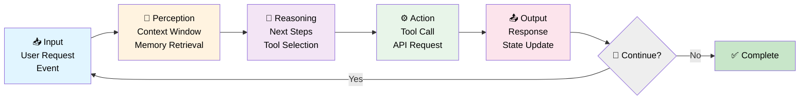
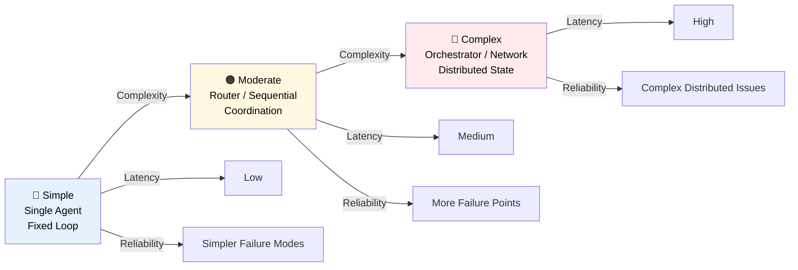
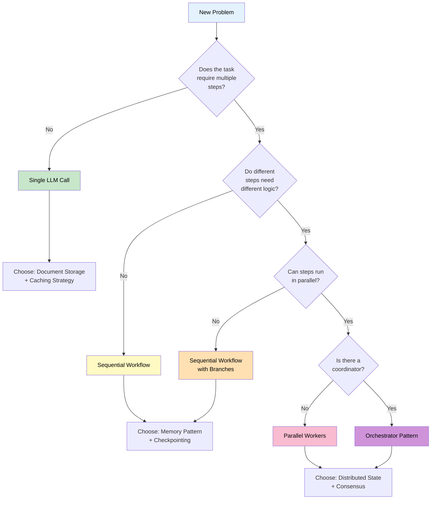

# 01 — Introduction to AI Agents

## Quick Summary

At its core, an AI agent is just a loop: read state, decide what to do, act, repeat until done. The architecture you choose determines how that loop runs — how it scales, where it breaks, and how much it costs you at 3am.

This document covers the mental model everything else in this playbook builds on.

---

## The Agent Loop (Mental Model)



**Every agent system has these five stages.** The architecture patterns in this playbook vary in:
- How many agents execute these stages
- How they coordinate
- How they persist state and memory
- How they handle failures

---

## Core Concepts

### 1. **State**
The information the agent needs to make decisions: current context, history, environment.

### 2. **Perception**
What the agent observes: user input, memory retrieval, tool outputs, environment data.

### 3. **Reasoning**
What the agent decides: next action, tool selection, response structure.

### 4. **Action**
What the agent does: API call, database query, tool invocation, message send.

### 5. **Output**
What the agent produces: user-facing response, state update, event emission.

### 6. **Iteration**
Whether the loop repeats or terminates. This is the critical architectural decision.

---

## Architecture Spectrum



---

## When You Need an Agent

| Need | Reason | Example |
|------|--------|---------|
| **Multi-step reasoning** | Single API call isn't enough | Research, planning, analysis |
| **Tool access** | Agent needs external systems | Database queries, API calls, calculations |
| **Iterative refinement** | Task improves with feedback loops | Code review, content generation, debugging |
| **Dynamic behavior** | Logic depends on runtime state | Routing, conditional branching, adaptation |
| **State tracking** | Must remember decisions and context | Conversation continuity, multi-turn tasks |

---

## When You DON'T Need an Agent

| Condition | Why | Alternative |
|-----------|-----|-------------|
| **Simple classification** | LLM single-pass is sufficient | Direct API call |
| **No tool access needed** | Pure text-in, text-out | Prompt engineering |
| **Fixed workflow** | Steps are predetermined | Orchestration templates |
| **Real-time is critical** | Agent latency is unacceptable | Streaming + caching |
| **Cost is primary concern** | Every iteration is expensive | Batch processing |

---

## Key Insights for Architects

### 1. **Iteration is Expensive**
Every loop iteration is another LLM call. Agent design is fundamentally cost control. If your agent takes 8 iterations when 3 would do, you've tripled your inference bill.

```
Single-pass system: 1 LLM call
Agent with 3 iterations: 3 LLM calls
Cost multiplier: 3x
```

### 2. **State is Your Bottleneck**
How you structure state determines everything else — latency, cost, correctness, debuggability. Engineers who skip state design end up refactoring their entire system two weeks later.

### 3. **Failure Modes Compound**
With N agents, you don't have N failure modes — you have combinations of partial failures, timeouts, and stale state. Systems that look fine in testing fall apart in production because nobody modeled what happens when agent 2 times out while agent 3 is mid-execution.

### 4. **Observability is Not Optional**
You cannot debug what you cannot see, and agent failures are rarely obvious. Without traces, every incident becomes a guessing game.

### 5. **Complexity is a Cost Center**
Every agent you add is another thing that can fail, another thing to deploy, another thing to monitor. The best agent architectures are the ones that solve the problem with the fewest moving parts.

---

## Decision Framework



---

## Architecture Patterns at a Glance

| Pattern | Agents | Coordination | Use Case |
|---------|--------|--------------|----------|
| **Single Agent** | 1 | None | Simple tasks, classification, generation |
| **Router** | N | Static routing | Multi-domain dispatch |
| **Sequential** | N | Ordered stages | Pipeline tasks |
| **Parallel** | N | Independent + wait | Parallel research, brainstorming |
| **Orchestrator** | N | Central coordinator | Complex workflows, dynamic dispatch |
| **Network** | N | Peer communication | Distributed reasoning, emergent behavior |

---

## Common Mistakes

### ❌ Building Multi-Agent Too Early
**What happens:** Two weeks of architecture work, and the single-agent prototype you built in day one still outperforms it.

**Fix:** Start with single agent. Add agents only after you've proven the single agent can't do the job.

### ❌ Ignoring State Management
**What happens:** The agent hallucinates, repeats itself, or loses context mid-task. Then you spend a week debugging prompts when the real issue is memory design.

**Fix:** Design your memory and state schema before writing a single line of agent logic.

### ❌ No Observability
**What happens:** Something breaks in production. You have no traces, no logs, no idea what the agent decided or why. Hours of investigation follow.

**Fix:** Instrument every decision point, tool call, and state change from day one. Retrofitting observability is painful.

### ❌ Synchronous Everything
**What happens:** Your pipeline takes 30 seconds when it could take 8. Users notice.

**Fix:** Look at your task dependencies. Anything independent can run in parallel.

### ❌ Assuming Determinism
**What happens:** Your tests pass, production behaves differently, and you spend two days convinced there's a bug when it's just LLM variance.

**Fix:** Build for probabilistic outputs. Test distributions, not single outputs. Monitor output quality in production.

---

## Real-world Example: Support Ticket System

**Problem:** Support tickets need intelligent routing and multi-step resolution.

**Wrong Approach (Too Complex):**
```
Ticket → Agent 1 → Agent 2 → Agent 3 → ... (5-agent network)
```
- Unpredictable routing
- Hard to debug
- High latency
- State coordination nightmare

**Right Approach (Staged):**
```
Ticket → Classifier Agent → Decision
         ├─ Route to Self-Service Agent
         ├─ Route to Human Queue
         └─ Route to Escalation
```

**Evolution Path:**
1. **Start:** Single classifier agent
2. **Add:** Self-service resolution agent
3. **Add:** Human escalation with context
4. **Monitor:** Success rates, escalation rates, resolution time
5. **Optimize:** Only if data shows bottleneck

---

## Best Practices

| Practice | Why | How |
|----------|-----|-----|
| **Explicit Goals** | Agents optimize for what you measure | Define success metrics before building |
| **Staged Rollout** | Catch failure modes early | Start single-agent, add complexity gradually |
| **Tight Loops First** | Single agent + fast iteration beats multi-agent | Optimize single-agent behavior first |
| **State as First-Class** | Memory determines correctness | Design state schema before agent logic |
| **Failure Injection** | Catch edge cases in development | Test tool failures, timeouts, retries |
| **Cost Accounting** | Agent economics drive architecture | Track cost per iteration, per output |
| **Observability Standard** | You cannot debug what you cannot see | Every agent must be fully traceable |

---

## Summary

**An AI agent is a loop. Everything else is orchestration.**

The patterns in this playbook are different answers to the same question: how do you run that loop — across one agent or many, with shared state or isolated, sequentially or in parallel?

**Take these with you:**
- Every loop iteration costs money. Minimize them.
- State is the hardest part. Design it before anything else.
- The simplest architecture that works is the right architecture.
- If you can't observe it, you can't operate it.
- Failure gets exponentially harder to debug as you add agents.

→ [02 — How to Choose](02-how-to-choose.md)
