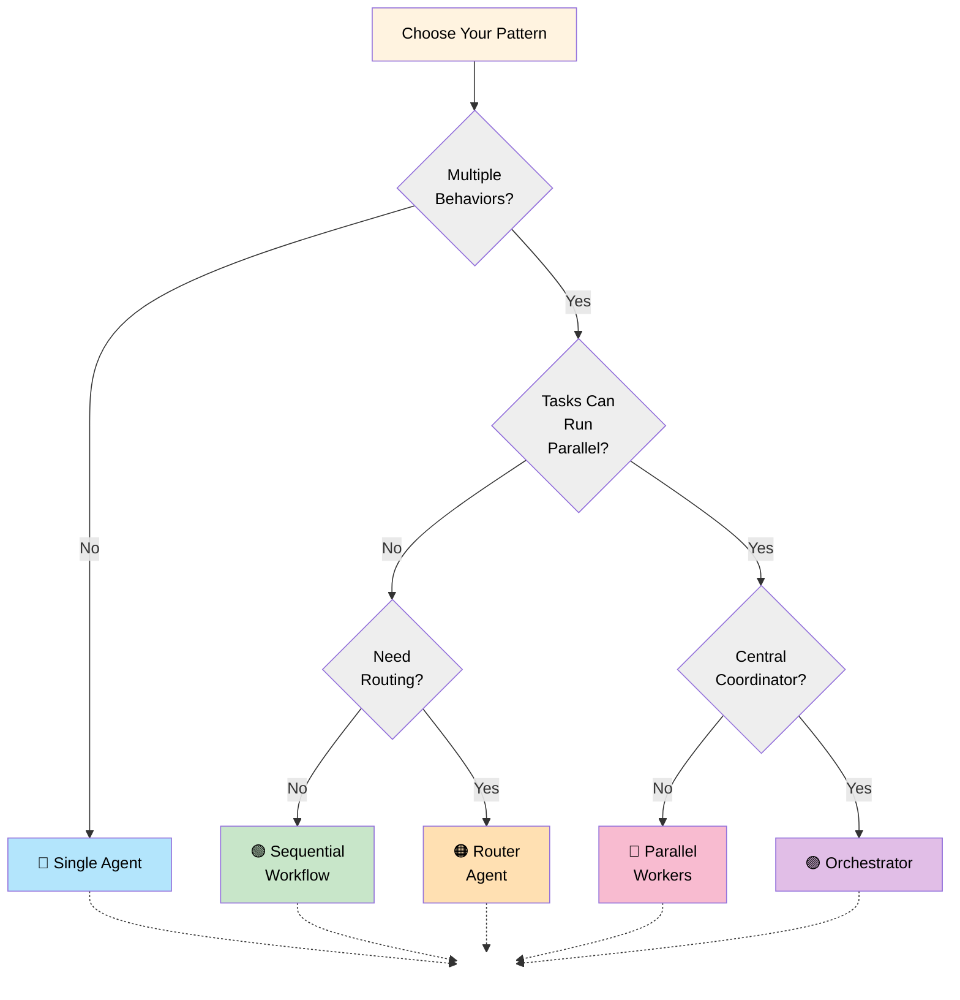
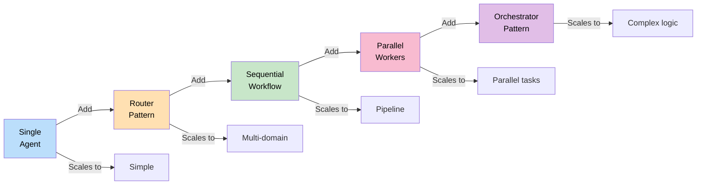
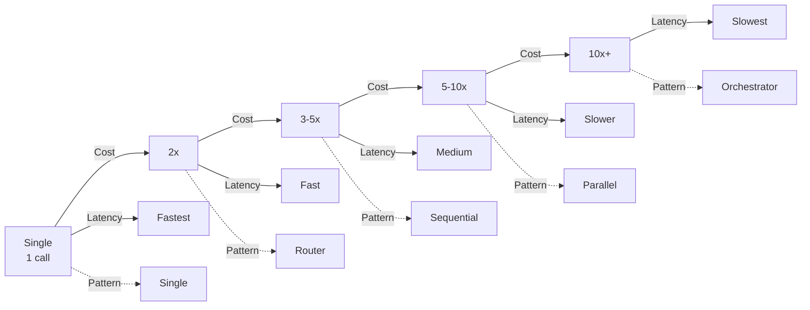

# 02 — How to Choose an Architecture

## Quick Summary

There are five patterns that cover almost everything. The hard part isn't learning them — it's resisting the urge to use a more complex one than you need.

This document is a decision framework. Use the tree, pick the simplest pattern that fits, and move on. Detailed breakdowns are in the dedicated documents.

---

## The Five Core Patterns



---

## Pattern Comparison Matrix

| Pattern | Agents | Use Case | Latency | Complexity | State Mgmt | Cost |
|---------|--------|----------|---------|-----------|-----------|------|
| **Single Agent** | 1 | Simple tasks, single behavior | ⬇️ Low | ⬇️ Low | Simple | ⬇️ Low |
| **Router** | 2-5 | Multi-domain dispatch | ⬇️ Low | ⬇️ Low | Simple | ↔️ Medium |
| **Sequential** | 2-5 | Pipeline stages | ↔️ Medium | ↔️ Medium | Staged | ↔️ Medium |
| **Parallel** | 2-N | Independent parallel tasks | ↔️ Medium | ↔️ Medium | Merged | ↔️ Medium |
| **Orchestrator** | 2-N | Complex dynamic workflows | ⬆️ High | ⬆️ High | Centralized | ⬆️ High |

---

## Decision Criteria

### 1. **How Many Different Behaviors?**

**One behavior** (classification, generation, summarization):
```
→ Single Agent ✓
→ Everything else is overengineered
```

**Two to five behaviors** (classification → action):
```
→ Router Pattern ✓
→ Each behavior gets its own agent
```

**Five or more behaviors OR behaviors can run in parallel**:
```
→ Sequential Workflow OR Parallel Workers ✓
→ Depends on whether tasks are ordered or independent
```

**Behaviors depend on runtime logic OR need central coordination**:
```
→ Orchestrator Pattern ✓
→ Only if you cannot pre-specify the workflow
```

---

### 2. **Can Tasks Run in Parallel?**

**Completely sequential** (output of stage N is input to stage N+1):
```
Step 1 → Step 2 → Step 3 → Output
→ Sequential Workflow ✓
```

**Some independence** (tasks don't depend on each other):
```
Task A ─┐
Task B ─┼→ Merge → Final Output
Task C ─┘
→ Parallel Workers ✓
```

**Hybrid** (some sequential, some parallel):
```
Step 1 → [Parallel 2A, 2B] → Step 3
→ Orchestrator Pattern ✓
```

---

### 3. **Do You Need Routing?**

**Fixed routing** (user domain determines agent):
```
Admin queries → Admin Agent
Customer queries → Customer Agent
→ Router Pattern ✓
```

**Dynamic routing** (runtime logic determines path):
```
Query analysis → Decide path → Route accordingly
→ Orchestrator Pattern ✓
```

**No routing** (single workflow):
```
→ Sequential or Single Agent ✓
```

---

## When to Use Each Pattern

### 🔵 **Single Agent**

```
Use when:
✓ Single behavior
✓ <3 minutes to complete
✓ No tool iteration needed
✓ Simple tasks (classification, extraction, generation)

Example:
- Email classification
- Content summarization
- Data extraction
- Code review for style
```

---

### 🟠 **Router Pattern**

```
Use when:
✓ Multiple domains or behaviors
✓ Each domain needs different logic
✓ Routing is straightforward (based on category/intent)
✓ Each branch is relatively simple

Example:
- Support ticket router (billing → billing agent, tech → tech agent)
- Intent classification → specialized handler
- Multi-tenant system
```

---

### 🟢 **Sequential Workflow**

```
Use when:
✓ Tasks are strictly ordered
✓ Output of one is input to next
✓ Each stage needs different behavior
✓ Checkpointing is useful

Example:
- Information gathering → Analysis → Writing → Review
- Data processing pipeline
- Content generation workflow (outline → draft → edit)
```

---

### 🔴 **Parallel Workers**

```
Use when:
✓ Multiple independent tasks
✓ No dependencies between tasks
✓ Results must be merged/combined
✓ Parallelism speeds up completion

Example:
- Research on multiple topics in parallel
- Multi-source data gathering
- A/B comparison (generate option A, B in parallel)
- Brainstorming session
```

---

### 🟣 **Orchestrator Pattern**

```
Use when:
✓ Complex conditional workflows
✓ Runtime logic determines path
✓ Mix of sequential and parallel
✓ Need central coordination
✓ Workflow is dynamic

Example:
- Incident response (severity determines path)
- Adaptive troubleshooting (results inform next step)
- Multi-stage approval workflows
- Dynamic resource allocation
```

---

## Quick Decision Table

| Question | Answer | Pattern |
|----------|--------|---------|
| How many distinct behaviors? | 1 | Single Agent |
| | 2-5, static dispatch | Router |
| | 2-5, ordered | Sequential |
| | 2-5, parallel | Parallel Workers |
| | 5+, dynamic dispatch | Orchestrator |
| Are tasks parallel? | No | Sequential |
| | Yes, independent | Parallel Workers |
| | Yes, coordinated | Orchestrator |
| Is workflow predetermined? | Yes | Sequential or Router |
| | No | Orchestrator |
| Does cost matter most? | Yes | Single Agent or Router |
| Does latency matter most? | Yes | Parallel Workers |
| Do you need complex logic? | No | Router or Sequential |
| | Yes | Orchestrator |

---

## Anti-Patterns: What NOT to Do

### ❌ **Multi-Agent for Single-Agent Problems**

**Problem:**
```
Email Classification:
Multiple agents → Routing overhead → Slower + costlier
```

**Solution:**
```
Single agent classifier → 10x cheaper, faster
```

**Rule:** If one agent solves it, don't add more.

---

### ❌ **Sequential When Parallel Fits**

**Problem:**
```
Gather data A (5s) → Gather data B (5s) → Total: 10s
```

**Bad:**
```
Sequential: 10s total time
```

**Good:**
```
Parallel: max(5s, 5s) = 5s total time
```

**Rule:** Look for independent tasks. Parallelize them.

---

### ❌ **Router for Dynamic Workflows**

**Problem:**
```
"Route based on previous answer" → Router doesn't support conditions
```

**Solution:**
```
→ Orchestrator Pattern
```

**Rule:** If routing logic is complex, use Orchestrator.

---

### ❌ **Orchestrator for Simple Workflows**

**Problem:**
```
Simple 3-stage pipeline with Orchestrator
→ Complex state management, hard to debug, expensive
```

**Solution:**
```
→ Sequential Workflow
```

**Rule:** Orchestrator adds complexity. Only use if necessary.

---

## Capability Matrix



---

## Implementation Path

### Phase 1: Foundation (Week 1)
```
Start with Single Agent
✓ Validate the problem
✓ Get first working solution
✓ Establish baselines (latency, cost, quality)
```

### Phase 2: Growth (Week 2-3)
```
Add Router if needed
✓ Multiple behaviors emerge
✓ Routing rules are clear
✓ Monitor performance per route
```

### Phase 3: Optimization (Week 4+)
```
Upgrade to Sequential/Parallel if needed
✓ Performance becomes bottleneck
✓ Workflow patterns are clear
✓ Cost optimization is worthwhile
```

### Phase 4: Complexity (If necessary)
```
Consider Orchestrator only if:
✓ Dynamic routing is proven necessary
✓ Sequential/Parallel insufficient
✓ Complex state coordination needed
```

---

## Cost-Latency Trade-off



---

## Real-world Example: E-Commerce Support

**Requirement:** Handle customer support tickets with routing, research, and resolution.

**Wrong (Over-engineered):**
```
Ticket → Multi-agent network → Emergent behavior → ???
Result: Unpredictable, slow, expensive
```

**Right (Staged):**

**V1 (Week 1):**
```
Ticket → Single Agent Classifier
- Handles 60% of cases
- Cost: $0.001/ticket
```

**V2 (Week 2):**
```
Ticket → Router Agent
├─ FAQ Agent (40% of cases)
├─ Billing Agent (30% of cases)
└─ Tech Support Agent (30% of cases)
- Handles 90% of cases
- Cost: $0.003/ticket
```

**V3 (Week 4):**
```
Ticket → Router
├─ FAQ Agent
├─ Billing → [Lookup → Response] (Sequential)
└─ Tech Support → [Diagnose, Research] (Parallel)
- Handles 95% of cases
- Cost: $0.005/ticket (but quality improved)
```

**V4 (Week 8, if needed):**
```
Ticket → Orchestrator
- Dynamic routing based on complexity
- Escalation logic
- Only if data shows 5% baseline is bottleneck
```

---

## Common Mistakes

### ❌ **Choosing Pattern Before Understanding the Problem**

"I'll use the Orchestrator — it's the most powerful." This is how you end up with a distributed system debugging nightmare when a single prompt would have worked.

**Fix:** Understand the requirements first. Then use the decision tree.

---

### ❌ **Assuming More Agents = Better Quality**

This is the most common mistake. More agents add latency, cost, and failure surface area. Quality comes from good tools, good prompts, and good state design — not from agent count.

**Fix:** Baseline single-agent quality before adding anything. You might be surprised.

---

### ❌ **Switching Patterns Without Measuring First**

If you don't know your current latency, cost, and quality numbers, you have no idea whether an architectural change actually helped.

**Fix:** Establish baselines. Measure. Then change.

---

### ❌ **Underestimating Operational Complexity**

"Orchestrator is more elegant" — until you're at 2am trying to figure out why worker 3 silently dropped a task and the coordinator never found out.

**Fix:** Choose patterns you can actually operate. Elegant on paper ≠ easy in production.

---

## Summary Table: Pattern by Scenario

| Scenario | Pattern | Why |
|----------|---------|-----|
| Content generation | Single Agent | One behavior, simple |
| Ticket classification → action | Router | Multiple behaviors, static routing |
| Data pipeline: gather → analyze → report | Sequential | Ordered stages |
| Multi-source research | Parallel Workers | Independent parallel tasks |
| Incident response (severity → different paths) | Orchestrator | Dynamic conditional routing |
| Real-time chat assistant | Single Agent | Low latency required |
| Compliance review (checks ordered, some conditional) | Orchestrator | Complex logic + some order |
| Brainstorming (generate multiple ideas) | Parallel Workers | Independent parallel generation |

---

## Best Practices

| Practice | Why |
|----------|-----|
| **Start with Single Agent** | Simplest, cheapest, easiest to debug. 80% of problems solve here. |
| **Add complexity incrementally** | Measure before changing architecture |
| **Choose for observability** | Can you trace decisions and debug failures? |
| **Account for operational cost** | Monitoring, debugging, deployment complexity increase with patterns |
| **Document routing logic** | Whatever pattern you choose, routing rules must be explicit |
| **Plan failure modes** | Each agent adds failure points. Orchestrator has the most. |
| **Baseline first** | Measure single-agent performance before deciding to scale |

---

## Next Steps

Once you've chosen your pattern, read its dedicated document:

- [04 — Single Agent](04-single-agent.md)
- [05 — Router Pattern](05-router-pattern.md)
- [06 — Sequential Workflow](06-sequential-workflow.md)
- [07 — Parallel Workers](07-parallel-workers.md)
- [08 — Orchestrator Workers](08-orchestrator-workers.md)

---

## Summary

**Three questions pick your pattern:**
1. How many different behaviors do you need?
2. Can tasks run in parallel?
3. Is routing dynamic or predetermined?

If you're honest about the answers, the framework points clearly. Most of the time, the answer is Single Agent or Router — not Orchestrator.

Measure before you change anything. Engineers who skip baselines end up rebuilding architecture twice.

→ Pick your pattern and go deep.
