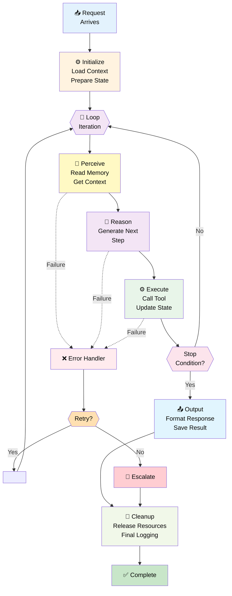
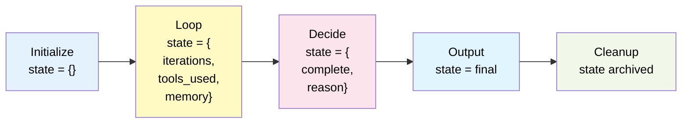
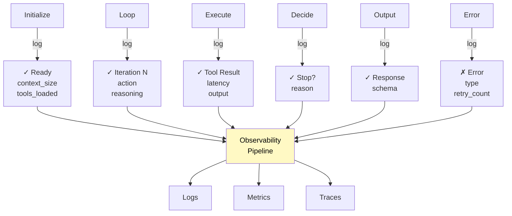
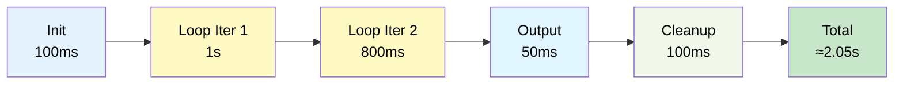
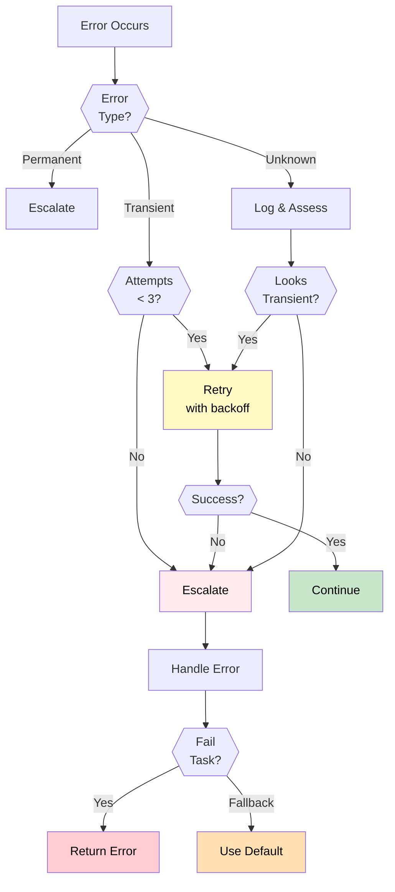

# 03 — Agent Lifecycle

## Quick Summary

Every agent execution follows the same path: initialize, loop until done, clean up. That sounds simple until something fails mid-loop and you realize you have no idea what state the system is in.

This document is about making that path explicit — so failures are predictable, observable, and recoverable.

---

## The Complete Lifecycle



---

## Lifecycle Phases

### 1. **Initialization**

**Purpose:** Prepare the agent for execution.

**Operations:**
- Load configuration (model, temperature, timeout)
- Initialize memory/context store
- Load system prompt and tools
- Validate inputs
- Set up observability (tracing, logging)
- Allocate resources (connections, credentials)

**Duration:** 50-500ms (dominated by context loading)

**Failures:**
- Configuration missing or invalid
- Memory store unavailable
- Tool initialization fails
- Credentials invalid

**Observable metrics:**
- Initialization time
- Context size loaded
- Tool availability status

---

### 2. **Execution Loop**

**Purpose:** Iteratively perceive, reason, and act.

**Each iteration:**

```
Iteration N:
├─ Perceive: Read current state, memory, tool outputs
├─ Reason: Generate next action
├─ Execute: Call tool or emit output
└─ Decide: Stop or continue?
```

**Expected iterations:** 1-10 (median 2-3)

**Cost per iteration:** 1 LLM call + tool execution

**Duration per iteration:** 500ms - 5s (depends on tool)

**Failures per iteration:**
- Token limit exceeded
- Tool timeout
- Tool returns error
- Invalid tool selection
- Hallucinated tool name

**Observable metrics:**
- Iteration count
- Time per iteration
- Tool success rate
- Token usage per iteration

---

### 3. **Termination Decision**

**Purpose:** Determine when to stop the loop.

**Termination conditions:**

| Condition | Type | Example |
|-----------|------|---------|
| **Goal reached** | Success | Task completed, answer generated |
| **Max iterations** | Timeout | 10 iterations attempted, stop |
| **Max tokens** | Resource | Token limit exceeded |
| **Time budget** | Timeout | 30 seconds elapsed |
| **Tool failure** | Error | Tool returns unrecoverable error |
| **No progress** | Stall | Last 3 iterations repeated same action |
| **Explicit stop** | Signal | User cancels execution |

**Best practice:** Use ALL of these, not just one.

```
Stop if:
- Goal is reached ✓
- OR iterations >= 10 ✓
- OR tokens >= 4000 ✓
- OR elapsed time >= 30s ✓
- OR same action repeated 3x ✓
```

---

### 4. **Error Handling & Retry**

**Purpose:** Recover from transient failures.

**Failures fall into two categories:**

| Category | Cause | Action |
|----------|-------|--------|
| **Transient** | Timeout, rate limit, connection | Retry with backoff |
| **Permanent** | Invalid input, tool broken, logic error | Escalate or fail |

**Retry strategy:**

```
Attempt 1 (immediate)
  └─ Fail → Attempt 2 (wait 100ms)
    └─ Fail → Attempt 3 (wait 500ms)
      └─ Fail → Attempt 4 (wait 2s)
        └─ Fail → Escalate
```

**Do NOT retry on:**
- Invalid tool name (agent hallucinating)
- Authentication failure
- Bad input format
- Permanent API errors (410, 403)

**Observable metrics:**
- Retry count
- Retry success rate
- Backoff strategy effectiveness
- Escalation frequency

---

### 5. **Output & Formatting**

**Purpose:** Present results to the user/system.

**Operations:**
- Extract final answer from agent state
- Format according to spec (JSON, markdown, etc.)
- Validate output schema
- Sanitize for external systems
- Attach metadata (cost, latency, iterations)

**Failures:**
- Output doesn't match expected schema
- Contains sensitive data
- Incomplete or malformed

---

### 6. **Cleanup & Logging**

**Purpose:** Release resources and record execution.

**Operations:**
- Close database connections
- Release file handles
- Revoke temporary credentials
- Write final logs
- Update metrics/monitoring
- Archive execution trace

**Critical:** Must execute even on failure.

```
try:
    execute_agent()
finally:
    cleanup()  # Always runs
    log_metrics()  # Always runs
```

---

## State Management Through Lifecycle



**State evolves through each phase.** What's observable must be logged at each step.

---

## Observability Hooks



**Every phase must be observable.**

---

## Timing & Latency



**Typical breakdown (for 2-iteration agent):**
- Initialization: 5%
- Perception + Reasoning per iter: 40-50%
- Tool execution: 40-50%
- Output + Cleanup: 5%

**Cost breakdown:**
- Each LLM call: $0.0005 - $0.005
- Each tool call: $0.00 - $0.10
- Storage: negligible
- Total per execution: $0.001 - $0.050

---

## Stop Conditions: Detailed

### ✅ **Goal Reached (Success)**

Agent explicitly signals task complete.

```
Agent output: "The answer is X. Task complete."
→ Stop immediately
```

**Metrics:** ~70% of executions end here (healthy)

---

### ⏱️ **Max Iterations (Timeout)**

Agent has looped N times without completing.

```
Set max_iterations = 10
If iteration >= 10: stop regardless of state
```

**When to use:** Always. Prevents runaway loops.

**Value:** 5-15 is typical for most tasks

**Metrics:** Track % of executions hitting limit (should be <5%)

---

### 🎫 **Max Tokens (Resource)**

Agent has used too many tokens.

```
Set max_tokens = 4000
If tokens_used >= 4000: stop
```

**When to use:** Always. Prevents cost runaway.

**Value:** 3000-8000 depending on model

**Metrics:** Track % hitting limit (should be <1%)

---

### ⏰ **Time Budget (Wall Clock)**

Execution has taken too long.

```
Set timeout = 30s
If elapsed_time >= 30s: stop
```

**When to use:** Always for user-facing requests.

**Value:** 10-60s depending on SLA

**Metrics:** Track p95, p99 latencies

---

### 🔁 **No Progress (Stall)**

Agent is repeating itself without advancing.

```
Track last 3 actions
If actions are identical: increment stall_counter
If stall_counter >= 3: stop
```

**When to use:** Recommended for all agents.

**Prevents:** Infinite loops in edge cases

**Metrics:** Track stall detection frequency (should be rare)

---

### 🚫 **Explicit Stop (User Cancel)**

User cancels execution mid-loop.

```
If user_cancels: immediately stop
Clean up resources
Return partial result if available
```

**When to use:** Always for interactive requests.

**Metrics:** Track cancellation rate and latency before cancel

---

## Error Handling Decision Tree



---

## Production Checklist

### Before Launch

- [ ] Initialization timeout set (should complete in <1s)
- [ ] Max iterations configured (5-15 for most tasks)
- [ ] Max tokens configured (3000-8000)
- [ ] Execution timeout set (10-60s)
- [ ] Stop conditions covered (all 6 types)
- [ ] Error retry policy defined
- [ ] Escalation path documented
- [ ] Observability instrumented (all phases)
- [ ] Circuit breaker configured
- [ ] Fallback strategy defined
- [ ] Load tested (concurrent agents)
- [ ] Chaos testing (failure injection)

### During Operation

- [ ] Monitor iteration count distribution
- [ ] Track % hitting max iterations (alert if >5%)
- [ ] Track % hitting max tokens (alert if >1%)
- [ ] Monitor latency p95, p99
- [ ] Track error rate by type
- [ ] Track retry success rate
- [ ] Monitor cost per execution
- [ ] Alert on stalls, escalations

---

## Common Mistakes

### ❌ **No Max Iterations**

You'll hit this in production, not in dev. An edge case input causes the agent to loop indefinitely. By the time you notice, you've burned hundreds of LLM calls on a single request.

**Fix:** `max_iterations = 10` is a sane default. Set it before you ship.

---

### ❌ **No "No Progress" Detection**

The agent isn't infinite-looping — it's calling the same tool with the same arguments three times in a row because it doesn't know what else to do. Without stall detection, this runs until the token budget hits.

**Fix:** Track the last 3 actions. If they're identical, stop.

---

### ❌ **Retrying Permanent Errors**

The agent hallucinated a tool name that doesn't exist. Retrying three times doesn't help — the tool still doesn't exist. But you've added 3x latency and cost.

**Fix:** Categorize errors before retrying. Transient (timeout, rate limit) → retry. Permanent (invalid tool, bad input) → fail fast.

---

### ❌ **Skipping Cleanup on Error**

An error fires, execution short-circuits, and now you have open DB connections, temp files, and dangling credentials sitting around. This compounds in production.

**Fix:** `try/finally`. Cleanup runs regardless of outcome — always.

---

### ❌ **No Observability**

Something breaks. You have a stack trace but no context: no iteration count, no tool call history, no state at failure point. Investigation takes hours.

**Fix:** Log at every phase. The overhead is negligible. The debugging time savings are not.

---

### ❌ **Timeout Set by Guessing**

Someone picked 5 seconds because it felt reasonable. p95 of your real traffic is 4.8 seconds. You're killing valid requests.

**Fix:** Measure p95 of successful completions first. Set timeout at p95 + 20% buffer.

---

## Real-world Example: Support Ticket Resolution

**Scenario:** Agent resolves customer support ticket

**Lifecycle:**

```
T=0ms: Initialize
  ├─ Load ticket context (100ms)
  ├─ Load customer history (50ms)
  ├─ Prepare tools (50ms)
  └─ Ready (elapsed: 200ms)

T=200ms: Loop Iteration 1
  ├─ Perceive: Read ticket + history (50ms)
  ├─ Reason: Decide action (LLM call 500ms)
  ├─ Execute: Search knowledge base (200ms)
  └─ Elapsed this iter: 750ms

T=950ms: Loop Iteration 2
  ├─ Perceive: Read search results (50ms)
  ├─ Reason: Generate response (LLM call 500ms)
  ├─ Check stop condition: "Response complete" → YES
  └─ Elapsed: 550ms

T=1500ms: Output
  ├─ Format response (50ms)
  ├─ Validate schema (10ms)

T=1560ms: Cleanup
  ├─ Close connections (30ms)
  ├─ Log execution (20ms)
  └─ Done (elapsed: 1.6s)

Total: 2 iterations, 2 LLM calls, 1 tool call, 1.6s latency
Cost: ~$0.003/ticket
```

**Observability logged:**
```json
{
  "request_id": "ticket-12345",
  "iterations": 2,
  "latency_ms": 1600,
  "tokens_used": 420,
  "cost_usd": 0.003,
  "tools_called": ["knowledge_base_search"],
  "stop_reason": "goal_reached",
  "error_count": 0,
  "retry_count": 0
}
```

---

## Best Practices

| Practice | Why |
|----------|-----|
| **Multiple stop conditions** | No single condition catches all edge cases |
| **Explicit phase logging** | Trace every state transition |
| **Resource limits (time, tokens, iterations)** | Prevents runaway execution |
| **Retry only transient errors** | Permanent errors won't resolve on retry |
| **Observable at every phase** | Cannot debug what you cannot see |
| **Separate initialization** | Catch config errors before loop starts |
| **Explicit cleanup** | Use try/finally, always runs |
| **Categorize failures** | Distinguish transient from permanent |
| **Track iterations distribution** | Health metric for agent behavior |
| **Set realistic timeouts** | Based on p95 of successful runs |

---

## Summary

**Six phases, every execution:**
1. Initialize
2. Loop (perceive → reason → act)
3. Check stop conditions
4. Handle errors
5. Format output
6. Cleanup — always, even on failure

**Stop conditions aren't optional.** Every production agent needs all six: goal reached, max iterations, max tokens, time budget, stall detection, user cancel. One missing condition is the one that bites you.

**Classify your errors.** Retrying a permanent failure wastes time and money. Fail fast on what won't recover.

**Observe everything.** The phases that feel boring to instrument are the ones you'll wish you had logged when something goes wrong at 2am.

→ [04 — Single Agent](04-single-agent.md)
