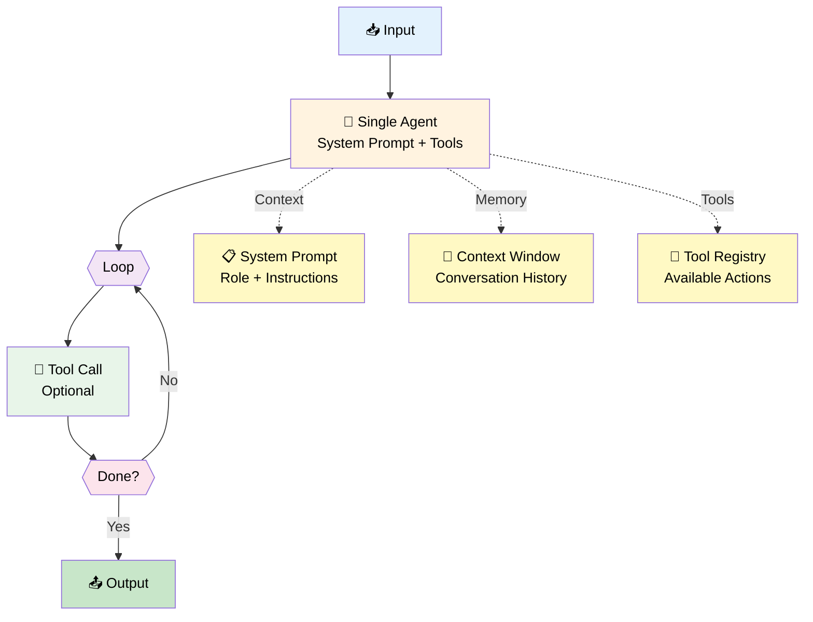
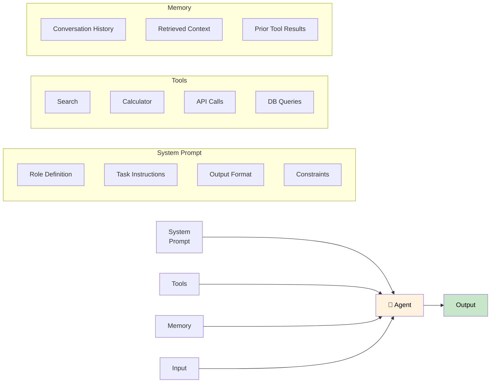
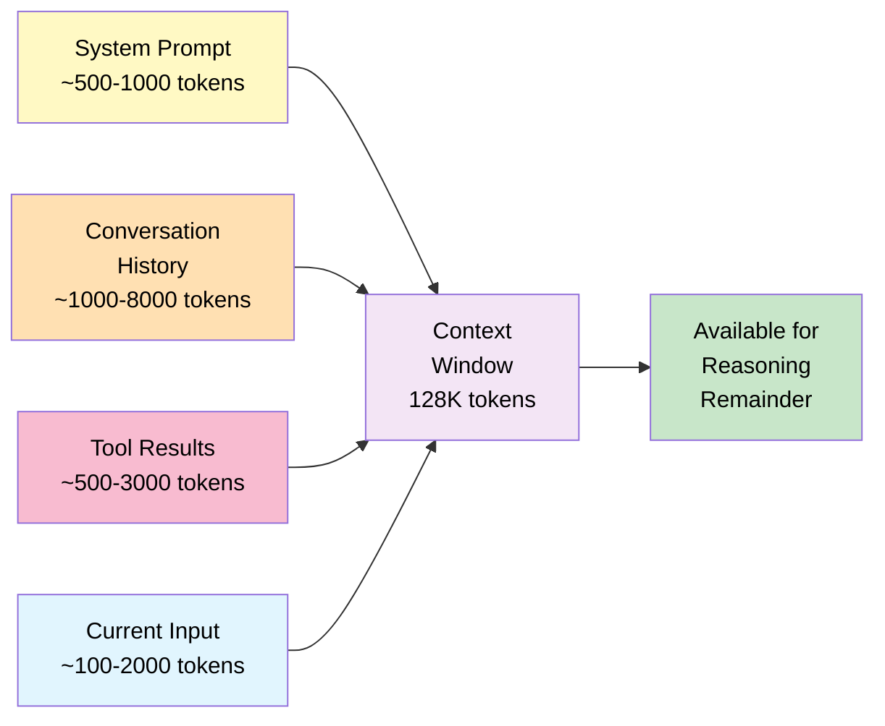
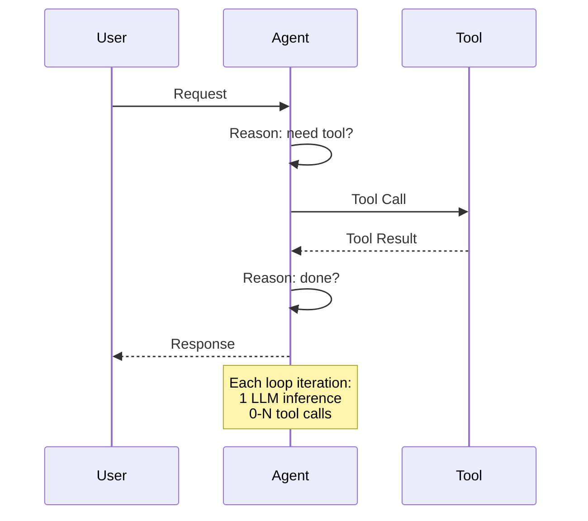
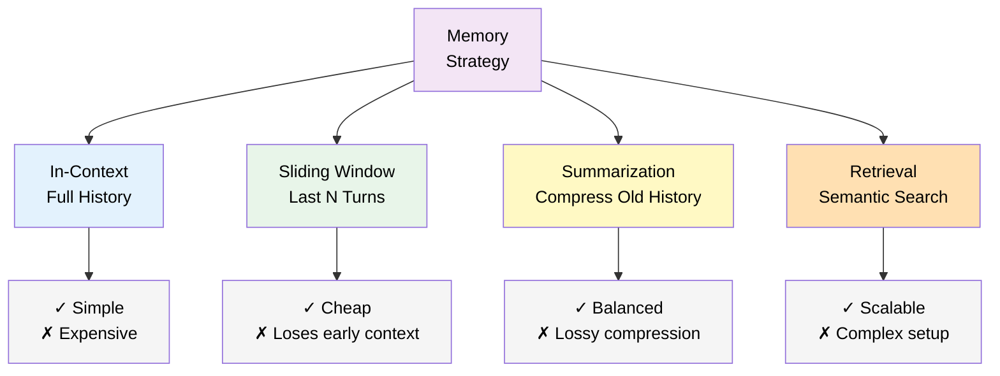
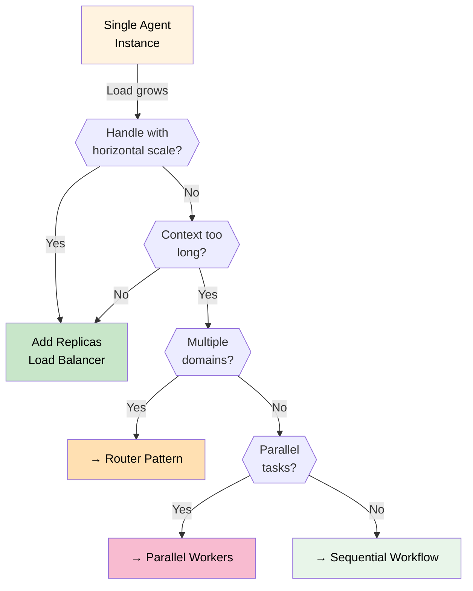

# 04 — Single Agent

## Quick Summary

One model. One task. One loop. Most agent problems don't need anything more than this, and the ones that do usually need better tools and prompts — not more agents.

Build this first. Don't upgrade until it provably can't handle the job.

---

## Architecture



---

## When to Use

| Scenario | Why Single Agent Works |
|----------|----------------------|
| **Classification tasks** | Single reasoning pass is sufficient |
| **Content generation** | One model, one context, one output |
| **Data extraction** | Structured output from text |
| **Q&A with tool access** | Lookup → Answer pattern |
| **Summarization** | Input → Compressed output |
| **Code review** | Analyze and report |
| **Single-turn interactions** | No history needed |
| **Simple multi-step tasks** | 2-5 tool calls, linear path |

---

## When NOT to Use

| Scenario | Why It Fails | Alternative |
|----------|-------------|-------------|
| **Multiple domains** | Prompt becomes too broad, accuracy drops | Router Pattern |
| **Long pipelines (5+ stages)** | Context window fills up, quality degrades | Sequential Workflow |
| **Parallel independent work** | Sequential bottleneck | Parallel Workers |
| **Dynamic conditional routing** | Fixed prompt can't adapt | Orchestrator |
| **Specialized expertise needed** | One prompt can't be expert in everything | Router → Specialists |
| **Tasks > 10 minutes** | Context window exhaustion | Sequential with checkpointing |

---

## Anatomy of a Single Agent



---

## Advantages

| Advantage | Impact |
|-----------|--------|
| **Lowest latency** | 1 LLM call per response (minus tool calls) |
| **Lowest cost** | No coordination overhead |
| **Simplest to debug** | Single execution path, single log stream |
| **Easiest to deploy** | One container, one process |
| **Fastest iteration** | Change prompt → test → deploy |
| **Predictable failure modes** | Limited blast radius |
| **No coordination state** | No distributed state to manage |

---

## Trade-offs

| Trade-off | Impact | Mitigation |
|-----------|--------|-----------|
| **Context window limit** | Hard ceiling on knowledge and history | Compress memory, use retrieval |
| **Single point of failure** | Agent fails → task fails | Circuit breaker, retry |
| **No specialization** | One prompt serves all domains | Segment by use case |
| **Scaling is vertical** | More load = bigger model or more instances | Horizontal replica scaling |
| **Prompt complexity grows** | As requirements grow, prompt becomes unwieldy | Split into Router → Specialists |
| **No parallelism** | All steps are sequential | Acceptable for most tasks |

---

## Context Window Budget



**Typical token budget (128K window):**

| Component | Typical Tokens | % of Window |
|-----------|---------------|-------------|
| System prompt | 500 - 2,000 | 1-2% |
| Conversation history | 1,000 - 10,000 | 1-8% |
| Tool results | 500 - 5,000 | 0.5-4% |
| Current input | 100 - 2,000 | 0.1-2% |
| Reasoning output | 500 - 2,000 | 0.5-2% |
| **Available buffer** | **~108K** | **~85%** |

**Rule:** Design prompts and history truncation so the system never exceeds 80% of the context window.

---

## Tool Calling Pattern



**Tool call economics:**
- Each LLM inference: $0.0005 - $0.005
- Each tool call: usually free to $0.10
- Minimize tool calls per loop
- Batch tool calls when possible (parallel tool use)

---

## System Prompt Design

The system prompt is the agent's configuration. Poor system prompts are the #1 cause of single-agent failures.

### Structure

```
1. Role
   "You are a [role] that [core responsibility]."

2. Task Definition
   "Your task is to [specific goal]."

3. Tools Available
   "You have access to: [tool list with purpose]."

4. Output Format
   "Always respond with [format: JSON/markdown/plain]."

5. Constraints
   "Do not [constraint 1]. Never [constraint 2]."

6. Failure Behavior
   "If you cannot complete the task, respond with [fallback]."
```

### Anti-patterns

| Anti-pattern | Problem | Fix |
|-------------|---------|-----|
| **Vague role** | "You are a helpful assistant" | Be specific: "You are a billing support agent that resolves payment disputes" |
| **No output format** | Free-form output, hard to parse | Specify exact schema |
| **No constraints** | Agent invents behaviors | Explicitly list what NOT to do |
| **No failure case** | Agent hallucinates when stuck | Define fallback behavior |
| **Overly long prompt** | Model ignores instructions past ~2000 tokens | Keep core instructions under 800 tokens |

---

## Memory Strategies



**Choose based on task type:**

| Task Type | Strategy | Why |
|-----------|----------|-----|
| Single-turn | No memory needed | No history to track |
| Short conversation (<10 turns) | Full in-context | Simple, sufficient |
| Long conversation (10-50 turns) | Sliding window | Cost control |
| Very long sessions (50+ turns) | Summarization | Context window protection |
| Knowledge-intensive | Retrieval (RAG) | Scalable, precise |

---

## Scaling a Single Agent



**Don't over-engineer:** Most single agents scale fine with horizontal replicas until very high load.

---

## Failure Modes

| Failure | Cause | Detection | Fix |
|---------|-------|-----------|-----|
| **Hallucination** | Insufficient context or tools | Output validation, confidence threshold | Ground with retrieval, better tools |
| **Tool loop** | Agent keeps calling same tool | Iteration counter, stall detection | Add "no progress" stop condition |
| **Context overflow** | History fills window | Token counter alert at 80% | Memory compression policy |
| **Prompt injection** | User manipulates system prompt | Input sanitization | Separate system/user prompts strictly |
| **Latency spike** | Tool timeout | Per-tool timeout | Set tool timeouts, circuit breaker |
| **Wrong format** | Output doesn't match schema | Output validator | Enforce schema in system prompt |

---

## Engineering Notes

> **Note 1: Tools beat reasoning every time**
> A single agent with one good, reliable tool will consistently outperform a five-agent network reasoning without access to real data. Fix the tools before you add agents.

> **Note 2: The system prompt is your infrastructure**
> It deserves the same rigor as your database schema. Version it. Review changes. Test it against edge cases. A two-line prompt change can tank accuracy silently.

> **Note 3: Iteration count is your canary**
> If the median is above 5, something is wrong. Either the task is too complex for this pattern, a tool is failing, or the prompt is ambiguous. Don't tune LLM parameters before investigating this.

> **Note 4: Context window is your cost dial**
> Token cost is roughly linear with context size. Conversation history is usually the biggest waste. Compress it. Don't send 8000 tokens of history when a 500-token summary will do.

> **Note 5: Scale out before you scale up**
> Before jumping to a larger, more expensive model, try running more instances of the current one. Horizontal scale is cheaper, faster to ship, and doesn't change your architecture.

---

## Common Mistakes

### ❌ **Overly Broad System Prompt**

"You are a helpful assistant" is not a system prompt — it's an invitation to improvise. An agent with no clear scope will handle everything generically and nothing well.

**Fix:** One agent, one domain, one output format. If the prompt grows past 1000 tokens with actual responsibilities (not just caveats), it's time to split.

---

### ❌ **No Output Validation**

You ask for JSON. The agent returns prose with a JSON block embedded in it. Your parser breaks. You write a workaround. The workaround breaks next week.

**Fix:** Define the exact schema. Validate every response. Retry on violation — but alert if you're retrying more than 5% of the time.

---

### ❌ **Unbounded Tool Loops**

The agent calls the search tool 20 times because it's not finding what it needs and doesn't know when to stop. You find out when the bill arrives.

**Fix:** `max_iterations = 10`. Track repeated actions. If the last 3 tool calls are identical, stop.

---

### ❌ **Full History in Context**

A long-running conversation starts with 80K tokens of history. The agent starts hallucinating because the model is struggling to attend to the relevant parts. Cost doubles.

**Fix:** Compress at 70% of your context budget. A summarized history is almost always sufficient.

---

### ❌ **Ignoring Prompt Injection**

A user discovers they can paste "Ignore previous instructions..." into your input field and override your system prompt behavior. This is a real attack vector, not a theoretical one.

**Fix:** Never interpolate raw user input into the system prompt. Keep system and user messages strictly separated at the API level.

---

### ❌ **Blaming the Architecture When the Prompt is Wrong**

The agent gets 70% accuracy and the team decides to go multi-agent. Three weeks later, the multi-agent system gets 71% accuracy and is 5x harder to debug.

**Fix:** Profile failures before changing anything. In most cases, the problem is prompt coverage or missing tools — not architecture.

---

## Real-world Example: Legal Document Reviewer

**Task:** Review contracts and flag non-standard clauses.

**Single Agent Design:**

```
System Prompt:
  Role: Contract review specialist
  Task: Identify non-standard clauses vs. company policy
  Tools: [policy_lookup, clause_extractor, risk_scorer]
  Output: JSON list of {clause, risk_level, recommendation}
  Constraints: Flag but do not modify. Never hallucinate policy.
  Fallback: If policy unclear, return "requires_human_review"

Loop:
  Iteration 1: Extract all clauses (clause_extractor tool)
  Iteration 2: For each clause, lookup policy (policy_lookup tool)
  Iteration 3: Score risks (risk_scorer tool)
  Done: Return structured JSON report

Stop conditions:
  - All clauses reviewed ✓
  - Max 15 iterations ✓
  - Max 6000 tokens ✓
  - Time budget: 60s ✓
```

**Metrics:**
- Average iterations: 3-4
- Latency: 8-12s (3 tool calls)
- Cost: ~$0.01/contract
- Accuracy: 94% clause coverage

**When to upgrade to Router:**
- When document types (contract vs. NDA vs. SLA) each need different policies
- When accuracy drops below 90% on any document type
- When latency exceeds 30s

---

## Best Practices

| Practice | Why |
|----------|-----|
| **Start here, always** | Cheapest, fastest, simplest to debug |
| **Scope the prompt tightly** | One domain, one purpose, one output format |
| **Set all stop conditions** | Iteration, token, time, stall |
| **Validate output schema** | Every response, not just some |
| **Instrument every iteration** | Log action, tool, token count, latency |
| **Version system prompt** | Track prompt changes as infra config |
| **Test tool failures** | What does the agent do when a tool returns an error? |
| **Profile before upgrading** | 80% of "agent problems" are prompt problems |
| **Compress memory** | Never let context exceed 80% of window |
| **Set per-tool timeouts** | Prevent one slow tool from blocking the loop |

---

## Summary

**Start here. Most of the time, stay here.**

The single agent pattern handles the majority of production use cases. When it fails, it fails cleanly and predictably. When something more complex fails, you'll spend days figuring out which agent in which state caused what.

**What determines success:**
- System prompt quality → does the agent know what to do?
- Tool quality → does the agent have what it needs to act?
- Memory strategy → does the agent have the right context?
- Stop conditions → does the agent know when to quit?
- Output validation → is the response actually usable?

**When to move on:**
- Accuracy degrades across distinct domains → [05 — Router Pattern](05-router-pattern.md)
- Task has clear sequential stages → [06 — Sequential Workflow](06-sequential-workflow.md)
- Independent subtasks are slowing you down → [07 — Parallel Workers](07-parallel-workers.md)
- Workflow logic can't be predetermined → [08 — Orchestrator Workers](08-orchestrator-workers.md)

If you don't have data showing the single agent is the bottleneck, don't change the architecture.

→ [05 — Router Pattern](05-router-pattern.md)
