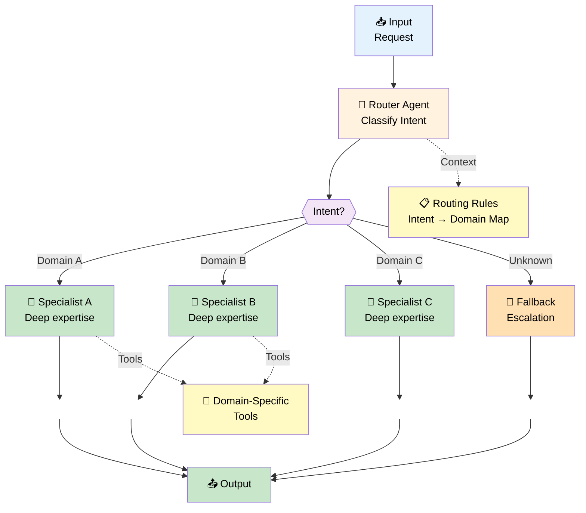
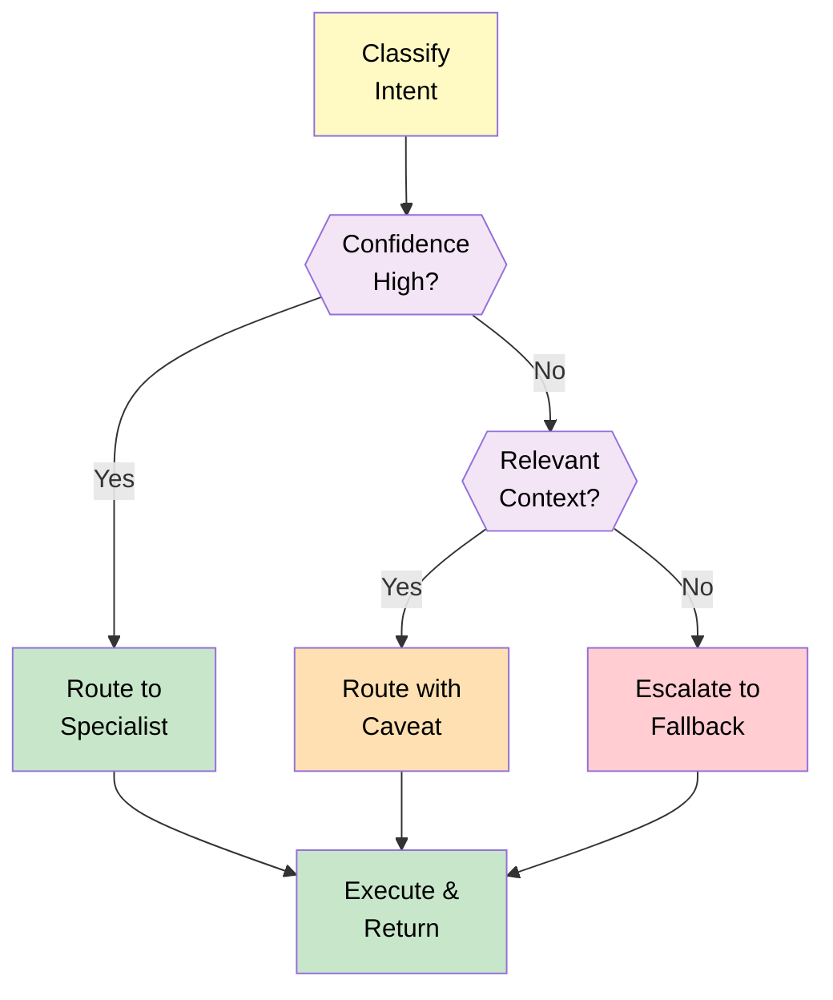

# 05 — Router Pattern

## Quick Summary

When a single agent can't cover all domains well, the router pattern dispatches requests to specialized agents. It adds complexity, but not much — and it's almost always the right first step when a single agent starts struggling.

Build this when single-agent quality drops across distinct domains. Not before.

---

## Architecture



---

## When to Use

| Scenario | Why Router Works |
|----------|-----------------|
| **Multi-domain requests** | Each domain needs different logic and tools |
| **Quality drops on edge cases** | Single agent compromises accuracy across domains |
| **Different SLAs per domain** | Some requests need faster response, some need accuracy |
| **Team owns different domains** | Billing team owns billing logic, support team owns support |
| **User segments have different needs** | Premium users get detailed domain A, free users get lite version |
| **Clear intent classification** | You can reliably predict which domain a request belongs to |
| **Static routing logic** | Routing rules don't change mid-execution |

---

## When NOT to Use

| Scenario | Why Router Fails | Alternative |
|----------|-----------------|-------------|
| **Dynamic, conditional routing** | Router decides statically; can't adapt mid-task | Orchestrator |
| **Overlapping domains** | Request belongs to multiple domains equally | Orchestrator |
| **Intent classification is hard** | Router misclassifies frequently | Improve classification first, then route |
| **Sequential workflow** | Request flows through stages in order, not by domain | Sequential Workflow |
| **Single domain works well** | Adding complexity without benefit | Stay with Single Agent |
| **Routing logic is complex** | More than 10 domain rules, many conditions | Orchestrator |
| **Domains are tightly coupled** | Specialist agents need frequent cross-domain calls | Rethink domain boundaries |

---

## Router Agent Design

The router is the critical component. A bad router breaks everything downstream.

```
Router Responsibilities:
├─ Classify the intent from the request
├─ Map intent to the right specialist
├─ Extract context relevant to that specialist
├─ Handle unclassifiable requests (fallback)
└─ Log the routing decision for analysis

Router Constraints:
├─ Must be fast (<500ms typical)
├─ Must be accurate (>95% target)
├─ Must have explicit fallback
└─ Must not hallucinate domains
```

---

## Routing Strategies

### 1. **Keyword-Based (Simplest)**

```
If request contains "refund" or "payment" → Billing Agent
If request contains "bug" or "error" → Support Agent
If request contains "feature" → Product Agent
Else → Fallback
```

**Pros:** Fast, deterministic, no LLM call needed  
**Cons:** Brittle, misses nuance, no cross-domain requests  
**Use when:** Domains are linguistically distinct

---

### 2. **LLM Classification (Recommended)**

```
System Prompt: "Classify this request into one of: billing, support, product, other"
Response: JSON {"domain": "billing", "confidence": 0.92}

Route if confidence > 0.90
Fallback if confidence < 0.90
```

**Pros:** Handles ambiguity, learns from examples  
**Cons:** Adds ~500ms latency, non-deterministic  
**Use when:** Domains have semantic overlap

---

### 3. **Hybrid (Best)**

```
Try keyword-based first (instant decision)
  If no match OR confidence low:
    → LLM classification (slower, more accurate)
  Else:
    → Route immediately
```

**Cost:** Keyword-only routes cost $0.0000, LLM routes cost $0.0005  
**Performance:** 70% keyword hits skip LLM call entirely

---

### 4. **Confidence Escalation**

```
Confidence > 95%: Route to specialist
Confidence 80-95%: Route with caveats ("I think this is X, but...")
Confidence < 80%: Route to Fallback agent
```

**Reduces mis-routing significantly.** The specialist sees the confidence flag and adjusts behavior accordingly.

---

## Routing Decision Table



---

## Cost & Latency Model

```
Total latency = Router latency + Specialist latency

Router latency breakdown:
├─ Classification: 0ms (keyword) or 500ms (LLM)
├─ Context extraction: 50-200ms
└─ Routing decision: negligible

Specialist latency:
├─ Tool calls: 200ms - 5s
├─ LLM inference: 500-1000ms
└─ Output formatting: 50ms

Total: typically 1.5-6s
(vs. 1-2s for single agent, but better quality)

Cost breakdown:
├─ Router LLM call: $0.0005 (keyword route saves this)
├─ Specialist LLM call: $0.001-$0.005
├─ Tool calls: $0.00-$0.10
└─ Total per request: $0.002-$0.015
```

---

## Specialist Agent Design

Each specialist is just a single agent with a tightly scoped prompt.

```
Billing Specialist:
├─ Role: "Billing support, payment issues, refunds"
├─ Tools: [lookup_invoice, check_payment_status, process_refund]
├─ Output: JSON {status, action, next_step}
├─ Constraints: "Never grant refunds > $100 without escalation"
└─ Scope: Billing domain only

Support Specialist:
├─ Role: "Technical support, bug triage, documentation lookup"
├─ Tools: [search_docs, log_bug, check_system_status]
├─ Output: JSON {severity, solution, escalation_needed}
├─ Constraints: "Don't guess — always link to docs"
└─ Scope: Support domain only
```

**Key:** Each specialist is simpler than a single multi-domain agent because its scope is clear.

---

## Advantages

| Advantage | Impact |
|-----------|--------|
| **Better accuracy per domain** | Specialist agents outperform generalists on their domain |
| **Easier to deploy specialists independently** | Billing team updates billing agent without affecting support |
| **Clear responsibility** | Each agent owns one domain, no ambiguity |
| **Easier to test** | Each specialist's behavior is predictable |
| **Scales better than single agent** | Add new domain = add new specialist, no need to retrain router |
| **Easier to monitor quality per domain** | Separate metrics for each specialist |

---

## Trade-offs

| Trade-off | Impact | Mitigation |
|-----------|--------|-----------|
| **Router misclassification** | Request goes to wrong agent, poor response | Log confidence, escalate low-confidence requests |
| **N+1 LLM calls (router + specialist)** | Doubled latency vs. single agent | Use keyword routing for 70% of requests, skip LLM |
| **Cross-domain requests fail** | Request needs two domains, router only calls one | Explicitly forbid cross-domain in router prompt |
| **Specialist context isolation** | Specialist doesn't see full request context | Router extracts and includes relevant context |
| **More to monitor** | N agents to track instead of 1 | Centralize monitoring, aggregate metrics |
| **Harder to debug** | Is it a router issue or specialist issue? | Log routing decision and classifier confidence always |

---

## Failure Modes

| Failure | Cause | Detection | Fix |
|---------|-------|-----------|-----|
| **Chronic misrouting** | Router accuracy < 85% | Monitor routing accuracy per domain | Improve classification prompt or add keyword rules |
| **Specialist overload** | One domain gets 90% of traffic | Monitor request distribution | Rebalance or split specialist |
| **Cross-domain requests** | "I need billing AND technical help" | Log co-occurring intents | Escalate to orchestrator or human |
| **Confidence drift** | Router confidence decreases over time | Monitor confidence distribution | Retrain classifier on recent data |
| **Specialist context loss** | Specialist doesn't understand full request | Specialist returns "unclear" responses | Router includes more context, or improve extraction |
| **Cascading failure** | One specialist goes down → router still routes to it | All requests fail for that domain | Circuit breaker: if specialist errors > 10%, route to fallback |

---

## Engineering Notes

> **Note 1: Routing accuracy is the bottleneck**
> A 90% accurate router means 10% of requests go to the wrong specialist. That's bad enough for production. Invest in classifier quality before scaling specialists.

> **Note 2: Keyword routing is underrated**
> If you can solve 70% of routing with keyword matching, do it. Keyword routes cost $0. LLM routes cost $0.0005. At scale, that's meaningful.

> **Note 3: Confidence is actionable data**
> A router that says "I'm 92% confident this is billing" is infinitely better than one that just routes. Confidence lets specialists adapt their behavior.

> **Note 4: Fallback is not optional**
> Every router needs an explicit fallback for requests that don't fit cleanly. That fallback can be a Triage Agent ("I don't know, but let me figure it out") or escalation to human.

> **Note 5: Domain boundaries matter**
> If your domains overlap significantly, the router will struggle. Spend time defining clear, non-overlapping domain scopes. This is more important than router quality.

---

## Common Mistakes

### ❌ **Adding a Router Too Early**

You have 70% accuracy with a single agent and think a router will help. In reality, you'll add router misclassification on top of specialist accuracy problems.

**Fix:** Get single-agent accuracy to >85% first. Then route.

---

### ❌ **Routing Without Confidence**

The router classifies the request and routes it. Zero context about how confident the decision was.

**Result:** You can't tell if a bad response is a routing mistake or a specialist problem. Debugging becomes guessing.

**Fix:** Always include classifier confidence. Log it. Use it to make fallback decisions.

---

### ❌ **Overlapping Domains**

"Is this billing or product?" is genuinely ambiguous for some requests. Your router will misclassify 20% of edge cases.

**Fix:** Explicitly define non-overlapping domain scopes. If there's overlap, add explicit rules for the overlap zone or use Orchestrator.

---

### ❌ **Zero Context Loss**

Router classifies as "billing", extracts invoice number, routes to specialist. Specialist gets only the invoice number, loses the original customer question.

**Result:** Specialist can't contextualize the request properly.

**Fix:** Router extracts relevant context AND the core question. Pass both to specialist.

---

### ❌ **No Fallback Behavior**

Request doesn't clearly match any domain. Router... hangs? Guesses? Fails silently?

**Result:** 5% of requests disappear into a black hole.

**Fix:** Define explicit fallback. Options: (1) Triage agent, (2) Escalation to human, (3) Most-likely specialist with caveat.

---

### ❌ **Treating Specialists Like Single Agents**

You port your multi-domain single agent into each specialist without narrowing scope.

**Result:** Each specialist still tries to do everything. No quality improvement.

**Fix:** Rewrite specialist prompts for single-domain focus. Different tools, different constraints, different scope.

---

## Real-world Example: SaaS Support Platform

**Scenario:** Support requests cover billing, technical issues, product questions, feature requests.

**Single Agent (Baseline):**
- 70% accuracy across all domains
- Average latency: 3s
- Cost: $0.003/request
- Customer satisfaction: 62%

**With Router (Well-tuned):**
- Router accuracy: 95%
- Specialist accuracies: 88% (billing), 92% (tech), 85% (product), 80% (feature)
- Average latency: 2.8s (keyword routing skips router LLM)
- Cost: $0.004/request (router LLM only on 30% of requests)
- Customer satisfaction: 81%

**Routing breakdown:**
- 40% billing (keyword-routed, instant)
- 35% technical (keyword-routed, instant)
- 15% product (LLM-classified, takes 500ms)
- 10% fallback/escalation (sent to human)

**When to upgrade to Orchestrator:**
- When cross-domain requests hit 20%+ ("I need billing AND account migration")
- When specialist accuracy plateaus and can't improve further
- When routing logic becomes too complex (more than 20 rules)

---

## Best Practices

| Practice | Why |
|----------|-----|
| **Keyword + LLM hybrid routing** | 70% of requests bypass LLM entirely, 30% get accurate classification |
| **Always log routing decision and confidence** | Debugging requires visibility into why a request went where |
| **Rewrite specialist prompts for domain focus** | Generic prompts in specialists defeat the purpose of routing |
| **Define non-overlapping domains first** | Router quality is bounded by domain clarity |
| **Explicit fallback behavior** | No black holes. Unclassifiable requests have a defined path |
| **Monitor routing accuracy by domain** | 95% overall average masks 70% accuracy in one domain |
| **Route with context, not just intent** | Specialist needs to understand the full request, not just the category |
| **Test edge cases that blur domains** | These are where routers fail. Know them. Handle them explicitly. |
| **Set classifier confidence threshold** | Don't route if confidence < 85%. Escalate instead. |
| **Measure specialist accuracy separately** | Total system accuracy = router accuracy × specialist accuracy |

---

## Monitoring & Alerts

```
Key metrics:
├─ Router classification accuracy (target: >95%)
├─ Router confidence distribution (alert if median < 80%)
├─ Specialist latency per domain (alert if p95 > 5s)
├─ Specialist accuracy per domain (alert if any < 85%)
├─ Fallback rate (alert if > 5%)
├─ Cross-domain request rate (alert if > 10%)
└─ End-to-end latency (alert if p95 > 6s)

Dashboards:
├─ Routing accuracy heatmap (domains × time)
├─ Specialist response quality histogram
├─ Confidence distribution over time
└─ Failure rate by specialist
```

---

## Summary

**The router pattern is the first step beyond single agent.** It's not complex, and it scales well.

**Key design decisions:**
- Keyword + LLM hybrid routing (cheap + accurate)
- Clear, non-overlapping domain boundaries
- Explicit fallback for edge cases
- Confidence threshold for escalation
- Per-domain specialist monitoring

**Success metrics:**
- Router accuracy > 95%
- Per-specialist accuracy > 85%
- Fallback rate < 5%
- Cross-domain requests can be escalated

**When to upgrade:**
- Cross-domain requests exceed 10%
- Routing logic becomes too complex
- Specialist accuracy plateaus
- → [08 — Orchestrator Workers](08-orchestrator-workers.md)

**What NOT to do:**
- Don't add a router before single-agent quality is solid
- Don't route without confidence scores
- Don't create overlapping domains
- Don't lose context during routing

→ [06 — Sequential Workflow](06-sequential-workflow.md)
