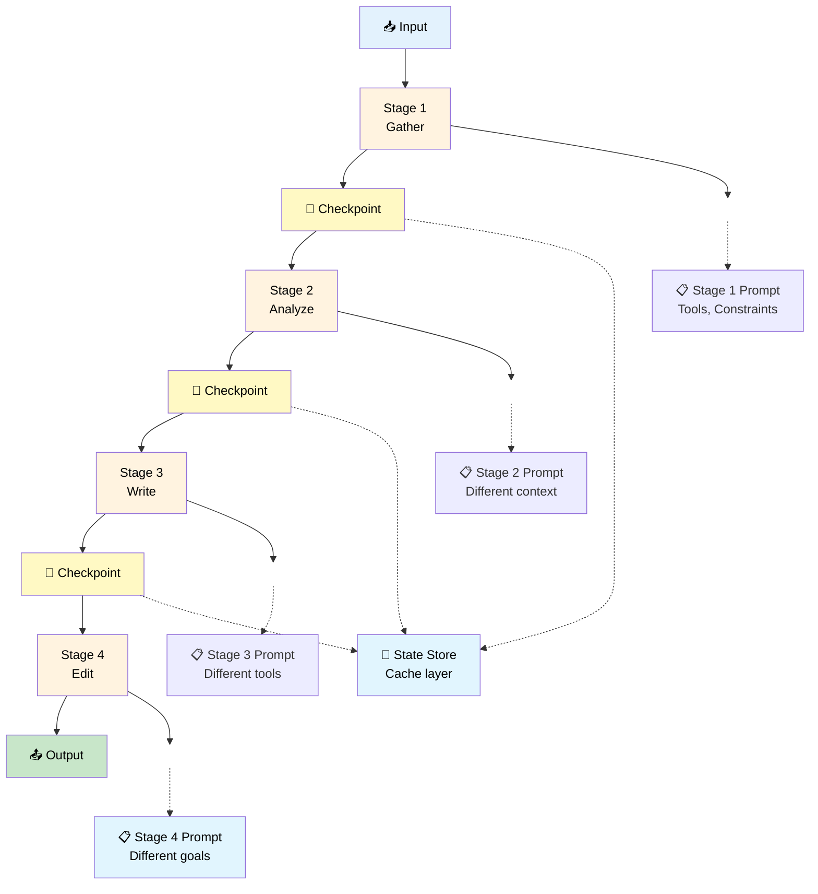
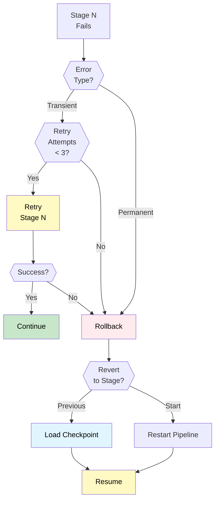

# 06 — Sequential Workflow

## Quick Summary

Some tasks are naturally sequential: gather data, analyze it, write it up, edit it. Each stage transforms the output from the previous one. Sequential workflows excel at these multi-stage, ordered tasks.

Use this when tasks have clear stages and each stage's output becomes the next stage's input. Don't use it when stages can run in parallel — that's a different pattern.

---

## Architecture



---

## When to Use

| Scenario | Why Sequential Works |
|----------|----------------------|
| **Multi-stage content generation** | Outline → draft → edit → publish |
| **Data pipeline** | Extract → transform → validate → load |
| **Research & writing** | Gather sources → synthesize → write → review |
| **Decision workflows** | Gather facts → analyze → recommend → escalate if needed |
| **Document processing** | Parse → classify → extract → format |
| **Testing & validation** | Run → collect results → analyze → report |
| **Clear stage ordering** | Output of stage N is input to stage N+1 |
| **Stages need different logic** | Each stage has different prompts, tools, constraints |

---

## When NOT to Use

| Scenario | Why Sequential Fails | Alternative |
|----------|---------------------|-------------|
| **Stages can run in parallel** | Serialization wastes time | Parallel Workers |
| **No clear stage ordering** | Stages depend on runtime logic | Orchestrator |
| **Single stage is sufficient** | Over-engineered for simple task | Single Agent |
| **Dynamic branching** | "If X, do A; if Y, do B" | Orchestrator |
| **Stages are highly coupled** | Each stage needs constant cross-talk | Reconsider stage design |
| **Context grows unbounded** | Pipeline explodes token budget after stage 3 | Add aggressive compression |
| **Stages frequently fail** | Error recovery across stages is complex | Simplify or break into independent jobs |

---

## Pipeline Design

A good sequential pipeline has three properties:

### 1. **Clear Stage Boundaries**

Each stage has:
- One clear input format
- One clear output format
- One responsibility
- One set of tools

```
Good:
Stage 1 (Gather): "Collect raw data from these sources"
  Input: topic string
  Output: structured list of facts
  Tools: [search, web_fetch, database_query]

Bad:
Stage 1 (Gather): "Collect data and also analyze it if it looks interesting"
  Input: topic string
  Output: either raw facts or analysis (ambiguous)
  Tools: [search, web_fetch, database_query, analysis_tool]
```

---

### 2. **Explicit State Passing**

Each stage receives:
- Output from the previous stage (always)
- Original input context (optional but recommended)
- Stage-specific instructions

```
Stage 2 Input:
{
  "original_request": "Write about AI ethics",
  "stage_1_output": [facts, sources, key_points],
  "stage_2_task": "Synthesize and identify themes"
}

Stage 2 Output:
{
  "themes": [theme1, theme2, ...],
  "outline": [...],
  "context_for_next_stage": {...}
}
```

---

### 3. **Checkpointing**

Save state between stages so you can:
- Resume from failure without rerunning prior stages
- Parallelize the same pipeline for different inputs
- Debug what stage 2 received
- Rerun stage 3 with different parameters

```
Checkpoint at each stage:
├─ Stage 1 output → cache
├─ Stage 2 output → cache
├─ Stage 3 output → cache
└─ Stage 4 output → final result

Resuming from stage 3 failure:
├─ Load checkpoint from stage 2
├─ Skip stages 1-2
├─ Retry stage 3
└─ Complete stages 4+
```

---

## Token Growth & Context Management

This is where sequential pipelines fail in production: context explodes.

```
Stage 1: 500 tokens output
Stage 2: Receives 500 + adds 1000 = 1500 total
Stage 3: Receives 1500 + adds 2000 = 3500 total
Stage 4: Receives 3500 + adds 3000 = 6500 total
Result: 6500 tokens of accumulated context

With 128K window: Acceptable
But if pipeline has 10 stages: Total grows to 20K+ tokens
```

**Compression strategies:**

| Strategy | When to Use | Cost |
|----------|------------|------|
| **Selective pass-through** | Keep only stage N output, drop N-1 | Fast, lossy |
| **Summarization** | Compress stage output at >70% token threshold | ~500ms per compress |
| **Segmented context** | Keep different sections, not everything | Moderate, effective |
| **External storage** | Save to database, reference by ID | Scalable, adds latency |

**Rule:** If context exceeds 50% of your window, compress immediately.

---

## Error Handling in Pipelines



**Failure recovery options:**

1. **Retry the failed stage** (transient errors only)
2. **Rollback to previous stage** (permanent errors, retry other approach)
3. **Restart entire pipeline** (if state is corrupted)
4. **Escalate to human** (if retries exhausted)

**Important:** Not all stages have the same failure cost:
- Stage 1 (gather) fails: Cheap to retry (5s, $0.001)
- Stage 3 (write) fails: Expensive to retry (30s, $0.02)
- Stage 4 (edit) fails: Could be catastrophic to stage 1 (start over)

---

## Resource Allocation Per Stage

Each stage should have independent budgets:

```
Stage 1 (Gather):
├─ Max iterations: 5 (lookup is deterministic)
├─ Max tokens: 1000 (facts are compressed)
├─ Timeout: 10s

Stage 2 (Analyze):
├─ Max iterations: 3 (synthesis is quick)
├─ Max tokens: 2000 (analysis is verbose)
├─ Timeout: 15s

Stage 3 (Write):
├─ Max iterations: 8 (writing is iterative)
├─ Max tokens: 4000 (content generation is token-heavy)
├─ Timeout: 30s

Stage 4 (Edit):
├─ Max iterations: 3 (editing is light)
├─ Max tokens: 2000 (refinement, not generation)
├─ Timeout: 10s

Total budget: 9000 tokens, 65s
```

**Why separate budgets?**
- Prevents one slow stage from blocking others
- Allows stages to fail fast if they're not making progress
- Makes debugging easier (know which stage burned tokens)

---

## Advantages

| Advantage | Impact |
|-----------|--------|
| **Clear stage responsibilities** | Easier to reason about behavior |
| **Can specialize each stage** | Stage 1 agent knows gathering, stage 3 knows writing |
| **Easier to test stages independently** | Test stage 3 with canned stage 2 output |
| **Recoverable from failures** | Checkpoints let you retry from the failure point |
| **Parallelizable inputs** | Process 100 requests through the same pipeline |
| **Observable per-stage** | Clear metrics for each stage |
| **Easier to update one stage** | Update writing prompt without touching gather logic |

---

## Trade-offs

| Trade-off | Impact | Mitigation |
|-----------|--------|-----------|
| **Total latency is sum of stages** | 4 stages × 2s each = 8s minimum | Parallelize where possible, optimize each stage |
| **Context accumulation** | Token budget grows with each stage | Compress at 70% threshold, don't keep full history |
| **More state to manage** | Checkpoints, intermediate outputs, error recovery | Centralize state store, versioning |
| **Error recovery complexity** | Rollback logic, retry policies, cascade failures | Test failure scenarios before production |
| **Harder to debug cross-stage issues** | Is it stage 2 receiving bad stage 1 output? | Log all checkpoints, make outputs inspectable |
| **More monitoring required** | Track metrics for each stage | Central dashboard per pipeline |

---

## Failure Modes

| Failure | Cause | Detection | Fix |
|---------|-------|-----------|-----|
| **Silent context truncation** | Context > window, model auto-truncates | Stage N produces incoherent output | Monitor context size, compress proactively |
| **Stage cascades** | Stage 1 error → stage 2 gets garbage → stage 3 fails | Multiple stages report errors | Validate stage output schema at checkpoints |
| **Token budget exhaustion** | Early stages consume too many tokens | Stage N gets incomplete context | Set per-stage budgets, measure token growth |
| **Checkpoint data loss** | Failure during checkpoint write | Retries fail ("checkpoint not found") | Use transactional writes, verify after save |
| **Forgetting original input** | Later stages don't know the original request | Stage 3 produces wrong type of output | Always pass original input through all stages |
| **Stage ordering assumption** | Code assumes stage 2 ran before stage 3 | Race condition (shouldn't happen in sequential) | Validate stage sequence in every checkpoint |
| **Timeout cascade** | Stage 1 takes 25s when limit is 30s, stage 2 gets 5s | Stage 2 times out immediately | Set realistic per-stage budgets before pipeline starts |

---

## Engineering Notes

> **Note 1: Checkpoint more than you think you need**
> Save state at every stage. Seems wasteful. Then production breaks and you realize you saved days of debugging.

> **Note 2: Compression is not optional**
> Token budgets explode with sequential pipelines. Implement compression before you need it, not after.

> **Note 3: Each stage owns its own budget**
> Global token budget kills debugging. "We spent 6000 tokens" tells you nothing. "Gather spent 500, Analyze spent 2000" tells you everything.

> **Note 4: Intermediate outputs are golden data**
> Don't delete checkpoints. Archive them. They're your debugging trail, your audit log, your way to understand what actually happened.

> **Note 5: Test rollback before shipping**
> Failure recovery sounds good until you actually test it and find out checkpoint loading is broken. Test this in staging.

---

## Common Mistakes

### ❌ **No Checkpointing**

"We'll just run the pipeline and save the final output." Stage 2 fails. Now you're rerunning stage 1 (which cost 10 seconds) to retry stage 2 (which takes 2 seconds).

**Fix:** Checkpoint after every stage. The storage cost is negligible compared to re-execution.

---

### ❌ **Losing Original Context**

Stage 1 receives the original request. Stage 2 receives stage 1 output. Stage 3 has no idea what the original request was, only what stage 2 produced.

**Result:** Stage 3 produces output that doesn't match the original intent because it never saw it.

**Fix:** Pass original input + all stage outputs through every checkpoint.

---

### ❌ **Unbounded Token Growth**

"Let's just pass everything forward." Stage 1 produces 500 tokens, stage 2 produces 1000 more, stage 3 produces 2000 more. By stage 4, you've accumulated 3500 tokens of history.

**Result:** Stage 5 gets only 1500 tokens of context because the window is nearly full.

**Fix:** Compress at 70% of context budget. Drop old stages if needed.

---

### ❌ **No Error Recovery Strategy**

Stage 3 fails. What now? Retry stage 3? Restart from stage 1? Roll back to stage 2?

**Result:** Engineers argue about the right behavior while the pipeline hangs.

**Fix:** Define error recovery policy before shipping. Test it.

---

### ❌ **Serializing Parallelizable Stages**

Stages 1-2 need to be sequential, but stages 3-4 are independent (could run in parallel). You run them sequentially anyway because the code is linear.

**Result:** 4-stage pipeline takes 8s when it could take 6s.

**Fix:** Identify independent stages. Run them in parallel, merge results.

---

### ❌ **One Global Budget**

"The whole pipeline gets 6000 tokens." Stage 1 uses 3000, stage 2 uses 2000, stage 3 gets 1000 and fails.

**Result:** You don't know which stage is the problem.

**Fix:** Per-stage budgets. Measure per-stage token usage.

---

### ❌ **Ignoring Stage-Specific Prompts**

All stages use the same generic prompt: "Do your job, output JSON."

**Result:** Stages produce misaligned outputs that don't compose well.

**Fix:** Each stage has its own tightly scoped system prompt, optimized for its specific task.

---

## Real-world Example: Research Report Generator

**Task:** Given a topic, generate a professional research report (outline → draft → cite → polish).

**Pipeline:**

```
Stage 1 (Research, 10s):
├─ Task: Gather sources and facts
├─ Tools: [web_search, academic_db, news_api]
├─ Output: {sources: [{url, title, summary}], key_facts: [...]}
├─ Token budget: 1000
└─ Max iterations: 5

Stage 2 (Synthesize, 15s):
├─ Task: Extract themes and create outline
├─ Input: facts from stage 1
├─ Output: {outline: [...], themes: [...], structure: [...]}
├─ Token budget: 2000
└─ Max iterations: 3

Stage 3 (Draft, 25s):
├─ Task: Write initial draft based on outline
├─ Input: outline + themes from stage 2
├─ Output: {draft: "full_text...", word_count: 2500}
├─ Token budget: 4000
└─ Max iterations: 5

Stage 4 (Cite, 10s):
├─ Task: Add citations and fact-check
├─ Input: draft + original sources from stage 1
├─ Output: {cited_draft: "full_text...", citations: [...]}
├─ Token budget: 2000
└─ Max iterations: 3

Stage 5 (Polish, 10s):
├─ Task: Final edit for tone and clarity
├─ Input: cited draft from stage 4
├─ Output: {final_report: "full_text..."}
├─ Token budget: 1500
└─ Max iterations: 2

Total: ~70 seconds, 10500 tokens
Cost: ~$0.05 per report
```

**Checkpoints:**
```
After Stage 1: raw_facts.json
After Stage 2: outline_and_themes.json
After Stage 3: draft.json
After Stage 4: cited_draft.json
After Stage 5: final_report.json (+ status)
```

**Error handling:**
```
If Stage 3 fails (draft quality issue):
├─ Retry stage 3 with different prompt
├─ If still fails: rollback to stage 2, try different outline
├─ If outline fails: rollback to stage 1, gather more sources

If Stage 4 fails (citation issue):
├─ Retry stage 4 (likely transient)
├─ Escalate if retries exhausted
```

**Results:**
- Average latency: 75s
- Success rate: 94% (one of five stages fails sometimes)
- Cost: $0.05/report
- Quality: 4.2/5 (citations sometimes missed, but content solid)

---

## Monitoring Per-Stage

```
Metrics per stage:

Stage X:
├─ Latency (p50, p95, p99)
├─ Token usage (distribution)
├─ Success rate (% completing)
├─ Error rate by type (transient vs. permanent)
├─ Retry count (alert if > 2 per request)
├─ Output schema violations (alert immediately)
└─ Context size received (alert if > 80% window)
```

---

## Best Practices

| Practice | Why |
|----------|-----|
| **Checkpoint after every stage** | Enables debugging, recovery, parallelization |
| **Compress context at 70% threshold** | Prevents token exhaustion mid-pipeline |
| **Pass original input through all stages** | Later stages need to know what was asked |
| **Per-stage resource budgets** | Enables fast failure, clear debugging |
| **Explicit error recovery policy** | No ambiguity about what happens on failure |
| **Test rollback before production** | You will need it. Test it first. |
| **Independent stage prompts** | Each stage optimized for its task |
| **Validate stage output schema** | Catch errors immediately, don't propagate |
| **Monitor per-stage metrics** | Know which stage is the bottleneck |
| **Parallelize independent stages** | Don't serialize unnecessarily |

---

## Summary

**Sequential workflows handle ordered, multi-stage tasks well.**

**Key design principles:**
- Clear stage boundaries and responsibilities
- Explicit state passing between stages
- Checkpointing at every stage (enables recovery)
- Compression strategy (prevent token explosion)
- Per-stage resource budgets (enable fast failure)
- Error recovery policy (defined before shipping)

**When it works:**
- Stages have clear inputs/outputs
- Stages can't run in parallel
- Total latency is acceptable
- Token growth is managed

**When to upgrade:**
- Stages need to run in parallel → [07 — Parallel Workers](07-parallel-workers.md)
- Workflow is conditionally branching → [08 — Orchestrator Workers](08-orchestrator-workers.md)
- Single stage works fine → [04 — Single Agent](04-single-agent.md)

→ [07 — Parallel Workers](07-parallel-workers.md)
