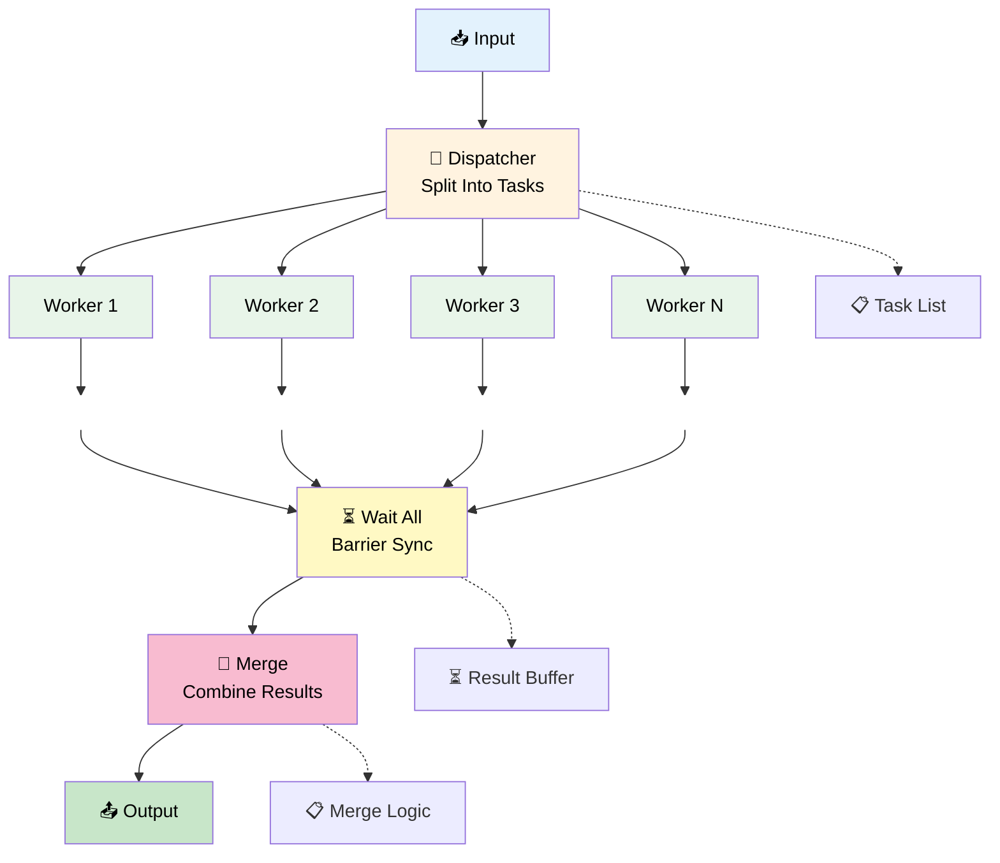
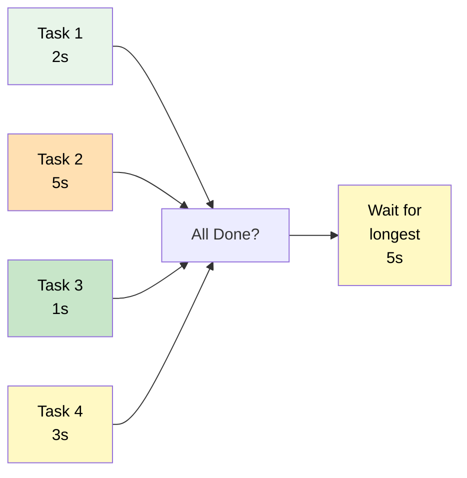
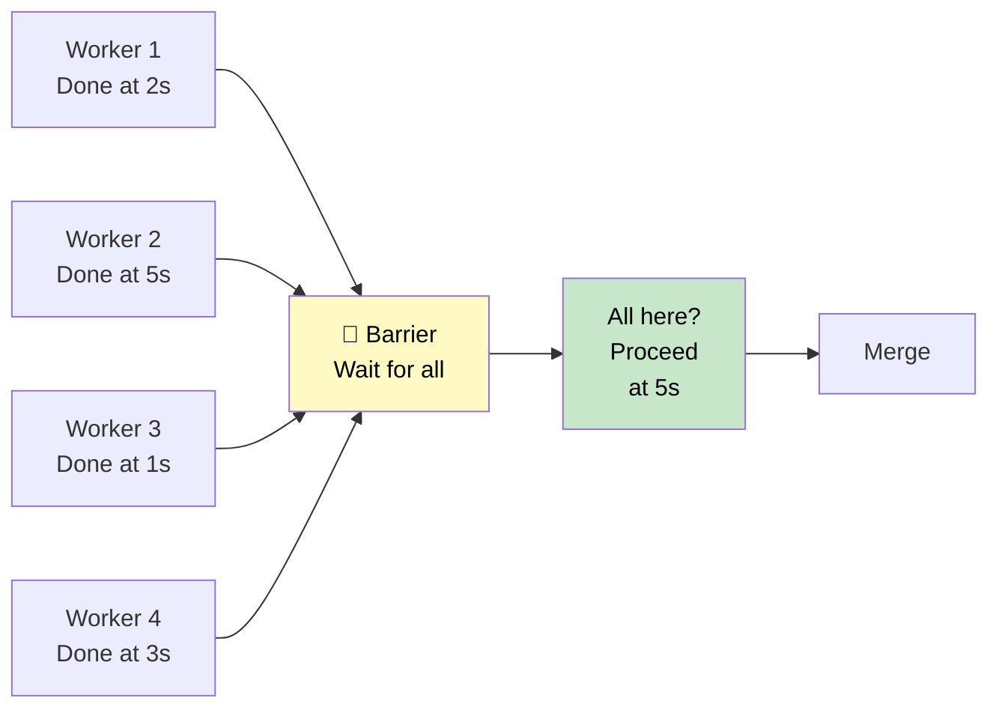

# 07 — Parallel Workers

## Quick Summary

When you have N independent tasks that don't depend on each other, run them in parallel instead of sequentially. Simple math: 4 tasks × 2s each = 8s serial, max(2s, 2s, 2s, 2s) = 2s parallel.

The tradeoff is orchestration complexity and the coordination problem. Not as hard as it looks if you design for it.

---

## Architecture



---

## When to Use

| Scenario | Why Parallel Works |
|----------|-------------------|
| **Independent research tasks** | Gather info on topic A, B, C in parallel |
| **Multiple data sources** | Query database, API, file system simultaneously |
| **A/B comparison** | Generate option A and B in parallel, return both |
| **Brainstorming session** | Generate 5 different ideas in parallel |
| **Duplicate checking** | Check source 1, 2, 3 for duplicates in parallel |
| **Fanout-then-merge** | Decompose problem, solve parts in parallel, combine |
| **Batch processing** | Process multiple requests simultaneously |
| **No cross-task dependencies** | Task A output doesn't feed task B input |

---

## When NOT to Use

| Scenario | Why Parallel Fails | Alternative |
|----------|-------------------|-------------|
| **Tasks are ordered** | B depends on A output | Sequential Workflow |
| **Single task is sufficient** | Over-engineered | Single Agent |
| **Tasks are tightly coupled** | Workers constantly communicate | Rethink decomposition |
| **Cost is primary concern** | N workers × 2s = N LLM calls | Sequential if time permits |
| **Latency doesn't matter** | Adding parallelism for no reason | Sequential is simpler |
| **Result merge is complex** | Combining N results is hard | Reconsider the task |
| **Failure of any task fails all** | One error stops everything | Plan for partial completion |
| **Resource limits** | Can't run 10 agents in parallel | Batch or queue tasks |

---

## Decomposition Strategies

Before you parallelize, you need tasks worth parallelizing.

### 1. **Data Parallelism**

Same task, different input.

```
Task: "Research AI agents"
Decompose by source:
├─ Worker 1: Search academic papers
├─ Worker 2: Search news articles
├─ Worker 3: Search GitHub projects
└─ Worker 4: Interview subject matter experts

Merge: Combine all findings into single report
```

**Best for:** Information gathering, multi-source queries  
**Decomposition cost:** Low (clearly defined inputs)

---

### 2. **Functional Decomposition**

Different tasks, same input.

```
Task: "Analyze a company"
Decompose by function:
├─ Worker 1: Financial analysis
├─ Worker 2: Market position analysis
├─ Worker 3: Management team analysis
└─ Worker 4: Technology stack analysis

Merge: Combine analyses into single assessment
```

**Best for:** Multi-perspective analysis, comprehensive reviews  
**Decomposition cost:** Medium (need to know all perspectives)

---

### 3. **Hybrid Decomposition**

Combine both.

```
Task: "Analyze top 5 companies in AI"
├─ Data parallelism: Company 1, 2, 3, 4, 5 (5 workers)
└─ Functional parallelism per company: Finance, market, tech (3 workers each)

Total: 15 concurrent tasks
Merge: Combine all into comparative analysis
```

**Best for:** Large problems with multiple dimensions  
**Decomposition cost:** High (complex merge logic)

---

## Load Balancing

Not all parallel tasks finish at the same time.



**Total latency = max(task 1, task 2, task 3, task 4) = 5s**

**Common strategy: Task prioritization**

```
High-priority task (fast):
├─ Task A: 500ms (results needed first)

Medium-priority tasks (medium):
├─ Task B: 2s
├─ Task C: 2s

Low-priority tasks (can wait):
├─ Task D: 5s
├─ Task E: 6s

Strategy: Start all. Return as soon as high+medium complete.
Return low-priority results async if available, else null.
```

---

## Work Distribution

### **Fixed Pool (Simplest)**

```
Workers = 4 (fixed)
Tasks = 100

Each worker gets ~25 tasks to process sequentially
Total time = ceil(100/4) × time_per_task = 25 × 2s = 50s
```

**Pros:** Simple, predictable  
**Cons:** One slow task blocks its worker's queue

---

### **Dynamic Queue (Better)**

```
Workers = 4 (fixed)
Tasks = 100 (in a queue)

Worker 1 takes task 1, runs it, takes task 5, runs it, ...
Worker 2 takes task 2, runs it, takes task 6, runs it, ...
...

If task 5 is slow, worker 1 still moves to task 20+ eventually
Load naturally balances
```

**Pros:** Handles variable task latency well  
**Cons:** Requires coordinated queue

---

### **Adaptive (Complex but Scalable)**

```
Monitor worker utilization:
├─ If any worker is idle: spawn new task
├─ If queue is empty: start merging results
├─ If new task arrives mid-execution: queue it

Scale up or down workers based on queue depth
```

**Pros:** Optimal resource utilization  
**Cons:** Complex, hard to debug

---

## Synchronization: The Barrier Problem



**Key insight:** You can't start merging until all workers finish. The slowest worker determines your total latency.

**Mitigation strategies:**

| Strategy | Use When |
|----------|----------|
| **Timeout instead of wait** | Some results okay to be missing |
| **Return partial results** | N-1 out of N results is acceptable |
| **Adaptive merge** | Merge results as they arrive (streaming) |
| **Timeout + retry** | Slow worker might be stuck, restart it |

---

## Failure Modes in Parallel Systems

Parallel execution introduces failure modes that sequential execution doesn't have.

```
Scenario 1: Worker 2 crashes
├─ Worker 1: done, waiting
├─ Worker 2: DEAD (error)
├─ Worker 3: done, waiting
├─ Worker 4: done, waiting
Result: Barrier never completes (deadlock-like state)

Scenario 2: Worker 2 hangs (slow)
├─ Worker 1: done at 2s
├─ Worker 2: stuck in infinite loop
├─ Worker 3: done at 1s
├─ Worker 4: done at 3s
Result: System waits 15 minutes for worker 2 timeout

Scenario 3: Worker 2 returns wrong result
├─ Workers 1, 3, 4: correct results
├─ Worker 2: hallucinated data
Result: Merge gets mixed good/bad data, produces garbage
```

| Failure | Detection | Fix |
|---------|-----------|-----|
| **Worker crashes** | No result after timeout | Retry worker, fallback, or partial merge |
| **Worker hangs** | Timeout reached | Kill worker, return partial results |
| **Wrong result** | Schema validation fails | Flag, quarantine, escalate |
| **Merge fails** | Merge logic error | Partial merge, return what's available |
| **All workers timeout** | All tasks timeout | Escalate, don't retry blindly |

---

## Result Merging

Merging is where most parallel systems break. Combining N results is not always straightforward.

### **Simple Concatenation**

```json
Worker 1 result: {facts: [fact1, fact2]}
Worker 2 result: {facts: [fact3, fact4]}
Worker 3 result: {facts: [fact5, fact6]}

Merge: {facts: [fact1-6]}
```

**Works for:** Lists, append operations  
**Breaks for:** Contradictory data, duplicates, ordering dependencies

---

### **Deduplication**

```json
Worker 1: {ideas: ["AI agents", "LLMs"]}
Worker 2: {ideas: ["AI agents", "transformers"]}
Worker 3: {ideas: ["reasoning", "planning"]}

Merge: {ideas: ["AI agents", "LLMs", "transformers", "reasoning", "planning"]}
```

**Works for:** Generating brainstorms, avoiding duplication  
**Fails for:** When duplicates are meaningful, order matters

---

### **Reconciliation**

```json
Worker 1 (source A): {market_size: "$10B"}
Worker 2 (source B): {market_size: "$12B"}
Worker 3 (source C): {market_size: "$11B"}

Merge: {market_size: "$11B (median)", sources: [A, B, C], confidence: 0.85}
```

**Works for:** Multiple sources, conflicting data  
**Fails for:** Non-numeric data, complex reasoning

---

### **Aggregation**

```
Worker 1: 50% positive sentiment
Worker 2: 60% positive sentiment
Worker 3: 55% positive sentiment

Merge: 55% (average)
```

**Works for:** Metrics, scores, votes  
**Fails for:** Categorical data, non-commutative operations

---

## Cost & Latency Model

```
Sequential: Task A (2s) → Task B (3s) → Task C (1s) = 6s total
Cost: 3 LLM calls

Parallel: Task A (2s) || Task B (3s) || Task C (1s) = max(2,3,1) = 3s total
Cost: 3 LLM calls (same)

Trade-off: 3s faster execution, same cost
But: Resource utilization is higher (3 workers running simultaneously)
```

**When to parallelize based on cost:**

```
Latency savings > resource cost?

4 workers × $0.001 per LLM call = $0.004
Saved time: 3s × hourly_rate

If hourly_rate > $0.004/3s (~$0.001/s), parallelize
Most use cases: YES (human time >> compute cost)
```

---

## Engineering Notes

> **Note 1: The barrier is your bottleneck**
> Parallel systems are only as fast as the slowest worker. Design for this. Consider timeout-based completion instead of "wait for all."

> **Note 2: Merging is 80% of the complexity**
> The parallelization part is easy. The merge logic is where bugs hide. Think through merge before you parallelize.

> **Note 3: Failures compound, not linearly**
> With 1 agent: 5% failure rate. With 4 agents: ~18% chance at least one fails. Plan for partial results.

> **Note 4: Worker independence is a hard requirement**
> If workers need to communicate, you don't have true parallelism. You have a distributed system, which is 10x harder.

> **Note 5: Timeout is your safety valve**
> Don't wait forever for the slowest worker. Set aggressive timeouts. Return partial results rather than no results.

---

## Common Mistakes

### ❌ **Waiting for All Workers Always**

"Worker 1 done, Worker 2 done, Worker 3 done... waiting for Worker 4 to finish."

Worker 4 hangs (infinite loop). System waits 5 minutes for timeout. User experience is terrible.

**Fix:** Use timeout-based completion. If 3/4 workers finish, return partial results after 5s instead of waiting forever.

---

### ❌ **Spawning Too Many Workers**

"100 tasks, let's spawn 100 workers in parallel."

Each LLM worker call costs tokens and API quota. You hit rate limits. System becomes slower than sequential.

**Fix:** Use a bounded pool (4-8 workers) with a queue. Let workers consume tasks from the queue.

---

### ❌ **Merging Without Validation**

Worker 1 returns `{result: "xyz"}`. Worker 2 returns `{result: [1,2,3]}` (wrong type). Merge concatenates them. Downstream code breaks.

**Fix:** Validate each worker result against schema. Reject invalid results, don't pass them to merge.

---

### ❌ **Not Detecting Cross-Task Dependencies**

You think tasks are independent. Task B actually needs output from Task A. Run them in parallel anyway. Task B produces garbage.

**Fix:** Explicitly model dependencies before parallelizing. If dependencies exist, use Sequential or Orchestrator.

---

### ❌ **Ignoring Worker Failure**

Worker 2 crashes. Merge logic assumes all N results exist, crashes when it doesn't find result[2].

**Result:** Entire system fails because one worker died.

**Fix:** Design merge for partial results. Always handle "missing result" case.

---

### ❌ **Timeout Too Aggressive**

Set timeout to 2s. Legitimate requests that take 2.1s time out. Retry logic kicks in, system gets slower.

**Fix:** Measure p95 latency per task. Set timeout at p95 + 20% buffer.

---

### ❌ **No Worker Affinity**

Every request creates 4 new workers. Initialization overhead dominates. Parallelization helps, but not much.

**Fix:** Use a persistent worker pool. Reuse workers across requests. Initialization happens once.

---

## Real-world Example: Multi-Perspective Analysis

**Task:** Analyze a startup from multiple angles (market, tech, team, traction).

**Sequential approach (bad):**
```
Market analysis: 5s
Tech assessment: 4s
Team evaluation: 3s
Traction review: 6s
Merge: 1s
Total: 19s
```

**Parallel approach (good):**
```
Worker 1 (market): 5s
Worker 2 (tech): 4s
Worker 3 (team): 3s
Worker 4 (traction): 6s
Max: 6s
Merge: 1s
Total: 7s

Speedup: 19s → 7s = 2.7x faster
```

**Implementation:**

```
Dispatcher: "Analyze the startup"
├─ Split into 4 tasks:
│  ├─ Market worker: "Analyze market fit, TAM, competition"
│  ├─ Tech worker: "Assess technology, architecture, scalability"
│  ├─ Team worker: "Evaluate founders, team composition, experience"
│  └─ Traction worker: "Review metrics, growth, revenue"
├─ Wait for all workers (timeout: 8s, fallback after 7s)
└─ Merge: Combine 4 perspectives into single assessment

Merge logic:
├─ Extract key points from each perspective
├─ Check for contradictions (flag if any)
├─ Synthesize into risk/opportunity assessment
└─ Format final report
```

**Results:**

```
Cost: 4 LLM calls (same as sequential)
Latency: 7s (vs. 19s sequential) — 63% faster
Quality: Better (multiple perspectives catch things single analyst misses)
```

---

## Monitoring Parallel Workloads

```
Per-worker metrics:
├─ Latency distribution (p50, p95, p99)
├─ Success rate
├─ Error rate by type
├─ Result size (tokens)
└─ Timeout rate (alert if > 1%)

System-level metrics:
├─ Barrier wait time (how long does slowest worker take?)
├─ Merge latency (time from last worker to merged result)
├─ Merge success rate (% of attempts that complete)
├─ Partial result rate (how often do we timeout early?)
└─ Worker pool utilization
```

---

## Best Practices

| Practice | Why |
|----------|-----|
| **Bounded worker pool** | Don't spawn workers = tasks. Use fixed pool with queue. |
| **Timeout + partial results** | Don't wait forever. Return best-effort results after timeout. |
| **Validate every result** | Wrong result from one worker can break merge. |
| **Explicit failure handling** | Plan for worker crash, timeout, wrong result. |
| **Clear merge logic** | Define exactly how results combine before implementing. |
| **Task independence verification** | Prove tasks don't depend on each other before parallelizing. |
| **Measure latency per worker** | Know which worker is slowest. Optimize that first. |
| **Persistent worker pool** | Reuse workers across requests, don't create new each time. |
| **Monitor barrier latency** | Your total latency = slowest worker. That's your optimization target. |
| **Test failure scenarios** | Test what happens when one worker crashes. Build for it. |

---

## Summary

**Parallel workers shine when you have independent tasks that can run simultaneously.**

**Key design principles:**
- Clear task decomposition (no cross-task dependencies)
- Bounded worker pool with task queue (don't spawn 1 worker per task)
- Timeout-based completion (don't wait forever for slowest worker)
- Explicit merge logic (define how results combine before coding)
- Failure handling (some workers will fail, design for partial results)

**When it works:**
- Tasks are truly independent
- Speedup > resource overhead
- Merge logic is well-defined

**When to avoid:**
- Sequential ordering required → Sequential Workflow
- Single task sufficient → Single Agent
- Merge is complex → Reconsider task decomposition

**Performance math:**
- Speedup = Sequential time / Parallel time
- But: Parallel time = max(task 1, task 2, ..., task N)
- Slowest worker determines your latency

→ [08 — Orchestrator Workers](08-orchestrator-workers.md)
