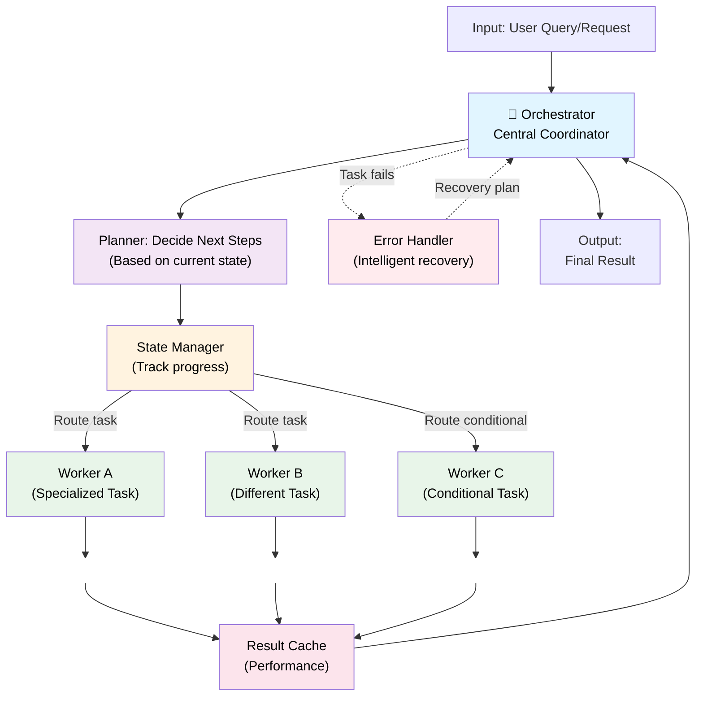

# 08 — Orchestrator Workers: Dynamic Workflows at Scale

## Quick Summary

An **Orchestrator** is a central coordinator that manages complex, heterogeneous workflows by dynamically routing work to specialized workers, managing state, and adapting execution at runtime. Unlike sequential workflows (fixed order) or parallel workers (independent tasks), the orchestrator pattern is for systems where:

- **Task order depends on runtime data** — Not known upfront
- **Tasks may have complex dependencies** — Task B only runs if Task A returns specific data
- **Some tasks are conditional** — "If analysis shows fraud, run verification; otherwise skip"
- **You need adaptive resource allocation** — Route expensive analysis to GPU workers, cheap lookups to CPU workers
- **Failures require intelligent recovery** — Not just "retry" but "use cached result or route to backup strategy"

**Cost model:** Same as sequential (sum of all tasks) + 10-30% overhead for coordination logic.

**When to reach for this:** You've outgrown the simpler patterns. Your workflow logic is dynamic, conditional, and requires runtime decisions. Orchestrators are **powerful but expensive**—they increase system complexity significantly.

---

## Architecture



**Key components:**
- **Orchestrator (coordinator)** — Single point of decision logic
- **Planner** — Determines next steps based on current state
- **State Manager** — Tracks completed tasks, results, decisions
- **Workers** — Specialized agents (can be LLMs, API calls, algorithms)
- **Result Cache** — Avoid re-running identical tasks
- **Error Handler** — Intelligent recovery (retry, alternative, degrade)

---

## When to Use Orchestrator Workers

### ✓ Use this pattern when:

1. **Workflow is dynamic** — Next step depends on previous results
   - Example: "Analyze sentiment → if negative, escalate to human; if positive, log and move on"
   - Contrast: Sequential workflow where order is always: Analyze → Log → Notify (static)

2. **Tasks have conditional dependencies** — Multiple potential execution paths
   - Example: Resume screening → if weak qualifications, auto-reject; if strong, send to hiring manager
   - Contrast: Parallel workers where all tasks run independently

3. **Some tasks are optional** — Conditional execution based on context
   - Example: Email classification → if spam confidence > 0.95, apply filters; if uncertain, queue for human review
   - Not every request needs every task

4. **You need intelligent failure recovery** — Not just "retry 3 times"
   - Example: API call fails → try cache → try backup API → degrade gracefully
   - Contrast: Single agent where failure = complete failure

5. **Resource constraints are heterogeneous** — Different tasks need different resources
   - Example: Route quick lookups to small model (fast, cheap); route complex reasoning to large model (slow, expensive)
   - Task routing is data-driven, not fixed

6. **You're managing multiple specialized agents** — Each expert in one domain
   - Example: Fraud detection has Legal Agent, Finance Agent, Risk Agent, all called conditionally
   - Contrast: Single agent trying to handle all domains

### ✗ Don't use this pattern when:

- **Workflow is simple and static** → Use sequential workflow
- **All tasks are truly independent** → Use parallel workers
- **You have one agent doing everything** → Use single agent
- **You need sub-100ms latency** — Orchestration adds 10-30% overhead
- **Coordination logic is complex enough to warrant its own testing** — Consider breaking into microservices instead

---

## Design Details: Core Concepts

### 1. Dynamic Planning (The Orchestrator's Job)

The orchestrator must answer: **"Given current state, what should I do next?"**

Three planning strategies:

#### Strategy A: Rule-Based Routing
```
if analysis.sentiment < -0.7:
    next_task = "escalate_to_human"
elif analysis.has_red_flags:
    next_task = "security_review"
else:
    next_task = "auto_approve"
```

**Pros:** Fast, predictable, no LLM cost  
**Cons:** Brittle as rules grow complex, requires maintenance

#### Strategy B: LLM-Based Routing
```
"Based on previous analysis: {previous_results}
What should we do next? Return: APPROVE | ESCALATE | DENY"
```

**Pros:** Flexible, handles nuance  
**Cons:** Every decision costs tokens, adds latency, non-deterministic (may change tomorrow)

#### Strategy C: Hybrid Routing (Recommended)
```
if confidence_score > 0.95:
    # High confidence: use rules
    next_task = rules[analysis.category]
elif confidence_score > 0.7:
    # Medium: ask LLM to route
    next_task = ask_llm_router(context)
else:
    # Low confidence: always escalate
    next_task = "human_review"
```

**Pros:** Cost-efficient, accurate, scales well  
**Cons:** Requires tuning confidence thresholds

**Engineering reality:** Start with rules. Only add LLM routing for the 10% of edge cases that break rules.

---

### 2. State Management (Critical)

The orchestrator must track:

| State | Purpose | Example |
|-------|---------|---------|
| **Completed Tasks** | Know what's done | `{"analyze": done, "verify": done, "approve": pending}` |
| **Task Results** | Know what we learned | `{"analysis": {...}, "verification": {...}}` |
| **Execution Path** | Know why we're here | `[analyze → suspicious → verify → escalate]` |
| **Attempt Count** | Know if we're looping | `{"verify": 1, "escalate": 1}` |
| **Time Budget** | Know when to stop | `elapsed: 8.2s / budget: 10s` |

**Checkpointing:** Save state after every task completes. If orchestrator crashes mid-workflow, resume from last checkpoint, not the beginning.

```python
# Pattern: Checkpoint after every task
result = run_task("verify")
checkpoint.save({
    "completed": [..., "verify"],
    "results": {..., "verify": result},
    "next_task": "escalate"
})
```

---

### 3. Worker Pool & Resource Allocation

You likely have different types of workers:

| Worker Type | Task | Model/Resource | Cost | Latency |
|-------------|------|----------------|------|---------|
| **Quick Lookup** | Cache hits, simple rules | CPU only | $0.001 | 100ms |
| **Standard Analysis** | Core logic | GPT-4o | $0.01 | 2s |
| **Deep Analysis** | Complex reasoning | GPT-4 Turbo | $0.05 | 8s |
| **Human Review** | Escalation | Human | $5 | 4 hours |

**Orchestrator's job:** Route task to cheapest worker that can do it.

```python
def route_task(task_type, context):
    if task_type == "classify" and len(context) < 500:
        return workers["quick_lookup"]  # $0.001
    elif task_type == "analyze":
        if context_complexity < 50:
            return workers["standard"]   # $0.01
        else:
            return workers["deep"]       # $0.05
    elif needs_human_judgment(context):
        return workers["human"]          # $5
```

**Key principle:** Minimize cost per task by matching task complexity to worker capability.

---

### 4. Failure Handling in Orchestrated Systems

Failures in orchestrators are more complex than in simpler patterns because tasks are interdependent.

**Four recovery strategies:**

#### A. Retry with Backoff
```
Task fails → wait 100ms → retry
If fails again → wait 500ms → retry
If fails 3x → escalate to human
```
Use for: Transient failures (network blip, temporary overload)

#### B. Fallback Path
```
Primary: "Use expensive GPT-4 analysis"
Fails? → Fallback: "Use cheaper GPT-4o with more retries"
Still fails? → Fallback: "Use rule-based classification"
```
Use for: When you have multiple strategies of decreasing sophistication

#### C. Degrade Gracefully
```
Need: ["fraud_score", "risk_level", "customer_history"]
Fraud service fails → Use cached fraud_score from 1 hour ago (vs. skip)
Continue with degraded confidence, adjust thresholds
```
Use for: When partial information is better than none

#### D. Alternative Workflow
```
Path A fails (detailed analysis impossible)
→ Switch to Path B (fast heuristic-based decision)
→ Flag for human review later
```
Use for: When you have fundamentally different approaches

**Implementation pattern:**
```python
def execute_with_recovery(task, orchestrator_state):
    try:
        return task.execute()
    except TransientError:
        return retry_with_backoff(task, max_retries=3)
    except CapabilityError:
        return fallback_task.execute()
    except Exception as e:
        orchestrator_state.flag_for_human_review(task, e)
        return degraded_result
```

---

## Advantages & Trade-Offs

### ✓ Advantages

| Advantage | Why It Matters | Example |
|-----------|---|---------|
| **Dynamic workflows** | Adapt execution to reality, not predefined plan | Fraud detection that escalates high-risk only |
| **Cost optimization** | Route to cheapest capable worker | Skip expensive LLM for simple cache hits |
| **Conditional execution** | Skip unnecessary tasks | Don't run verification if already confident |
| **Intelligent recovery** | Multiple strategies, not just retry | If API fails, use cache; if cache stale, use heuristic |
| **Observability** | Full trace of decisions and branching | "Task A triggered Task B because X, which led to Y" |
| **Heterogeneous workers** | Mix AI, APIs, humans, rules, algorithms | Use right tool for right job |

### ✗ Trade-Offs

| Trade-Off | Cost | Mitigation |
|-----------|------|-----------|
| **Complexity** | 3-5x more code than sequential | Document decision logic, test orchestration separately |
| **Latency overhead** | 10-30% for coordination | Use cached decisions for common paths |
| **Harder to test** | State + branching = explosion of cases | Test each branch independently, then orchestration logic |
| **Operational burden** | More things can fail (coordinator, workers, state manager) | Robust checkpointing, health checks on workers |
| **Debugging difficulty** | Non-deterministic routing hard to reproduce | Log decision reasoning, replay capability |

---

## Failure Modes

### 1. **Orchestrator Becomes Single Point of Failure**

**What happens:** Orchestrator service crashes → entire workflow stops

**Why it occurs:**
- Didn't design for orchestrator downtime
- Checkpoint only at end, not incremental
- No replica orchestrator

**Recovery:**
- Always checkpoint after every task
- Resume from last checkpoint on restart
- Use replica orchestrator with state sync
- Design workers to be independently callable (not tightly coupled to orchestrator)

---

### 2. **State Corruption / Inconsistency**

**What happens:** Orchestrator crashes mid-state-update → resumes with partial/corrupted state

**Why it occurs:**
- Non-atomic state updates
- Network failure during state sync
- Clock skew between checkpoints

**Recovery:**
- Use transactional state writes (atomic checkpoint)
- Version every state update
- Detect inconsistency on resume (e.g., task says "done" but result is missing)
- Rebuild state from task logs if needed

---

### 3. **Task Loops (Infinite Retry)**

**What happens:** Task fails → recover → same task fails again → recover → ...forever

**Why it occurs:**
- Recovery strategy is wrong for this failure mode
- Resource constraint not addressed (e.g., rate limit)
- Fundamental issue (bad input) not caught

**Recovery:**
- Track attempt count, stop at limit
- Classify failure: transient (retry) vs. permanent (don't retry)
- Monitor for loops: if same task tried 3+ times, escalate instead

---

### 4. **Stale Cache Leading to Wrong Decisions**

**What happens:** Orchestrator uses cached result from 2 hours ago → decisions based on outdated info

**Why it occurs:**
- Cache TTL too long
- Forgot cache is best-effort, not source of truth
- No cache invalidation triggers

**Recovery:**
- Add cache TTL per data type (analysis results: 5min, customer profile: 1h)
- Include cache age in decisions: "Use cache only if <10min old"
- Invalidate cache on critical events

---

### 5. **Worker Failure Cascades**

**What happens:** Worker fails → orchestrator retries → retries consume more resources → orchestrator eventually OOMs/timeouts

**Why it occurs:**
- No circuit breaker on failing workers
- Retry strategy too aggressive (exponential backoff missing)
- No health checks on workers

**Recovery:**
- Implement circuit breaker: after 5 failures in 60s, stop sending to this worker for 30s
- Exponential backoff: retry 1, 2, 4, 8, 16 seconds (don't retry immediately)
- Health check workers regularly, remove unhealthy from pool

---

### 6. **Deadlock in Task Dependencies**

**What happens:** Task A waits for Task B, Task B waits for Task A → nothing progresses

**Why it occurs:**
- Complex conditional logic created circular dependency
- Orchestrator doesn't detect cycles during planning

**Recovery:**
- Detect cycles before executing: build dependency graph, run cycle detection
- Add explicit timeout per task
- Implement deadlock detection: if no task completes in 30s, stop and escalate
- Simplify orchestration logic (circular logic usually means design is wrong)

---

## Engineering Notes

### Cost Model & Optimization

**Base cost** = sum of all task costs (same as sequential)  
**Overhead** = 10-30% for coordination (orchestration, state management, retries)

**Example:**
- Task A: $0.01
- Task B: $0.02
- Task C: $0.05
- **Sequential cost:** $0.08
- **Orchestrator cost:** $0.08 + ($0.08 × 0.15) = **$0.092**

**Where the 15% overhead goes:**
- 5% — Orchestration logic (routing decisions)
- 5% — Retries on failure (failed attempts re-run)
- 5% — Alternative paths (exploring multiple options)

**Optimizing:**
- Cache aggressive: if same query runs 3x/day, cache result for 6h
- Route to cheapest worker first
- Batch similar tasks (don't orchestrate 1000 independent tasks, batch them)

### Observability (Non-Negotiable)

Log **every decision** the orchestrator makes:

```
[14:23:45.123] Task: analyze | Confidence: 0.42 | Decision: route_to_llm | Duration: 150ms
[14:23:45.278] Task: verify | Input: {fraud_score: 0.89} | Decision: escalate | Duration: 2100ms
[14:23:47.401] Task: escalate | Type: human_review | Status: queued | Duration: 45ms
```

**Metrics to track:**
- Decision distribution (% auto-approve vs. escalate vs. deny)
- Task execution time per type
- Retry rate per task
- Failure rate per worker
- End-to-end workflow time

**Why:** When something breaks, you need to know why. Orchestrators are complex; observability is your debugging tool.

---

## Common Mistakes (War Stories)

### ❌ Mistake 1: "Too Much Routing to LLM"

**The story:** Team built orchestrator that called GPT-4 for every decision. "Let the model figure it out." Great for accuracy, terrible for cost.

**What happened:**
- Simple decision: "Is sentiment positive?" routed to $0.05 GPT-4 call
- Ran 1M requests/day: 1M × $0.05 = **$50k/day** just for routing
- Competitor with rules-based routing: 1M × $0.0001 = **$100/day**

**Lesson learned:** Use rules for 90% of cases. LLM only for edge cases.

---

### ❌ Mistake 2: "No Orchestrator Redundancy"

**The story:** Startup built orchestrator as single service. One failure = everything stops.

**What happened:**
- Orchestrator crashed at 2am
- All workflows blocked (200k pending requests)
- Recovery took 45min (found bug in state checkpoint code)
- Loss: $500k in unprocessed transactions

**Lesson learned:** Orchestrators must have hot-standby replicas and state sync.

---

### ❌ Mistake 3: "Infinite Retry Loops"

**The story:** Tried to be resilient by retrying failed tasks indefinitely.

**What happened:**
- One worker service went down for 30min
- Orchestrator kept retrying → consumed all quota → all other workflows slowed
- Simple fix: add max retry count, after 3 failures escalate instead
- This orchestrator consumed 40% of compute budget retrying a dead service

**Lesson learned:** Retries need limits and circuit breakers.

---

### ❌ Mistake 4: "State Management Forgotten"

**The story:** Orchestrator didn't checkpoint state. Lost task results on restart.

**What happened:**
- Workflow: [lookup → analyze → approve] took 5 minutes
- Orchestrator crashed during "approve" step
- On restart: lost results from lookup + analyze
- Had to start over: 5+ minute delay (vs. 10 second resume)
- For high-throughput system: repeated every day

**Lesson learned:** Checkpoint after every task. Resume from checkpoint on restart.

---

### ❌ Mistake 5: "Orchestration Logic Gets Complex, Untested"

**The story:** Orchestration routing logic grew to 500 lines of nested if-else. No test coverage.

**What happened:**
- New edge case: "If fraud_score > 0.9 AND customer_age < 6mo, escalate; but NOT if previous_transactions > 100"
- Complex condition had typo: `>` instead of `<`
- New legitimate customers got auto-rejected
- Bug went undetected for 2 weeks (low volume of new customers)

**Lesson learned:** Test orchestration logic separately. Use decision tables, not nested if-else.

---

## Real-World Example: Loan Approval Workflow

**Context:** Online lending platform. Need to approve/deny loans in 5-15 seconds. Some approvals can be instant (strong applicants), some need human review (edge cases).

**Workflow:**
1. **Load data** — Pull credit score, employment history, loan history ($0.001)
2. **Analyze** — Is this applicant risk profile acceptable? ($0.02)
3. **Route decision:**
   - **High confidence auto-approve** (score > 750, employment stable) → Approve instantly
   - **High confidence auto-deny** (score < 500, recent defaults) → Deny instantly
   - **Medium confidence** (550-750) → Route to underwriter ($5 human review)

**Orchestrator logic (pseudocode):**
```python
def loan_approval_orchestrator(application):
    state = {
        "completed": [],
        "results": {},
        "path": [],
        "attempt_count": {}
    }
    
    # Stage 1: Load data
    data = load_applicant_data(application.id)
    state["results"]["data"] = data
    checkpoint.save(state)
    
    # Stage 2: Analyze risk
    analysis = analyze_creditworthiness(data)
    state["results"]["analysis"] = analysis
    checkpoint.save(state)
    
    # Stage 3: Route decision
    if analysis["credit_score"] > 750 and analysis["employment_stable"]:
        state["path"].append("auto_approve")
        return approve_with_conditions(data, analysis)
    
    elif analysis["credit_score"] < 500 or analysis["recent_defaults"]:
        state["path"].append("auto_deny")
        return deny_application(analysis)
    
    else:
        state["path"].append("human_review")
        underwriter = route_to_available_underwriter()
        return request_human_review(application, underwriter)
```

**Cost breakdown:**
- Load data: $0.001
- Analyze: $0.02
- Route decision: $0.001 (rules-based, no LLM)
- **Total per application: $0.022**
- High confidence paths (80% of volume): **Skip human review, save $5**
- 1M applications/month: $22k analysis + ~$1M human review (~20% of apps)

**What happens on failure:**
- Analysis service fails → retry 2x → escalate to human review (safer than auto-approve)
- Underwriter assignment fails → queue in backup system → SLA tracked
- Checkpoint saves state → on orchestrator restart, resume from last task (no re-analysis)

---

## Best Practices

1. **Start simple, add orchestration only when needed**
   - Single agent first
   - Parallel workers if tasks are independent
   - Sequential if order is fixed
   - **Orchestrator only if workflow is truly dynamic**

2. **Use rule-based routing for 90%+ of decisions**
   - Reserve LLM-based routing for edge cases
   - Hybrid approach: rules first, escalate to LLM if uncertain

3. **Checkpoint religiously after every task**
   - On crash, resume from last checkpoint, not start
   - Include task results, attempt count, time budget in checkpoint
   - Make checkpoints atomic (all-or-nothing writes)

4. **Implement circuit breakers on all workers**
   - After 5 failures in 60s, stop sending to this worker for 30s
   - Prevents cascading failures
   - Auto-recovery: gradually resume after cooldown

5. **Test orchestration logic separately from task logic**
   - Decision tables for routing rules (test all branches)
   - Mock workers to test orchestrator behavior
   - Integration tests: full workflows end-to-end

6. **Monitor every decision point**
   - Log why each routing decision was made
   - Track decision distribution (% auto-approve vs. escalate)
   - Alert on unusual patterns (sudden shift in routing)

7. **Set explicit time budgets per workflow**
   - Total time allowed: 30 seconds
   - Per-task budget: analyze=5s, verify=3s, approve=2s
   - If any task overruns → escalate to faster fallback

8. **Design workers to be independently callable**
   - Don't couple to orchestrator
   - Worker should work via message queue, not tight RPC
   - Enables worker scaling independent of orchestrator

9. **Plan for orchestrator failure**
   - Hot-standby replica with state sync
   - Checkpoints in durable storage (not in-memory)
   - Graceful degradation: if orchestrator down, route to simpler pattern

10. **Document decision logic as decision tables, not prose**
    - Easier to test
    - Easier to maintain
    - Easier for new engineers to understand

---

## Summary

**Orchestrator Workers** are for when workflows are **dynamic, conditional, and require intelligent routing**. They enable:

- **Cost optimization** — Route to cheapest capable worker
- **Conditional execution** — Only run tasks that are necessary
- **Intelligent recovery** — Multiple strategies, not just "retry"
- **Complex workflows** — Mix of sequential, parallel, and conditional paths

**But they come with significant complexity:** state management, failure handling, observability, testing. **Only use when simpler patterns fail.**

**Decision framework:**
- 1 agent doing 1 task? → **Single Agent**
- N independent tasks? → **Parallel Workers**
- Fixed ordered stages? → **Sequential Workflow**
- Dynamic, conditional, heterogeneous? → **Orchestrator**
- Distributed, loosely coupled? → **Network Agents** (doc 09)

**Key principle:** Orchestrators are powerful precisely because they're complex. Respect that complexity. Invest in checkpointing, monitoring, and testing. Your future self (debugging at 2am) will thank you.

---

## Next Steps

→ Proceed to [09 — Network Agents](09-network-agents.md) to learn distributed patterns for loosely coupled agents.

→ Or jump to [10 — Memory & Context](10-memory.md) to understand how orchestrators manage long-running state.

→ Dive into [14 — Observability](14-observability.md) to master monitoring orchestrators in production.
