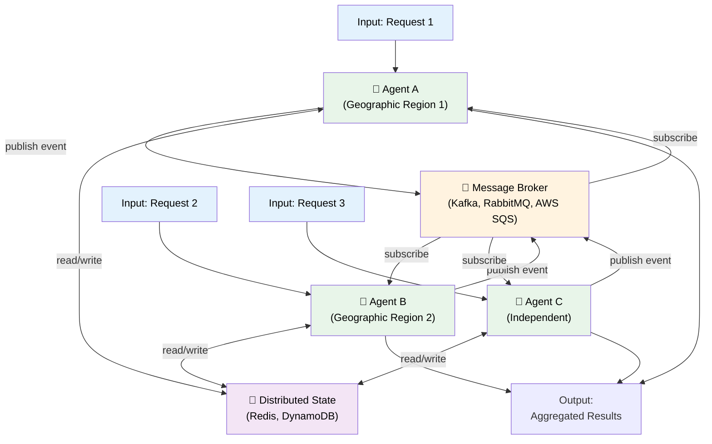

# 09 — Network Agents: Distributed & Loosely Coupled

## Quick Summary

**Network Agents** are independent agents that operate asynchronously, communicate via message passing, and coordinate without a central orchestrator. Each agent is:

- **Autonomous** — Runs independently, makes local decisions
- **Loosely coupled** — Communicates through messages, not direct function calls
- **Asynchronous** — Doesn't wait for responses synchronously
- **Distributed** — Can run on different machines, regions, or cloud providers

This pattern emerges when you need **scale beyond what one orchestrator can handle**, **resilience to single component failures**, or **geographic distribution**.

**Cost model:** Similar to orchestrator (sum of all tasks) but with network overhead (10-50% depending on message frequency).

**When to reach for this:** You've outgrown orchestrator patterns. Your system is geographically distributed, needs independent team ownership, or requires handling 1M+ concurrent workflows.

---

## Architecture



**Key components:**
- **Agents** — Independent decision makers
- **Message Broker** — Decouples agents (Kafka, RabbitMQ, SQS)
- **Distributed State** — Shared truth (Redis, DynamoDB, PostgreSQL)
- **No central orchestrator** — Each agent decides locally

---

## When to Use Network Agents

### ✓ Use this pattern when:

1. **Geographic distribution** — Agents in different regions/data centers
   - Example: EU compliance service runs in eu-central-1, US fraud service runs in us-east-1
   - Contrast: Orchestrator assumes shared latency/availability

2. **Horizontal scaling beyond one orchestrator** — Need 1M+ concurrent workflows
   - Example: Payment processor needs 10 independent agents (each handles 100k/sec)
   - Contrast: Single orchestrator becomes bottleneck at ~100k/sec

3. **Organizational decoupling** — Different teams own different agents
   - Example: Team A owns Fraud Detection Agent, Team B owns Compliance Agent
   - Contrast: Orchestrator implies single system, single team

4. **Independent failure domains** — One agent's failure shouldn't cascade
   - Example: EU fraud service goes down, US service keeps running
   - Contrast: Orchestrator failure stops everything

5. **Asynchronous, loosely coupled workflows** — No tight timing requirements
   - Example: "Analyze transaction, log to warehouse, notify team" (order doesn't matter)
   - Contrast: Sequential workflow where order is critical

6. **Multiple input sources** — Agents react to external events independently
   - Example: Agents consume from Kafka topics, act independently on each message
   - Contrast: Orchestrator pulls from one input queue

### ✗ Don't use this pattern when:

- **Sub-second end-to-end latency required** — Network overhead too high
- **Single data center** — Overhead of async messaging isn't justified
- **Workflow order is critical** — Use sequential or orchestrator instead
- **Team is small** — Operational complexity not worth it
- **You have tight consistency requirements** — Distributed state is eventual consistency

---

## Design Details: Core Concepts

### 1. Message Passing Model

Agents communicate by publishing and subscribing to events, not by calling each other directly.

**Event-based communication:**
```
Transaction received → Agent A publishes "transaction_analyzed"
                    → Agent B (subscriber) sees event → runs verification
                    → Agent B publishes "verification_complete"
                    → Agent A (subscriber) sees event → proceeds
```

**Advantages:**
- Agents don't know about each other (true decoupling)
- If Agent B is down, Agent A doesn't care (publishes anyway)
- Easy to add new agent: just subscribe to events

**Disadvantages:**
- Ordering not guaranteed (events may arrive out of order)
- Harder to debug ("Agent A is waiting for event from Agent B that never came")
- Requires global event schema agreement

**Broker choices:**

| Broker | Throughput | Ordering | Cost | Complexity |
|--------|-----------|----------|------|-----------|
| **Kafka** | 1M+/sec | Per partition | Managed $$$ | High |
| **RabbitMQ** | 100k/sec | Per queue | Self-hosted | Medium |
| **AWS SQS** | 300k/sec | No guarantee | Pay per msg | Low |
| **Redis Pub/Sub** | 500k/sec | No persistence | Low | Low |

**Engineer's reality:** Start with Kafka only if you need ordering guarantees. RabbitMQ or SQS for most cases.

---

### 2. Distributed State Management

With multiple agents, state must be shared. But shared state in distributed systems is hard.

**Challenge:** Agent A writes state, Agent B reads it. What if A crashes mid-write?

**Solution patterns:**

#### Pattern A: Eventually Consistent
```
Agent A writes: {"transaction_id": 123, "status": "analyzing"}
Agent B reads: {"transaction_id": 123, "status": "analyzing"}
(50ms later)
Agent A publishes: "analysis_complete" event
Agent B subscribes → reads updated state
```

**Use when:** Order doesn't matter, stale reads are acceptable, but consistency eventually converges.

#### Pattern B: Transactional Writes
```
Agent A: "Give me write lock on transaction 123"
        → Exclusive access, no one else can read/write
        → Do the work
        → Release lock
Agent B: "Give me write lock" → Waits until A releases
```

**Use when:** You need correctness guarantees. Trade-off: lower throughput (serialization).

#### Pattern C: State Sharding
```
Agent A owns transactions 1-50M
Agent B owns transactions 50M-100M
(No overlap, no coordination needed)
```

**Use when:** You can partition state by agent. Highest performance.

**Implementation reality:**
- **Eventually consistent:** Redis, DynamoDB (default)
- **Transactional:** PostgreSQL with distributed locks
- **Sharded:** Each agent owns separate database partition

---

### 3. Coordination Without Orchestrator

How do agents know what to do next without a central coordinator?

#### Strategy A: Event-Driven
Each agent reacts to events from message broker.
```
Agent: "On 'transaction_analyzed' event, run verification"
       (Broker publishes event → Agent wakes up → runs verification)
```

**Pros:** Simple, no coordinator needed  
**Cons:** Requires global event contract, hard to enforce order

#### Strategy B: Saga Pattern
Agents coordinate through a sequence of reversible steps.
```
Step 1: Agent A analyzes transaction (publishes "analyzed")
Step 2: Agent B verifies (publishes "verified") → if fails, publish "rollback"
Step 3: Agent A receives "rollback" → undo analysis
```

**Pros:** Can handle distributed transactions  
**Cons:** Complex to implement, need to code reversals

#### Strategy C: Leader Election
One agent becomes "coordinator" temporarily (leadership changes).
```
Agent A: "I'm taking leadership for transactions 1-50M"
Agent B: "I'm taking leadership for transactions 50M-100M"
(Using distributed consensus like etcd, Zookeeper)
```

**Pros:** Can have some central coordination without single point of failure  
**Cons:** Consensus overhead (10-50% latency hit)

---

### 4. Failure Modes in Distributed Systems

Distributed failures are categorized:

| Failure | Behavior | Example |
|---------|----------|---------|
| **Crash** | Component stops | Agent B service crashes |
| **Network partition** | Agent can't reach broker | Datacenter loses internet connectivity |
| **Byzantine** | Component sends wrong data | Agent A publishes corrupted state |
| **Cascading** | One failure triggers others | Agent A crashes → Agent B waits forever → times out → cascades |

**Failure you can handle:** Crash (restart it), network partition (wait for reconnect)

**Failure you can't handle:** Byzantine (assume it won't happen unless you use Byzantine consensus, which is slow)

---

## Advantages & Trade-Offs

### ✓ Advantages

| Advantage | Why It Matters | Example |
|-----------|---|---------|
| **Independent scaling** | Each agent scales independently | Fraud agent handles 10x more load, doesn't affect compliance agent |
| **Geographic distribution** | Low latency in each region | EU agent processes EU traffic locally |
| **Team autonomy** | Teams own their agents, not coupled | Team A deploys fraud changes without Team B coordination |
| **Failure isolation** | One agent's failure doesn't cascade | Fraud agent down, payment processing continues |
| **Flexible data flow** | Any agent can trigger any workflow | No fixed orchestrator logic |

### ✗ Trade-Offs

| Trade-Off | Cost | Mitigation |
|-----------|------|-----------|
| **Eventual consistency** | State may be stale/incorrect temporarily | Accept eventual consistency or use transactional writes |
| **Operational complexity** | Multiple moving parts, harder to debug | Invest in distributed tracing (Jaeger, DataDog) |
| **Network overhead** | 10-50% latency from message passing | Use local caching, batch messages |
| **Ordering not guaranteed** | Events may arrive out of order | Design workflows to be order-independent |
| **Harder to test** | Can't easily reproduce distributed failures | Chaos engineering, property-based testing |

---

## Failure Modes

### 1. **Message Loss**

**What happens:** Agent publishes event to broker, but broker crashes before persisting. Agent B never sees the event.

**Why it occurs:**
- Broker uses in-memory storage (no durability)
- Network failure between agent and broker

**Recovery:**
- Use durable brokers (Kafka persists to disk)
- Implement acknowledgment: broker acknowledges after writing to disk
- Dead letter queues: failed events go to quarantine for manual review

---

### 2. **Duplicate Message Processing**

**What happens:** Agent B receives "transaction_analyzed" event twice. Runs verification twice.

**Why it occurs:**
- Broker retries event after Agent B crashes mid-processing
- Network duplicates message
- Agent B crashes after reading but before acknowledging

**Recovery:**
- Idempotent processing: running twice = same result as running once
- Deduplication: track "processed message IDs", skip if already processed
- Exactly-once processing: harder, use distributed transactions (slower)

---

### 3. **Agents Out of Sync**

**What happens:** Agent A thinks state is "analyzing", Agent B thinks state is "verified". Both take conflicting actions.

**Why it occurs:**
- Eventual consistency: both agents read stale state
- No coordination: agents act independently
- Race condition: both agents update state simultaneously

**Recovery:**
- Version every state update: track "version 5 → version 6"
- Detect conflicts on read: "I expect version 5 but see version 4"
- Use last-write-wins or version vectors for conflict resolution

---

### 4. **Network Partition (Split Brain)**

**What happens:** Agent A and Agent B can't communicate but both think they're the "coordinator". Both make decisions, conflict when network heals.

**Why it occurs:**
- Datacenter network failure
- Regional isolation
- Broker unreachable

**Recovery:**
- Use quorum: coordinator needs consensus from majority of agents
- Fencing: once coordinator role lost, don't act as coordinator anymore
- Distributed consensus (Raft, Paxos): elect single coordinator safely

---

### 5. **Cascading Timeouts**

**What happens:** Agent A waits for event from Agent B (1s timeout). If Agent B is slow, Agent A times out. Then Agent A retries, creating more load on Agent B, making it even slower.

**Why it occurs:**
- No backpressure: Agent A keeps retrying
- Retry amplification: one slow agent causes many retries

**Recovery:**
- Exponential backoff with jitter: retry delays 1s, 2s, 4s, 8s + randomness
- Circuit breaker: after 5 timeouts, stop sending for 30s
- Bulkhead isolation: limit concurrent requests to Agent B

---

### 6. **Distributed Deadlock**

**What happens:** Agent A waits for Agent B, Agent B waits for Agent C, Agent C waits for Agent A. Nothing progresses.

**Why it occurs:**
- Complex inter-agent dependencies
- No global ordering

**Recovery:**
- Detect cycles in dependency graph before executing
- Add explicit timeout per workflow (total max time)
- Simplify: reduce inter-agent dependencies

---

## Engineering Notes

### Operational Complexity

Network agents are powerful but demand respect. Operational checklist:

**Deployment:**
- [ ] Message broker is replicated (at least 3 replicas)
- [ ] State store is replicated and backed up
- [ ] Health checks on all agents
- [ ] Circuit breakers between agents

**Monitoring:**
- [ ] Message throughput per agent
- [ ] Message latency (publish → consume)
- [ ] State consistency checks (periodic verification)
- [ ] Partition detection (agents can't reach broker?)

**Incident Response:**
- [ ] Procedure for broker recovery
- [ ] Procedure for state recovery (rollback, replay)
- [ ] Playbook for split-brain scenarios
- [ ] Runbook for agent restart

### Cost Model

**Base cost:** Sum of all agent tasks  
**Overhead breakdown:**
- 20% — Network/message passing
- 10% — Distributed state coordination
- 5% — Eventual consistency reconciliation

**Example:**
- Agent A: $0.02
- Agent B: $0.05
- Agent C: $0.01
- **Total tasks:** $0.08
- **Network agents cost:** $0.08 × 1.35 = **$0.108**

---

## Common Mistakes (War Stories)

### ❌ Mistake 1: "We'll Use Eventual Consistency for Everything"

**The story:** Team deployed network agents with eventual consistency. Fraud detection published "fraud_detected" event. Compliance agent subscribed but received state 2 seconds old.

**What happened:**
- Fraud score: 0.95 (high risk)
- Compliance agent received: 0.42 (outdated)
- Approved transaction that should have been blocked
- Fraud loss: $50k

**Lesson learned:** Eventual consistency is fine for recommendations, notifications, analytics. Not for financial transactions.

---

### ❌ Mistake 2: "No Message Persistence"

**The story:** Used Redis Pub/Sub because "it's fast". Broker crashed, lost all queued messages.

**What happened:**
- 1000 pending events in broker
- Broker crashed (power outage)
- On restart: all events gone
- 1000 transactions unprocessed
- Manual recovery: 8 hours of human work

**Lesson learned:** Use durable brokers (Kafka) for anything important.

---

### ❌ Mistake 3: "Agents Tightly Coupled to Event Schema"

**The story:** Event schema changed. Old agents didn't understand new format. New agents didn't understand old format.

**What happened:**
- Deploy Agent A (new code) → publishes "transaction": {..., "source": "mobile"}
- Agent B (old code) → expects "channel", not "source" → crashes parsing
- Rolling back Agent A breaks other systems
- Deployment took 6 hours to coordinate all teams

**Lesson learned:** Schema versioning is critical. Support multiple versions. Add deprecation warnings.

---

### ❌ Mistake 4: "No Circuit Breakers"

**The story:** Agent A makes requests to Agent B. Agent B's service degrades (slow). Agent A retries aggressively.

**What happened:**
- Agent B starts slow (5s responses)
- Agent A has 1s timeout, retries after timeout
- Each retry adds load to Agent B
- Agent B gets slower (now 10s)
- More retries, more load
- Agent B eventually crashes from overload
- Cascades to Agents C, D, E (all calling Agent B)

**Lesson learned:** Circuit breaker: after 5 failures in 60s, stop sending for 30s. Prevents cascades.

---

### ❌ Mistake 5: "No Idempotency"

**The story:** Message broker retried event after Agent B crashed mid-processing. Agent B processed same event twice.

**What happened:**
- Event: "send_notification", notification_id=123
- Agent B: sends email (first time)
- Agent B crashes
- Broker: retries event
- Agent B: sends email again (same email, different delivery)
- User receives duplicate notification

**Lesson learned:** Design all agent actions to be idempotent. Running twice = running once.

---

## Real-World Example: Multi-Region Payment Processing

**Context:** Payment platform processing 100k transactions/second across 3 regions (US, EU, APAC). Each region needs independent fraud detection but shared risk intelligence.

**System:**
- **US Agent** — Processes US transactions (50k/sec)
- **EU Agent** — Processes EU transactions (30k/sec)
- **APAC Agent** — Processes APAC transactions (20k/sec)
- **Risk Intelligence Agent** — Aggregates fraud patterns (global)

**Workflow:**
1. Transaction arrives in region
2. Regional Agent analyzes (rules + local ML model)
3. If fraud_score > 0.8 → escalate to Risk Agent
4. Risk Agent enriches (global patterns) → publishes result
5. Regional Agent receives enrichment → makes final decision

**Communication (event-driven):**
```
us_agent → "transaction_analyzed" 
           {id: 123, fraud_score: 0.75, region: US} 
        → Kafka topic: fraud_scores

eu_agent → "transaction_analyzed"
           {id: 124, fraud_score: 0.92, region: EU}
        → Kafka topic: fraud_scores

risk_agent subscribes to fraud_scores topic
If fraud_score > 0.8 → analyzes against global patterns
Publishes "risk_enriched" event with global context

Regional agents subscribe to "risk_enriched"
Make final approval/denial decision
```

**State (distributed, replicated):**
- **DynamoDB (replicated):** Transaction state (analyzing → verified → approved)
- **Redis (regional cache):** Recent fraud patterns (10 min TTL)
- **S3:** Audit trail (immutable)

**Failure scenarios:**
- US Agent crashes → EU + APAC continue (independent)
- Network partition (US ↔ Risk Agent) → US uses cached patterns, flags for manual review
- Risk Agent slow → US Agent uses timeout, makes local decision, logs for async enrichment

**Cost:**
- Base tasks: $0.10 (analysis per transaction)
- Network overhead: 15% = $0.115 per transaction
- 100k transactions/sec × $0.115 = **$11.5k/sec** operational cost

**Why this pattern?**
- Geographic distribution (low latency per region)
- Horizontal scaling (add agents independently)
- Failure isolation (one region's downtime doesn't affect others)
- Team autonomy (US team owns US agent, EU team owns EU agent)

---

## Best Practices

1. **Design agents to be order-independent**
   - Assume events may arrive out of order
   - Use idempotency: running twice = running once
   - Version state, detect conflicts

2. **Use durable message brokers**
   - Kafka for ordered, durable streams
   - RabbitMQ / SQS for standard messaging
   - Never use in-memory brokers for important data

3. **Implement circuit breakers between agents**
   - After N failures in T time, stop sending requests for X seconds
   - Prevents cascading failures
   - Monitor circuit breaker state

4. **Version your event schemas**
   - Support multiple schema versions simultaneously
   - Add deprecation warnings before removing old format
   - Document schema compatibility

5. **Make all agent operations idempotent**
   - Same input + same operation = same result (idempotent)
   - Enables safe retries and exactly-once semantics

6. **Monitor state consistency**
   - Regular verification: read state from multiple sources, compare
   - Alert on inconsistencies
   - Automated reconciliation where possible

7. **Use distributed tracing**
   - Trace messages through broker
   - Correlate events: transaction → events → agents
   - Debug why an event wasn't processed

8. **Plan for network partitions**
   - What happens when agents can't reach broker?
   - What happens when agents can't reach each other?
   - Test these scenarios regularly

9. **Implement backpressure**
   - Agents shouldn't process faster than they can store results
   - Slow consumers down, don't queue infinitely
   - Monitor queue depth, alert on growth

10. **Document agent contracts**
    - What events does this agent consume?
    - What events does it produce?
    - What state does it own?
    - What's the SLA (latency, availability)?

---

## Summary

**Network Agents** excel when you need **geographic distribution, horizontal scaling, or organizational decoupling**. They enable:

- **Independent scaling** — Each agent scales independently
- **Failure isolation** — One agent's failure doesn't cascade
- **Team autonomy** — Teams own their agents
- **High throughput** — Process 1M+ concurrent workflows

**But they demand operational sophistication:** distributed state management, eventual consistency, failure handling, observability.

**Use this pattern when:**
- Operating across multiple regions/datacenters
- Processing 100k+ concurrent workflows
- Need independent team ownership
- Agents can work asynchronously

**Don't use when:**
- Single datacenter
- Need strong consistency guarantees
- Sub-second latencies required
- Team is small

**Key principle:** Network agents are powerful tools for complex, distributed systems. Respect that complexity. Invest in operational infrastructure (monitoring, circuit breakers, distributed tracing) before pushing high throughput.

---

## Next Steps

→ Proceed to [10 — Memory](10-memory.md) to understand how agents persist and retrieve information.

→ Or jump to [14 — Observability](14-observability.md) to master monitoring distributed agents.

→ Continue to [16 — Enterprise Blueprint](16-enterprise-blueprint.md) for large-scale architecture combining multiple patterns.
