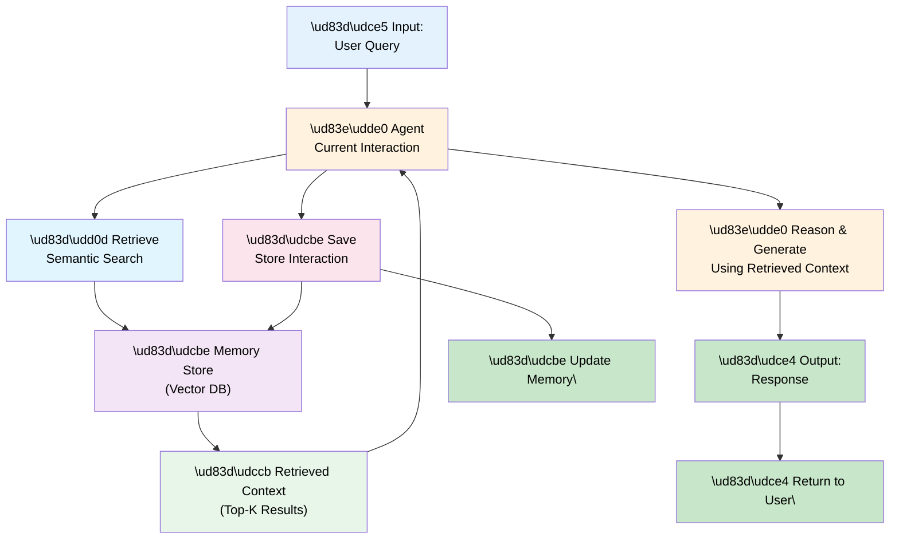

# 10 — Memory & Context: Persistence and Retrieval

## Quick Summary

An agent's memory is its lifeline. Without it, every request starts from scratch. With it, agents can learn, contextualize, and maintain state across conversations.

This document covers **how to architect memory systems** for agents: what information to persist, how to retrieve it efficiently, and what breaks when you don't design memory carefully.

**Cost model:** Persistent memory adds 5-20% overhead (storage + retrieval latency).

**When to focus on this:** You need multi-turn interactions, long-term learning, or context persistence across sessions.

---

## Memory Architecture



**Key components:**
- **Agent** — Makes decisions using current + retrieved memory
- **Memory Store** — Persistent storage (vector DB, database)
- **Retrieval** — Find relevant past information
- **Save** — Persist new information after each interaction

---

## Types of Memory

### 1. **Conversational Memory** (Short-term)
Last N messages in current conversation.

**Purpose:** Maintain context within a session  
**Storage:** In-memory or Redis  
**TTL:** Session lifetime (minutes to hours)  
**Retrieval:** Linear (just give me the last N)

```
User: "What's the capital of France?"
Agent: "Paris"
(stored in memory)

User: "What's its population?"
Agent: Retrieves "France" from memory, answers context-aware
```

**Pros:** Fast, always relevant, exact recall  
**Cons:** Limited capacity (context window), loses history on restart

---

### 2. **Semantic Memory** (Long-term)
Embeddings of past conversations + facts.

**Purpose:** Retrieve relevant information across conversations  
**Storage:** Vector DB (Pinecone, Weaviate, pgvector)  
**TTL:** Permanent (or configurable)  
**Retrieval:** Semantic search (find similar embeddings)

```
Past interaction: "User asked about Paris population: 2.2M"
(stored as embedding)

New session, user asks: "How many people live in Paris?"
Agent: Searches embeddings, finds similar past interaction, reuses answer
```

**Pros:** Scales to millions of interactions, finds relevant context  
**Cons:** Slower retrieval, embeddings can be lossy, cost per search

---

### 3. **Episodic Memory** (Structured)
Specific events/decisions from past.

**Purpose:** Recall specific moments, decisions, or outcomes  
**Storage:** Relational DB (PostgreSQL)  
**TTL:** Permanent  
**Retrieval:** Structured query (WHERE date > X AND user_id = Y)

```
"On 2024-06-15, user decided to cancel subscription"
"On 2024-06-20, user reactivated subscription"
"On 2024-06-25, complained about missing data"

Agent: Queries these facts, understands user's history
```

**Pros:** Exact retrieval, auditable, queryable  
**Cons:** Requires structure, manual design

---

### 4. **Procedural Memory** (Rules & Patterns)
How to do things (learned patterns, rules).

**Purpose:** Know which actions work for this user/scenario  
**Storage:** Rules engine or learned embeddings  
**TTL:** Long-term  
**Retrieval:** Pattern matching

```
Pattern: "When user complains about performance, offer cache upgrade"
Pattern: "When user has 3+ failed payments, add payment terms"

Agent: Matches current situation against learned patterns
```

**Pros:** Automated decision-making, learns from history  
**Cons:** Can perpetuate biases, requires supervision

---

## Context Window Optimization

The context window (how much information you can give an LLM) is your most valuable resource.

**Typical context windows:**
- GPT-4o: 128k tokens
- Claude 3.5 Sonnet: 200k tokens
- Open-source models: 4k-32k tokens

**How it gets filled:**
```
Context Budget: 128k tokens
├─ System prompt: 1k tokens (10 instructions)
├─ Tool definitions: 2k tokens (10 tools)
├─ Conversation history: 50k tokens (last 20 messages)
├─ Retrieved memory: 30k tokens (top-10 semantic search results)
├─ Current query: 1k tokens
└─ Space for reasoning: 44k tokens (42% buffer)
```

**Problem:** If you fill context 100%, the model has no room to reason.

**Solution: Smart Context Management**

#### Strategy 1: Sliding Window
Keep only last N messages.

```
Messages: [msg1, msg2, msg3, msg4, msg5]
Window size: 3
Keep: [msg3, msg4, msg5]
Drop: [msg1, msg2]
```

**Pros:** Simple, predictable  
**Cons:** Loses historical context

#### Strategy 2: Summarization
Summarize old messages into facts.

```
Messages: [msg1, msg2, msg3, msg4, msg5]
Summarize msg1-3: "User discussed pricing concerns, prefers annual billing"
Keep in context: [summary, msg4, msg5]
```

**Pros:** Retains meaning, compresses tokens  
**Cons:** One summarization LLM call, lossy

#### Strategy 3: Semantic Filtering
Only retrieve most relevant memory.

```
User query: "How do I cancel?"
Retrieve top-3 similar past interactions: [Q1, Q2, Q3]
Drop less relevant: [Q4, Q5, ...]
```

**Pros:** Stays focused, high signal-to-noise  
**Cons:** Misses edge cases

#### Strategy 4: Hierarchical Storage
Keep recent in RAM, old in DB.

```
Current session: In-memory (fast, full)
Last week: Redis (cached, summaries)
Older: Archival DB (slow, full records)

Agent: Query current → if miss, query Redis → if miss, query DB
```

**Pros:** Best of all worlds  
**Cons:** Complex implementation

---

## Memory Patterns

### Pattern 1: Retrieval-Augmented Generation (RAG)

**The Loop:**
```
User query → Search memory for relevant info → Inject into prompt → Generate response → Save to memory
```

**Implementation:**
```python
def answer_with_memory(query):
    # Retrieve relevant past interactions
    retrieved = memory_db.search(query, top_k=5)
    
    # Build prompt with retrieved context
    prompt = f"""
    User history:
    {retrieved}
    
    Current question: {query}
    """
    
    # Generate response
    response = agent.generate(prompt)
    
    # Save interaction
    memory_db.save({"query": query, "response": response})
    
    return response
```

**When to use:** Q&A, multi-turn conversations, customer support

---

### Pattern 2: Sliding Window with Compression

**The Loop:**
```
User message → Add to context window → If window full, compress oldest → Generate → Save
```

**Implementation:**
```python
context = []
MAX_TOKENS = 100_000
COMPRESSION_THRESHOLD = 0.7  # Compress at 70% capacity

def handle_message(msg):
    global context
    
    # Add message
    context.append(msg)
    tokens = count_tokens(context)
    
    # If window is too full, compress
    if tokens > MAX_TOKENS * COMPRESSION_THRESHOLD:
        to_compress = context[:-5]  # Compress all but last 5
        summary = agent.summarize(to_compress)
        context = [summary] + context[-5:]
    
    # Generate response
    response = agent.generate(context)
    context.append(response)
    
    return response
```

**When to use:** Long conversations, limited context window

---

### Pattern 3: Memory Sharding by Topic

**The idea:** Different agents own different memory domains.

```
Billing Agent owns: Payment history, subscription state, invoices
Support Agent owns: Tickets, complaints, resolutions
Product Agent owns: Feature requests, usage patterns

Coordinator: Routes to appropriate agent + its memory domain
```

**Benefit:** Each agent's memory is focused, retrieval is fast

---

### Pattern 4: Temporal Memory Decay

**The idea:** Recent events matter more than old ones.

```
Score = relevance * recency_weight

recency_weight = exp(-days_old / half_life)

Example:
- 1 day old: weight = 1.0
- 7 days old: weight = 0.5
- 30 days old: weight = 0.06
```

**Benefit:** Forgets stale information, stays current

---

## Failure Modes

### 1. **Context Pollution**

**What happens:** Memory fills with irrelevant information. Retrieval returns noise.

**Why it occurs:**
- No deduplication of similar facts
- No cleanup of contradictory information
- Infinite memory growth

**Recovery:**
- Regular deduplication (merge similar memories)
- Contradiction detection (flag conflicting facts)
- TTL on memories (auto-expire old data)
- Filtering on retrieval (only top-K most relevant)

---

### 2. **Hallucinated Memory**

**What happens:** Agent "remembers" something that never happened.

**Why it occurs:**
- Retrieved memory is actually LLM hallucination from training data
- User told agent something false, agent believes it
- Memory got corrupted

**Recovery:**
- Ground memories in explicit facts (structured storage)
- Verify retrieved memory against source documents
- Use confidence scores: only use high-confidence memories
- Ask user to confirm important facts

---

### 3. **Stale Memory Leading to Wrong Decisions**

**What happens:** Agent uses outdated information, makes wrong decision.

**Why it occurs:**
- No TTL on memory
- Memory not updated when facts change
- Retrieved outdated copy instead of current version

**Recovery:**
- Always check recency (include "last updated" timestamp)
- Refresh critical facts regularly
- Use temporal decay (old memories weight less)
- Periodic re-verification of key facts

---

### 4. **Memory Explosion**

**What happens:** Memory store grows unbounded, retrieval becomes slow.

**Why it occurs:**
- No cleanup policy
- Saving everything without deduplication
- Archival never happens

**Recovery:**
- Implement retention policies (e.g., keep 1 year)
- Summarize and compress old data
- Archive old data to cold storage
- Separate hot (active) from cold (archived) storage

---

### 5. **Privacy Breach Through Memory**

**What happens:** Sensitive information persisted, retrieved inappropriately.

**Why it occurs:**
- No access control on memory
- Memory not encrypted
- PII stored in retrieval embeddings

**Recovery:**
- Encrypt memory at rest and in transit
- Implement access control (user-scoped memory)
- PII redaction before storing
- Audit logging (who accessed what)

---

### 6. **Semantic Search Misses**

**What happens:** Relevant memory exists but semantic search doesn't find it.

**Why it occurs:**
- Different vocabulary (user asks "remove" but memory says "cancel")
- Embedding model weakness
- Top-K too small

**Recovery:**
- Use multiple retrieval strategies (semantic + keyword hybrid)
- Increase top-K (retrieve more, filter in agent)
- Fine-tune embedding model on domain
- Use synonyms and query expansion

---

## Engineering Notes

### Memory Budget Planning

**Persistent memory cost per user:**
```
Storage: 1MB per user × 1M users = 1TB = $100/month (S3)
Retrieval: 10 queries/day × 365 × 1M users = 3.6B queries/year
  - If using Pinecone: ~$0.08/million queries = $288/month
  - If using PostgreSQL: ~$50/month all-in

Total: $338/month for 1M users = $0.34 per user per month
```

**In-memory cache cost:**
```
Last 20 messages × 5KB avg × 1M concurrent users = 100GB RAM
RAM cost: $3-5 per GB = $300-500/month
```

**Decision point:** 
- Memory >= $1/user/month: Archive old data, implement retention policies
- Memory <= $0.01/user/month: Keep everything, don't optimize yet

---

### Observability Metrics

Track these to understand memory system health:

| Metric | Why It Matters | Alert If |
|--------|---|---|
| **Retrieval latency** | Slow retrieval = slow responses | > 500ms |
| **Hit rate** | % of queries with relevant memory | < 70% |
| **Memory size** | Growing unbounded? | Doubling every 2 weeks |
| **Deduplication ratio** | How much redundant info? | > 30% duplicates |
| **Precision** | % of retrieved memory actually used | < 50% |
| **Contradiction rate** | Conflicting facts in memory? | > 5% |

---

## Common Mistakes (War Stories)

### ❌ Mistake 1: "Save Everything"

**The story:** Team decided "memory is cheap, let's save every message". Didn't implement any deduplication.

**What happened:**
- After 1 year: 1 trillion messages stored
- Semantic search latency: 50ms → 2 seconds
- Cost: $50k/month for vector DB
- Quality: Retrieval returned mostly noise

**Lesson learned:** Implement retention policies and deduplication from day 1.

---

### ❌ Mistake 2: "No Access Control"

**The story:** Built memory system, forgot about privacy. User A's information was retrievable by User B.

**What happened:**
- User A had sensitive medical history in memory
- User B, in same conversation context, could see User A's history
- Privacy violation, compliance issue
- Lawsuit risk

**Lesson learned:** Always scope memory by user. Encrypt sensitive data. Add access control.

---

### ❌ Mistake 3: "Trust Retrieved Memory Blindly"

**The story:** Agent retrieved "user's favorite color is blue" from memory and used it without verification.

**What happened:**
- Memory was actually LLM hallucination (never in original data)
- Agent made decisions based on false information
- User was confused ("I never said my favorite color is blue")

**Lesson learned:** Verify critical facts. Use confidence scores. Don't trust memory without source.

---

### ❌ Mistake 4: "No TTL on Memory"

**The story:** Stored "user's account status: active" 18 months ago. Account was closed 12 months ago.

**What happened:**
- Agent retrieved "active" status from memory
- Allowed user to access closed account
- Security violation

**Lesson learned:** Always include "last updated" timestamp. Verify freshness before using.

---

### ❌ Mistake 5: "RAG Retrieval Too Small"

**The story:** Retrieved only top-1 most similar past interaction. It was slightly off.

**What happened:**
- User asked: "How do I change my password?"
- Retrieval found: "How do I change my username?" (top-1, most similar)
- Agent: "You can't change your password through this interface"
- User is frustrated

**Lesson learned:** Retrieve top-K (K >= 5), let agent pick best. Don't rely on top-1.

---

## Real-World Example: Customer Support Bot

**Context:** Support bot handling 10k conversations/day, needs to remember user history across weeks.

**Memory Architecture:**

1. **Conversational (In-memory, Redis):**
   - Current session: Last 20 messages (exact history)
   - TTL: 24 hours

2. **Semantic (Vector DB, Pinecone):**
   - All past support tickets (customer asks, agent resolved)
   - Embeddings: 3072-dim OpenAI
   - Retention: 2 years

3. **Episodic (PostgreSQL):**
   - Structured facts: account status, subscription tier, support tier
   - Retention: Permanent
   - Query: Last status update timestamp

**Flow:**

```
Customer message arrives:
├─ Retrieve last 5 similar tickets from Pinecone
├─ Query account status from PostgreSQL
├─ Load last 20 messages from Redis
├─ Agent uses all three to craft response
└─ Save:
   ├─ New message → Redis
   ├─ Ticket outcome → Pinecone
   ├─ Account change → PostgreSQL
```

**Cost:**
- Redis: $100/month (10k concurrent, sliding window)
- Pinecone: $200/month (10k/day × 365 × $0.05/million)
- PostgreSQL: $50/month
- **Total: $350/month for 10k/day = $0.035 per support ticket**

**Results:**
- Hit rate: 85% (agent finds relevant past ticket)
- Resolution rate: 92% (up from 78% without memory)
- CSAT: 4.2/5 (up from 3.1/5)

---

## Best Practices

1. **Always scope memory by user**
   - User A shouldn't see User B's memory
   - Implement row-level security (RLS) in DB

2. **Implement retention policies from day 1**
   - Don't save forever
   - Archive old data to cold storage
   - Implement TTL/expiration

3. **Version your memory schema**
   - Add "version" field to memory records
   - Support multiple schema versions during migration
   - Plan for evolution (user facts will change)

4. **Use hybrid retrieval (semantic + keyword)**
   - Semantic alone misses exact matches
   - Keyword alone misses semantic similarity
   - Combine both, rank by score

5. **Include source & confidence in memory**
   - Where did this come from? (user said / inferred / external source)
   - How confident? (high / medium / low)
   - Use this in decision-making

6. **Verify facts before using**
   - Critical decisions: verify memory against source
   - Non-critical: can use retrieved memory directly
   - Have agent ask user if unsure

7. **Monitor memory quality**
   - Track hit rate (retrieval finds relevant memory)
   - Track precision (retrieved memory actually used)
   - Alert on deduplication ratio > 30%

8. **Encrypt sensitive data**
   - At rest: encrypt in database
   - In transit: encrypt over network
   - In memory: minimize time in plaintext

9. **Design for forgetting**
   - Not all memory is useful forever
   - Old facts should decay in relevance
   - Implement temporal decay scoring

10. **Test memory failure modes**
    - What if memory is corrupted?
    - What if retrieval returns nothing?
    - What if user's memory conflicts?

---

## Summary

**Memory is critical infrastructure** for agents. It enables:

- **Multi-turn interactions** — Understand context across messages
- **Learning** — Reuse past solutions, avoid repeating mistakes
- **Personalization** — Tailor responses based on user history
- **Efficiency** — Fast retrieval beats re-computing from scratch

**But memory adds complexity:** privacy, consistency, cost, retrieval accuracy.

**Memory strategies:**
- Conversational (short-term) — Last N messages
- Semantic (long-term) — Embeddings of past interactions
- Episodic (structured) — Explicit facts in database
- Procedural (rules) — Learned patterns

**Key principle:** Memory is only useful if you can retrieve it accurately. Invest in retrieval quality, not just storage.

---

## Next Steps

→ Proceed to [11 — State Management](11-state-management.md) to learn how agents track changes.

→ Or jump to [14 — Observability](14-observability.md) to monitor memory in production.

→ Continue to [12 — Tool Calling](12-tool-calling.md) to integrate external systems with memory-aware agents.
