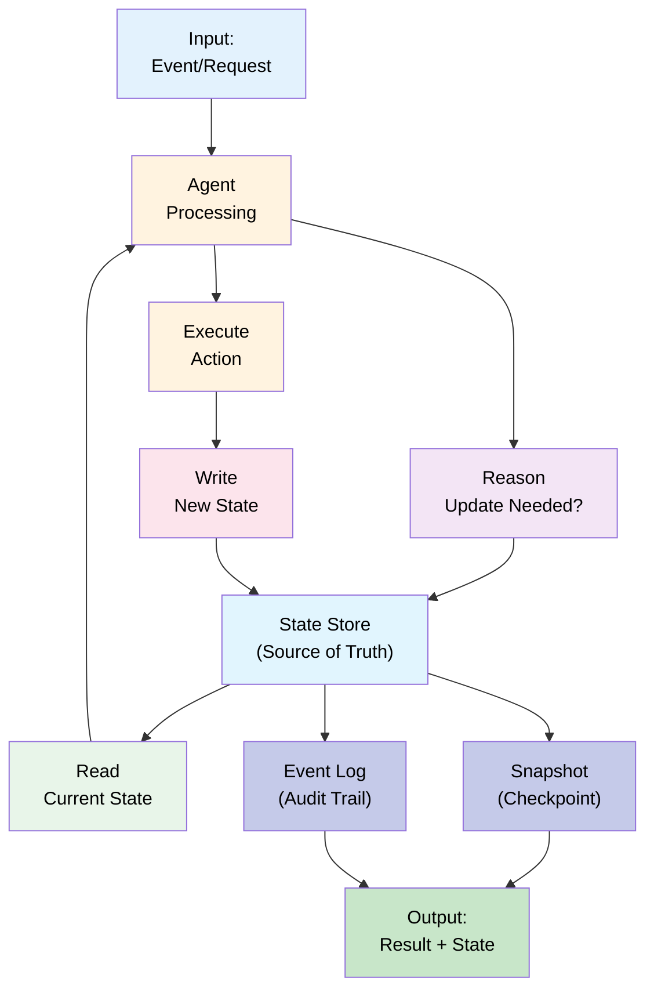

# 11 — State Management: Tracking Changes & Decisions

## Quick Summary

State is the ground truth of what's happening in an agent system. But state is hard:

- **When to update?** After every action? Every few actions? Only when "final"?
- **What to persist?** Everything, or just deltas?
- **How to recover?** If something crashes mid-transaction, where do we resume?
- **What about consistency?** Can state be stale? Inconsistent?

This document covers **how to design state systems** that are recoverable, observable, and consistent.

**Cost model:** State management adds 5-10% overhead (write latency + durability guarantees).

**When to focus on this:** Multi-step workflows, distributed agents, or high-reliability requirements.

---

## State Model



**Key components:**
- **State Store** — Single source of truth (database)
- **Read** — Load current state before acting
- **Write** — Persist changes after action
- **Snapshot** — Point-in-time checkpoint for fast recovery
- **Event Log** — Audit trail of all changes

---

## State Consistency Models

### Model 1: Strong Consistency
After write, all subsequent reads see the new value.

```
Time 0: Write "status: analyzing"
Time 1: Read returns "status: analyzing"
Time 2: Another agent reads "status: analyzing"

Guarantee: Always see latest state
```

**Pros:** Simple reasoning, no surprises  
**Cons:** Slower (requires distributed consensus), not always possible

**Use when:** Correctness > performance (financial transactions)

---

### Model 2: Eventual Consistency
Write completes, but reads may be stale temporarily.

```
Time 0: Write "status: complete"
Time 1: Read might return "status: analyzing" (stale)
Time 5: Read definitely returns "status: complete"

Guarantee: Eventually all reads see latest state
```

**Pros:** Fast, scales to any size  
**Cons:** Temporary inconsistency, must handle stale reads

**Use when:** Performance > immediate consistency (notifications, analytics)

---

### Model 3: Causal Consistency
Causally related operations see each other, unrelated may be out of order.

```
User's operations:
1. Create document
2. Edit document

Guarantee: If I see "document exists", I definitely see my edits

Unrelated operations (different users) may be out of order
```

**Pros:** Balances consistency and performance  
**Cons:** Harder to implement, requires versioning

**Use when:** User-scoped consistency needed (typical SaaS)

---

## State Management Strategies

### Strategy 1: Event Sourcing
Store only events (immutable changes). Derive state from replaying events.

```
Events:
├─ 2024-06-29 10:00:00 "TransactionCreated" {id: 123, amount: $100}
├─ 2024-06-29 10:00:15 "TransactionAnalyzed" {id: 123, fraud_score: 0.8}
├─ 2024-06-29 10:00:20 "TransactionEscalated" {id: 123, reason: "high_fraud"}

Current state: Replay all events → {status: "escalated", fraud_score: 0.8}
```

**Pros:**
- Complete audit trail (why we're here, not just where)
- Can replay history (debug, audit, time travel)
- Append-only (no complex transactions)

**Cons:**
- Slow (replay all events for every read)
- State derivation can be expensive
- More storage (all events forever)

**Use when:** Audit trail is critical (financial, compliance)

---

### Strategy 2: Snapshot + Delta Log
Store full state snapshot periodically, delta log in between.

```
Snapshot @ T0: {status: "analyzing", progress: 0.5}
Delta log @ T0→T1:
├─ progress: 0.5 → 0.7
├─ progress: 0.7 → 0.9
├─ status: "analyzing" → "complete"

Current state: Load latest snapshot, apply deltas
```

**Pros:**
- Fast reads (no replay)
- Compact (compress old deltas)
- Good audit trail

**Cons:**
- Requires snapshot + delta coordination
- Deltas must be idempotent

**Use when:** Balance of audit trail and performance

---

### Strategy 3: Last-Write-Wins
Overwrite state completely, keep only latest.

```
Time 0: {status: "analyzing", fraud_score: 0.5}
Time 1: {status: "complete", fraud_score: 0.8}  ← overwrites previous

Current state: Just read latest value
```

**Pros:**
- Fastest reads/writes
- Simplest implementation
- No historical data (minimal storage)

**Cons:**
- No audit trail
- Can't recover old state
- Lost data on overwrites

**Use when:** Performance critical, audit not needed

---

### Strategy 4: Versioned State
Keep multiple versions, allow rollback.

```
Version 1: {status: "analyzing", progress: 0.0}
Version 2: {status: "analyzing", progress: 0.5}
Version 3: {status: "complete", progress: 1.0}

Rollback: Use version 2 if version 3 is bad
```

**Pros:**
- Can undo bad state
- Time-travel debugging
- Safe deployments (can rollback)

**Cons:**
- More storage (multiple versions)
- Coordination needed for rollbacks
- Stale replicas possible

**Use when:** Correctness critical, safe recovery needed

---

## Failure Modes

### 1. **Lost Update**

**What happens:** Two agents update state simultaneously, one update is lost.

```
Initial: counter = 0

Agent A: Read 0 → Write 1
Agent B: Read 0 → Write 1 (overwrites A's update)

Result: counter = 1 (should be 2)
```

**Recovery:**
- Use optimistic locking (version check): "I expect version 5, if you have 6, fail"
- Use pessimistic locking (exclusive lock): Agent A locks counter until done
- Use atomic operations (increment is atomic, no intermediate state)

---

### 2. **Stale State Leading to Wrong Decision**

**What happens:** Agent reads state that's out of date, makes wrong choice.

**Why it occurs:**
- Eventual consistency: replica hasn't caught up
- Long operation: state changed while agent was working
- Cache: cached value not invalidated

**Recovery:**
- Read consistency guarantees (strong reads when needed)
- Verify state hasn't changed before acting (read → check → act atomically)
- Refresh before critical decisions
- Include timestamps: "state as of T, is this still valid?"

---

### 3. **Orphaned State**

**What happens:** Agent crashes mid-state-update. Left in bad state.

**Why it occurs:**
- No transactional guarantees
- Write happens, but response lost
- Partial writes (some fields updated, others not)

**Recovery:**
- Transactions (all-or-nothing writes)
- Idempotent updates (same update twice = same result)
- Recovery check: "Is this state valid?" → if not, rollback
- Checkpointing: Save state before risky operation

---

### 4. **State Explosion**

**What happens:** State object grows unbounded, performance degrades.

**Why it occurs:**
- Append-only without cleanup
- No archival of old data
- Nesting (object contains list of objects, contains lists...)

**Recovery:**
- Retention policies (keep 1 year of history)
- Archival (old state → cold storage)
- Compression (roll up small changes into single state)
- Separate hot (active) from cold (historical) storage

---

### 5. **Distributed State Inconsistency**

**What happens:** Different replicas have different state.

**Why it occurs:**
- Network partition (replica A gets update, replica B doesn't)
- Eventual consistency (replicas eventually converge, but not now)
- Conflict (two agents updated same field to different values)

**Recovery:**
- Quorum (majority consensus before commit)
- Conflict resolution (last-write-wins, or application-specific)
- Anti-entropy (periodic sync to detect+fix divergence)
- Version vectors (track causality to detect conflicts)

---

### 6. **State Corruption**

**What happens:** State data is malformed, unparseable, or invalid.

**Why it occurs:**
- Bug in state serialization
- Partial write (power failure mid-write)
- Storage failure
- Incorrect state transition

**Recovery:**
- Validation on read: Parse state, check validity. Fail loudly if invalid.
- Atomic writes: Write to temp file, rename atomically.
- Checksums: Detect corruption, trigger recovery
- Rollback: If state invalid, use previous valid snapshot

---

## State Design Patterns

### Pattern 1: State Machine

Define allowed transitions explicitly.

```
States: [pending, analyzing, verified, approved, denied]

Allowed transitions:
pending → analyzing
analyzing → verified OR denied
verified → approved
denied → final (no recovery)

Invalid: denied → analyzing (can't retry)
```

**Benefits:** Clear what's allowed, catch invalid transitions

```python
def transition_state(current, new):
    allowed = {
        "pending": ["analyzing"],
        "analyzing": ["verified", "denied"],
        "verified": ["approved"],
        "denied": []
    }
    if new not in allowed.get(current, []):
        raise ValueError(f"Can't go from {current} to {new}")
    return new
```

---

### Pattern 2: State Versioning

Every update increments version. Use this to detect stale reads.

```
Write: Update state_v2 = {...}, version = 2

Read: Get state_v1 with version = 1
Agent: "Version 1, but current is 2. State is stale!"
→ Refresh and retry
```

**Benefits:** Detect staleness, prevent using outdated state

---

### Pattern 3: Soft Delete

Mark as deleted but don't actually delete. Keep history.

```
Before delete: {id: 123, status: "active"}
After delete: {id: 123, status: "deleted", deleted_at: "2024-06-29T10:00:00Z"}

Query: SELECT * WHERE status != "deleted"
Audit: SELECT * (including deleted items)
```

**Benefits:** Keep audit trail, can undelete, recover accidentally deleted

---

### Pattern 4: State Snapshots for Recovery

Periodically save full state. On crash, resume from snapshot + deltas.

```
Snapshot @ T0: {progress: 0.0, completed_tasks: []}
Work from T0 → T1: Complete task 1, 2, 3
Crash!

Recovery: Load snapshot + replay deltas = Full state
No need to re-process tasks 1, 2, 3
```

**Benefits:** Fast recovery, don't lose work

---

## Best Practices

1. **Make state transitions explicit**
   - Use state machines to define allowed transitions
   - Fail loudly on invalid transitions
   - Document state diagram

2. **Choose consistency model based on use case**
   - Financial transactions: Strong
   - Social media likes: Eventual
   - SaaS workflows: Causal

3. **Version every state change**
   - Include version number in state
   - Use for conflict detection and staleness checks
   - Increment atomically with state update

4. **Implement checksums/validation**
   - Validate on read: catch corrupted state
   - Validate on write: catch invalid transitions
   - Fail early rather than propagate corruption

5. **Plan for recovery from failures**
   - Snapshots for checkpoint recovery
   - Event log for replay/audit
   - Rollback strategy if state is bad

6. **Use idempotent operations**
   - Running twice = running once
   - Safe to retry without side effects
   - Enables recovery without transaction complexity

7. **Monitor state health**
   - Alert on invalid state transitions
   - Track state distribution (% in each state)
   - Monitor staleness (max time since write to read)

8. **Implement proper locking**
   - Pessimistic (exclusive lock) for correctness critical
   - Optimistic (version check) for high throughput
   - Avoid deadlocks (acquire locks in order, timeout)

9. **Design for observability**
   - Log every state transition with timestamp, actor, reason
   - Include state version in logs
   - Make state changes queryable (what changed, when, by whom)

10. **Separate business logic from state management**
    - State transitions shouldn't contain business logic
    - Business logic reads state, proposes transitions
    - State layer validates, applies, persists

---

## Real-World Example: Workflow State Management

**Context:** Loan approval workflow. Loan passes through 5 states: applied → analyzed → underwritten → approved/denied.

**State Definition:**
```python
class LoanState:
    id: str                    # Immutable: loan ID
    status: str               # Mutable: current state
    version: int              # Mutable: increment on every change
    created_at: datetime      # Immutable: when created
    updated_at: datetime      # Mutable: when last updated
    analysis_result: dict     # Results from analysis stage
    underwriter_notes: str    # Notes from underwriter
    decision_reason: str      # Why approved/denied
```

**State Transitions:**
```
applied → (failed validation) → denied
applied → (passed validation) → analyzed
analyzed → (flagged) → escalated
analyzed → (passed) → underwritten
underwritten → (approved) → approved
underwritten → (denied) → denied
escalated → (resolved) → underwritten OR denied
```

**Write Pattern (Transactional):**
```python
def transition_loan(loan_id, new_status):
    # 1. Read current state
    current = db.read(loan_id)
    
    # 2. Validate transition
    if new_status not in ALLOWED[current.status]:
        raise ValueError(f"Can't transition {current.status} → {new_status}")
    
    # 3. Update state
    new_state = LoanState(
        id=current.id,
        status=new_status,
        version=current.version + 1,
        updated_at=now()
    )
    
    # 4. Write atomically
    # (only succeeds if version still == current.version)
    db.write(new_state, expected_version=current.version)
    
    # 5. Log the transition
    audit_log.write({
        "loan_id": loan_id,
        "from": current.status,
        "to": new_state,
        "timestamp": now(),
        "actor": current_actor()
    })
```

**Recovery Pattern:**
```python
def resume_workflow(loan_id):
    # 1. Load current state
    state = db.read(loan_id)
    
    # 2. Check if state is incomplete
    if state.status == "analyzing" and state.updated_at < (now() - 1_hour):
        # Stale: re-run analysis
        state = analyze_loan(state)
    
    # 3. Continue from current state
    if state.status == "analyzed":
        underwriter = assign_underwriter()
        state = transition_loan(state, "underwritten")
    
    return state
```

**Results:**
- Audit trail: Every transition logged, queryable
- Recovery: Resume from last checkpoint, no lost work
- Consistency: Version checking prevents lost updates
- Observability: Know exactly which state each loan is in

---

## Summary

**State management is critical infrastructure.** It determines whether your system:
- Can recover from failures
- Is auditable and compliant
- Stays consistent under concurrency
- Supports rollback and time-travel debugging

**Key patterns:**
- **Event Sourcing** — Complete audit trail, replay history
- **Snapshot + Delta** — Balance audit and performance
- **Last-Write-Wins** — Fast but no history
- **Versioned** — Safe rollback and conflict detection

**Consistency models:**
- **Strong** — Correctness critical (financial)
- **Eventual** — Performance critical (social media)
- **Causal** — User-scoped consistency (SaaS)

**Key principle:** State is only useful if you can recover from failures. Design for recoverability from day 1.

---

## Next Steps

→ Proceed to [12 — Tool Calling](12-tool-calling.md) to learn how agents interact with external systems.

→ Or jump to [14 — Observability](14-observability.md) to instrument state changes.

→ Continue to [13 — Production Runtime](13-production-runtime.md) to deploy state-managed systems.
