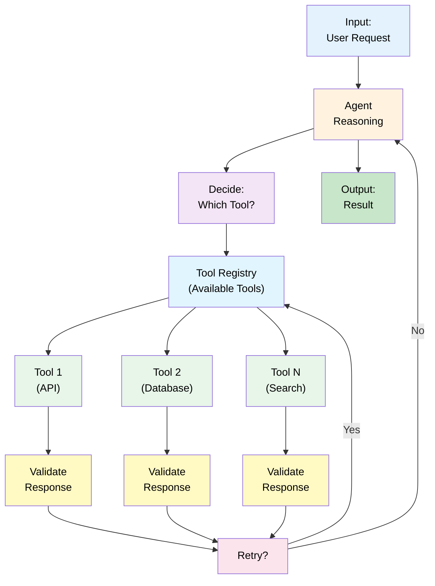

# 12 — Tool Calling: Integration with External Systems

## Quick Summary

An agent without tools is just a chatbot. Tools are how agents interact with the real world: APIs, databases, calculators, search engines, file systems.

This document covers **how to design tool interfaces** that are safe, reliable, and composable. The key insight: **the tool design is more important than the agent logic.**

**Cost model:** Each tool call adds latency (network I/O) + cost (API fees). Tool design determines efficiency.

**When to focus on this:** You're integrating with external systems, and reliability/performance matters.

---

## Tool Architecture



**Key components:**
- **Agent** — Decides which tool to call
- **Tool Registry** — All available tools + schemas
- **Tools** — External integrations (APIs, databases, etc.)
- **Validation** — Check response is valid
- **Retry** — Handle failures gracefully

---

## Tool Design Principles

### Principle 1: Clear Schema

Every tool must have explicit input/output specification.

```json
{
  "name": "search_database",
  "description": "Search customer database by email",
  "input_schema": {
    "type": "object",
    "properties": {
      "email": {
        "type": "string",
        "description": "Customer email address"
      },
      "limit": {
        "type": "integer",
        "description": "Max results (default 10)",
        "default": 10
      }
    },
    "required": ["email"]
  },
  "output_schema": {
    "type": "array",
    "items": {
      "type": "object",
      "properties": {
        "id": {"type": "string"},
        "email": {"type": "string"},
        "name": {"type": "string"}
      }
    }
  }
}
```

**Why it matters:** Agent knows what inputs are valid, what output to expect.

---

### Principle 2: Fail Fast & Loud

Tools should fail explicitly when something goes wrong, not silently degrade.

```python
def search_database(email):
    # Good: Fail fast
    if not email or "@" not in email:
        raise ValueError(f"Invalid email: {email}")
    
    # Bad: Silent failure
    # if not email or "@" not in email:
    #     return []  # Agent doesn't know what happened
```

---

### Principle 3: Idempotency

Running the same tool call twice should produce the same result (no side effects).

```python
# Good: Idempotent
def get_customer(customer_id):
    return database.select_by_id(customer_id)

# Bad: Not idempotent (creates new record each time)
def create_customer(name):
    return database.insert({"name": name})
    # Calling twice creates two customers
```

**Why it matters:** Agents can retry without causing duplicates.

---

### Principle 4: Bounded Latency

Tools should have explicit timeout. Never block forever.

```python
def call_external_api(url):
    # Good: 5 second timeout
    return requests.get(url, timeout=5)
    
    # Bad: No timeout (could hang forever)
    # return requests.get(url)
```

---

### Principle 5: Rate Limiting

Protect against overwhelming the tool with requests.

```python
limiter = RateLimiter(calls=100, period=60)  # 100 calls per minute

def search_api(query):
    limiter.wait()  # Block if rate limit exceeded
    return api.search(query)
```

---

## Tool Types & Patterns

### Type 1: Read-Only Tools

Query external systems without modification.

```
Examples: Search, Database Select, API GET, File Read

Characteristics:
- Safe (no state change)
- Cacheable (same input = same output)
- Can retry freely
```

**Implementation:**
```python
@cache(ttl=3600)  # Cache for 1 hour
def search_knowledge_base(query):
    return kb.search(query)
```

---

### Type 2: Read-Write Tools

Modify external systems.

```
Examples: Create Customer, Update Account, Send Email

Characteristics:
- Dangerous (state change)
- NOT cacheable (can't reuse results)
- Must be idempotent (handle retries safely)
```

**Implementation:**
```python
def create_support_ticket(user_id, description):
    # Check if ticket already exists
    existing = db.find_ticket(
        user_id=user_id,
        description=description,
        created_in_last_hour=True
    )
    if existing:
        return existing  # Idempotent
    
    # Create new ticket
    return db.create_ticket(user_id, description)
```

---

### Type 3: Streaming Tools

Return data in chunks over time.

```
Examples: File Processing, Log Streaming

Characteristics:
- Large results (don't fit in single response)
- Progressive (can start processing before complete)
- Can timeout mid-stream
```

**Implementation:**
```python
def stream_log_file(filename):
    with open(filename) as f:
        for line in f:
            yield line
    
# Agent processes incrementally
for chunk in stream_log_file("/var/log/app.log"):
    agent.process(chunk)
```

---

### Type 4: Async Tools

Fire-and-forget operations.

```
Examples: Send Notification, Queue Job

Characteristics:
- No immediate result (result comes later)
- Fire-and-forget pattern
- Need callback or polling for completion
```

**Implementation:**
```python
def send_email_async(to, subject, body):
    # Queue the email
    job_id = queue.enqueue(send_email, to, subject, body)
    
    # Return immediately
    return {"status": "queued", "job_id": job_id}

# Agent polls for completion
def check_email_status(job_id):
    return queue.get_status(job_id)
```

---

## Failure Modes

### 1. **Tool Timeout**

**What happens:** Tool takes longer than timeout, agent abandons it.

**Why it occurs:**
- External service is slow
- Network latency
- Database query is expensive

**Recovery:**
- Increase timeout (if acceptable)
- Use cached result if available
- Fall back to simpler tool (cheaper, faster)
- Queue for async processing

---

### 2. **Tool Returns Wrong Type**

**What happens:** Tool should return array, returns string instead. Agent breaks.

**Why it occurs:**
- Schema mismatch
- External API changed
- Error response not properly typed

**Recovery:**
- Validate output against schema: if invalid, retry or fail
- Use type hints + runtime validation
- Document expected types explicitly
- Version your schema

---

### 3. **Tool is Rate Limited**

**What happens:** Agent calls tool 1000 times, gets 429 (Too Many Requests).

**Why it occurs:**
- External API has rate limits
- Agent doesn't know limits
- No backoff strategy

**Recovery:**
- Implement rate limiter client-side (before hitting limit)
- Respect Rate-Limit response headers
- Exponential backoff on 429 responses
- Use token bucket or leaky bucket algorithm

---

### 4. **Tool Becomes Unavailable**

**What happens:** Tool is down. All workflows using it fail.

**Why it occurs:**
- External service outage
- Network unreachable
- Credentials expired

**Recovery:**
- Circuit breaker: after N failures, stop calling
- Fallback tool: use alternative if available
- Graceful degradation: continue with partial info
- Automatic retry with exponential backoff

---

### 5. **Tool is Too Expensive**

**What happens:** Calling this tool costs money. Agent runs up huge bill.

**Why it occurs:**
- External API charges per call
- Agent calls unnecessarily
- No cost awareness

**Recovery:**
- Set budget limits per workflow
- Prefer cheaper tools first
- Cache expensive results
- Batch operations to reduce call count
- Monitor cost and alert on anomalies

---

### 6. **Tool Hallucination (Agent Uses Non-Existent Tool)**

**What happens:** Agent tries to call a tool that doesn't exist.

**Why it occurs:**
- Tool not registered in tool registry
- Agent hallucinated the tool
- Schema mismatch

**Recovery:**
- Validate tool name against registry before calling
- Clear error message: "Tool X not found. Available: [list]"
- Restrict agent to known tools only
- Log hallucination attempts

---

## Tool Implementation Patterns

### Pattern 1: Tool Wrapper

Wrap external APIs in consistent interface.

```python
class Tool:
    def __init__(self, name, description, schema):
        self.name = name
        self.description = description
        self.schema = schema
    
    def call(self, **kwargs):
        # Validate input
        self._validate_input(kwargs)
        
        # Execute
        result = self._execute(**kwargs)
        
        # Validate output
        self._validate_output(result)
        
        # Return
        return result

class DatabaseSearchTool(Tool):
    def __init__(self):
        super().__init__(
            name="search_database",
            description="Search customer database by email",
            schema={...}
        )
    
    def _execute(self, email, limit=10):
        return db.search(email, limit)
```

---

### Pattern 2: Tool Retry with Backoff

```python
def call_with_retry(tool, kwargs, max_retries=3):
    for attempt in range(max_retries):
        try:
            return tool.call(**kwargs)
        except TemporaryError:
            if attempt < max_retries - 1:
                wait = 2 ** attempt + random.random()  # Exponential backoff
                time.sleep(wait)
            else:
                raise
```

---

### Pattern 3: Tool Composition

Chain tools together.

```python
def get_customer_with_orders(customer_id):
    # Tool 1: Get customer info
    customer = search_customer_tool(customer_id)
    
    # Tool 2: Get customer's orders
    orders = search_orders_tool(customer_id)
    
    # Combine
    return {
        "customer": customer,
        "orders": orders,
        "order_count": len(orders)
    }
```

---

## Best Practices

1. **Define explicit input/output schemas**
   - Use JSON Schema or similar
   - Validate on call
   - Document constraints

2. **Make tools idempotent**
   - Same input → same result
   - Safe to retry without side effects
   - Use deterministic IDs

3. **Implement timeouts everywhere**
   - No tool should block forever
   - Reasonable default: 5-30 seconds
   - Document if longer needed

4. **Use circuit breakers for external APIs**
   - After N failures, stop calling
   - Auto-recovery after cooldown
   - Prevents cascading failures

5. **Cache read-only tool results**
   - Reduces API calls + latency
   - Use appropriate TTL
   - Invalidate on known changes

6. **Rate limit proactively**
   - Don't hit external limits
   - Backoff before you're throttled
   - Monitor usage patterns

7. **Instrument every tool call**
   - Log inputs, outputs, latency
   - Track success/failure rate
   - Alert on errors

8. **Make tools fail explicitly**
   - Raise exceptions on error
   - Include context (what failed, why)
   - Don't silently return empty/null

9. **Version your tool schemas**
   - Support multiple versions during migration
   - Document breaking changes
   - Plan for evolution

10. **Monitor tool performance & costs**
    - Average latency per tool
    - Error rate per tool
    - Cost per tool (if applicable)
    - Alert on regressions

---

## Real-World Example: E-Commerce Checkout

**Context:** Checkout workflow needs multiple tools: inventory, payments, shipping, notifications.

**Tools:**

1. **Check Inventory** (Read-only, cacheable)
```python
def check_inventory(sku):
    return inventory_service.get_stock(sku)
```

2. **Calculate Shipping** (Read-only, fast)
```python
def calculate_shipping(destination, weight):
    return shipping_service.estimate(destination, weight)
```

3. **Process Payment** (Write, idempotent)
```python
def process_payment(order_id, amount, card_token):
    # Idempotent: check if already charged
    existing = payment_db.find(order_id)
    if existing:
        return existing  # Already charged
    
    # Charge card
    charge = payment_processor.charge(amount, card_token)
    payment_db.save(order_id, charge)
    return charge
```

4. **Create Shipment** (Write, idempotent)
```python
def create_shipment(order_id, items):
    # Idempotent: check if already created
    existing = shipment_db.find(order_id)
    if existing:
        return existing
    
    # Create shipment
    shipment = shipment_service.create(items)
    shipment_db.save(order_id, shipment)
    return shipment
```

5. **Send Notification** (Async)
```python
def send_notification(user_id, type, data):
    job = notification_queue.enqueue({
        "user_id": user_id,
        "type": type,
        "data": data
    })
    return {"status": "queued", "job_id": job.id}
```

**Workflow:**
```
1. Check inventory → cached, instant
2. Calculate shipping → read-only, fast
3. Process payment → idempotent, handles retry
4. Create shipment → idempotent, handles retry
5. Send notification → async, doesn't block
```

**Cost:**
- Tool 1: Free (in-memory cache)
- Tool 2: ~$0.001 per call (fast calculation)
- Tool 3: ~$0.03 per call (payment processor fee)
- Tool 4: ~$0.10 per shipment (external carrier)
- Tool 5: Free (internal queue)

**Results:**
- Latency: 200ms (cached inventory) + 50ms (shipping) + 500ms (payment) = 750ms total
- Reliability: Idempotent design handles retries safely
- Cost: ~$0.14 per completed checkout

---

## Summary

**Tool calling is critical** for agents to interact with real systems. Tools determine:

- **Latency** — Cached reads are instant, API calls add delay
- **Reliability** — Idempotent tools can retry safely
- **Cost** — Every call has a cost, design matters

**Key patterns:**
- **Read-only** — Cache aggressively, safe to retry
- **Read-write** — Make idempotent, handle retries
- **Streaming** — Process incrementally, handle timeouts
- **Async** — Queue and check status later

**Key principle:** Tool design is more important than agent logic. A great tool makes the agent's job easy. A bad tool breaks the entire system.

---

## Next Steps

→ Proceed to [13 — Production Runtime](13-production-runtime.md) to learn how to deploy agents.

→ Or jump to [14 — Observability](14-observability.md) to instrument tool calls.

→ Continue to [15 — Failure Patterns](15-failure-patterns.md) for resilience strategies.
