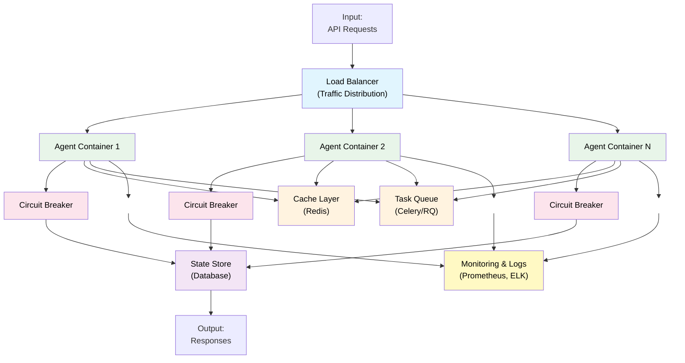

# 13 — Production Runtime: Deployment & Scaling

## Quick Summary

The gap between "works on my laptop" and "works at scale for 1M concurrent users" is everything in this document.

Production runtime covers **deployment strategies, scaling, containerization, orchestration, and operational readiness**. This isn't optional infrastructure—it's what separates a prototype from a system.

**Cost model:** Infrastructure overhead adds 20-50% to total cost (compute, memory, networking).

**When to focus on this:** Shipping to production, expecting >1000 requests/day, or multi-region deployments.

---

## Production Architecture



**Key components:**
- **Load Balancer** — Distribute traffic across containers
- **Agent Containers** — Stateless agent instances
- **State Store** — Persistent data (database)
- **Cache** — Hot data (Redis)
- **Queue** — Async task processing
- **Monitoring** — Observability (logs, metrics, traces)

---

## Deployment Models

### Model 1: Container-Based (Recommended)

Package agent as Docker container, deploy on Kubernetes.

**Advantages:**
- Reproducible (same container everywhere)
- Scalable (Kubernetes auto-scales)
- Isolated (dependencies contained)
- Versionable (track container versions)

**Kubernetes manifest example:**
```yaml
apiVersion: apps/v1
kind: Deployment
metadata:
  name: ai-agent
spec:
  replicas: 5
  selector:
    matchLabels:
      app: ai-agent
  template:
    metadata:
      labels:
        app: ai-agent
    spec:
      containers:
      - name: agent
        image: myregistry/ai-agent:v1.2.3
        resources:
          requests:
            memory: "256Mi"
            cpu: "250m"
          limits:
            memory: "512Mi"
            cpu: "500m"
        livenessProbe:
          httpGet:
            path: /health
            port: 8000
          initialDelaySeconds: 10
          periodSeconds: 10
        readinessProbe:
          httpGet:
            path: /ready
            port: 8000
          initialDelaySeconds: 5
          periodSeconds: 5
```

---

### Model 2: Serverless (AWS Lambda, Google Cloud Functions)

Deploy agent as function, pay only for execution time.

**Advantages:**
- No infrastructure management
- Pay-per-execution
- Auto-scaling

**Disadvantages:**
- Cold starts (initialization delay)
- Memory/duration limits
- Cost unpredictable at scale

**Use when:** Low volume, bursty traffic, or simple agents.

---

### Model 3: Managed Services (OpenAI Assistants API)

Outsource to provider's hosted platform.

**Advantages:**
- No operations burden
- Built-in scaling
- Managed memory/tools

**Disadvantages:**
- Limited customization
- Vendor lock-in
- Higher per-call cost

---

## Scaling Strategies

### Dimension 1: Horizontal Scaling (More Containers)

Add more agent instances.

```
1 container → 100 concurrent workflows max
5 containers → 500 concurrent workflows
10 containers → 1000 concurrent workflows
```

**Cost:** Linear with container count

**How to scale:**
- Kubernetes HPA (Horizontal Pod Autoscaler)
- Monitor CPU/memory, scale when > 70% usage

---

### Dimension 2: Vertical Scaling (Bigger Containers)

Increase container resources (CPU, memory).

```
256MB memory → Can hold small context
1GB memory → Can hold larger context
4GB memory → Can run expensive operations locally
```

**Cost:** Exponential (larger VMs cost more)

**Caution:** Don't scale vertically past 4-8GB. Use horizontal instead.

---

### Dimension 3: Caching Layer

Redis to cache expensive computations.

```
Without cache: Every request hits database
  - Database gets 1000 req/sec
  - Database is bottleneck

With cache: 80% of requests hit cache (in-memory, fast)
  - Database gets 200 req/sec (80% cache hit)
  - 5x reduction in database load
```

---

### Dimension 4: Queue-Based Processing

Async processing for long-running tasks.

```
Synchronous: API request → Process → Return (blocks for N seconds)
Async: API request → Queue → Return immediately
       Worker processes task in background
```

**Benefit:** Client doesn't wait, server handles load smoothly

---

## Operational Readiness

### Health Checks

Define what "healthy" means.

```python
@app.route("/health", methods=["GET"])
def health():
    # Quick check: is the process alive?
    return {"status": "ok"}, 200

@app.route("/ready", methods=["GET"])
def readiness():
    # Deep check: can we actually process requests?
    checks = {
        "database": db.ping(),
        "cache": cache.ping(),
        "memory_available": psutil.virtual_memory().percent < 90,
        "error_rate_1min": error_rate_recent() < 0.05
    }
    
    if all(checks.values()):
        return {"status": "ready"}, 200
    else:
        return {"status": "not_ready", "checks": checks}, 503
```

---

### Resource Requests & Limits

Define what each agent needs.

```yaml
resources:
  requests:           # Minimum guaranteed
    cpu: "250m"       # 0.25 vCPU
    memory: "256Mi"   # 256MB
  limits:             # Maximum allowed
    cpu: "500m"       # 0.5 vCPU
    memory: "512Mi"   # 512MB
```

**Tuning:**
- Monitor actual usage (CPU, memory)
- Set requests to 80% of peak usage (allows bursting)
- Set limits to 110% of peak usage (prevent OOM)

---

### Graceful Shutdown

Handle signals to shutdown cleanly.

```python
import signal
import sys

def signal_handler(sig, frame):
    logger.info("Shutdown signal received")
    
    # Stop accepting new requests
    app.stop_accepting_requests()
    
    # Wait for in-flight requests to complete
    app.wait_for_requests(timeout=30)
    
    # Close connections
    db.close()
    cache.close()
    
    sys.exit(0)

signal.signal(signal.SIGTERM, signal_handler)
```

**Why it matters:** Kubernetes sends SIGTERM before killing pod. Graceful shutdown ensures in-flight work completes.

---

## Failure Recovery

### Pattern 1: Rolling Deployment

Gradually replace old version with new.

```
Version 1: 5 instances
Deploy Version 2:
├─ Start Version 2 instance 1
├─ Stop Version 1 instance 1
├─ Start Version 2 instance 2
├─ Stop Version 1 instance 2
└─ Continue until all Version 2

Benefit: Zero downtime, can rollback easily
```

---

### Pattern 2: Blue-Green Deployment

Run two complete environments, switch traffic.

```
Blue (current): 5 instances, handling traffic
Green (new): 5 instances, being tested

Test completes → Switch all traffic to Green
If problem: Switch back to Blue (fast rollback)
```

---

### Pattern 3: Canary Deployment

Route small % of traffic to new version.

```
Traffic:
├─ 95% → Version 1 (current)
└─ 5% → Version 2 (new, being tested)

Monitor error rate, latency of 5%
If good: Increase to 10%, then 50%, then 100%
If bad: Rollback (still on version 1 for 95%)
```

---

## Failure Modes

### 1. **Cascading Failure (Thundering Herd)**

**What happens:** One service goes down. All agents retry simultaneously. System collapses.

**Why it occurs:**
- No circuit breaker
- All agents retry at same time
- Retry causes more load on downed service

**Recovery:**
- Circuit breaker: stop calling after N failures
- Exponential backoff + jitter: spread retries over time
- Bulkhead isolation: limit concurrent requests to one service

---

### 2. **Memory Leak**

**What happens:** Agent container uses more memory over time. Eventually OOM killed.

**Why it occurs:**
- Circular references not garbage collected
- Unbounded caches growing forever
- Connection pools not cleaned up

**Recovery:**
- Monitor memory usage over time
- Implement memory limits (container killed at limit)
- Regular restart (rolling deployment every day)
- Profile with memory profiler (find leaks)

---

### 3. **Slow Rollout**

**What happens:** Deployment takes hours. Any incident during rollout is bad.

**Why it occurs:**
- Health checks too strict (take too long to pass)
- Database migrations take long time
- No automation

**Recovery:**
- Fast health checks (< 5 seconds)
- Quick database migrations (or handle schema drift)
- Automated deployment (not manual)
- Smaller deployments (deploy more frequently)

---

### 4. **Configuration Drift**

**What happens:** Two containers have different configurations. Behavior is inconsistent.

**Why it occurs:**
- Manual config changes
- Environment variables not consistent
- No version control for config

**Recovery:**
- Infrastructure-as-code (all config in version control)
- Environment variables from ConfigMap/Secrets
- Config validation on startup

---

### 5. **Uncontrolled Cost**

**What happens:** Bill is $50k/month. No one knows why.

**Why it occurs:**
- No resource limits (containers using unlimited CPU/memory)
- Expensive API calls not metered
- Auto-scaling triggered by spike

**Recovery:**
- Set resource limits (prevent runaway)
- Meter all API calls (budget per service)
- Alert on cost anomalies
- Manual approval for scale-up

---

## Best Practices

1. **Containerize everything**
   - Dockerfile for reproducible builds
   - Multi-stage builds (smaller images)
   - Pin dependencies (no latest tags)

2. **Use orchestration (Kubernetes)**
   - Replicas (high availability)
   - Health checks (self-healing)
   - Rolling updates (zero downtime)

3. **Design for statelessness**
   - Containers are replaceable
   - State lives in database/cache
   - Any container can handle any request

4. **Monitor from day 1**
   - Prometheus for metrics
   - ELK for logs
   - Jaeger for traces
   - Set up alerts before incident

5. **Plan for graceful degradation**
   - Circuit breaker for external services
   - Cache for fallback
   - Queue for async processing

6. **Test failure scenarios**
   - Kill containers (chaos engineering)
   - Simulate network partitions
   - Test database failures
   - Verify rollback procedure

7. **Automate everything**
   - Deployment pipeline
   - Scaling triggers
   - Health checks
   - Rollback on error

8. **Version your deployments**
   - Every build gets version tag
   - Track what's deployed where
   - Easy rollback to previous version

9. **Use feature flags**
   - Deploy code before enabling feature
   - Gradual rollout without redeployment
   - Quick disable if broken

10. **Document runbooks**
    - What to do if service down
    - How to scale up/down
    - How to rollback
    - Who to call

---

## Real-World Example: High-Scale Agent Service

**Context:** SaaS platform with 100k agents deployed. 1M concurrent workflows. 99.99% availability required.

**Infrastructure:**

1. **Compute (Kubernetes)**
   - 100 nodes (m5.2xlarge AWS)
   - 500 agent containers (5 per node)
   - Auto-scaling based on CPU > 70%
   - Replicas: 5 (surviving 4 node failures)

2. **Storage**
   - PostgreSQL (17TB, read replicas in 3 regions)
   - Redis (600GB for caching)
   - S3 for archival

3. **Queue**
   - RabbitMQ (5 node cluster)
   - 10 worker nodes for async tasks

4. **Monitoring**
   - Prometheus (metrics)
   - ELK (logs)
   - Jaeger (distributed tracing)
   - PagerDuty (on-call)

**Cost Breakdown:**
- Compute: $50k/month (100 nodes)
- Database: $20k/month (PostgreSQL managed)
- Cache: $5k/month (Redis)
- Queue: $3k/month
- Monitoring: $5k/month
- **Total: $83k/month for 1M concurrent workflows**

**Reliability:**
- 99.99% availability (52.6 minutes downtime/year)
- Auto-recovery from any single node failure
- 5-minute deployment time
- Canary testing for all changes

**Performance:**
- P95 latency: 150ms
- P99 latency: 500ms
- Throughput: 10k requests/second

---

## Deployment Checklist

Before deploying to production:

- [ ] Containerized (Dockerfile + image registry)
- [ ] Health checks defined (liveness + readiness)
- [ ] Resource limits set (CPU + memory)
- [ ] Graceful shutdown implemented
- [ ] Monitoring configured (metrics + logs)
- [ ] Alerting set up (key metrics)
- [ ] Runbooks written (incident response)
- [ ] Tested failure scenarios (chaos testing)
- [ ] Rollback plan ready
- [ ] Feature flags for gradual rollout
- [ ] Secrets management (no hardcoded credentials)
- [ ] Database migrations tested
- [ ] Load testing passed (expected peak load)
- [ ] Security scan passed
- [ ] Documentation complete

---

## Summary

**Production runtime is critical infrastructure.** It determines whether your agent:
- Handles expected load
- Recovers from failures
- Can deploy safely
- Costs are reasonable

**Key patterns:**
- **Container-based** — Docker + Kubernetes (recommended for most)
- **Serverless** — Lambda/Cloud Functions (bursty traffic)
- **Managed** — OpenAI Assistants (simplicity first)

**Scaling dimensions:**
- Horizontal (more containers)
- Vertical (bigger containers)
- Caching (in-memory)
- Async queues (background processing)

**Key principle:** Production systems require infrastructure investment. Don't deploy without health checks, monitoring, and runbooks.

---

## Next Steps

→ Proceed to [14 — Observability](14-observability.md) to instrument your production system.

→ Or jump to [15 — Failure Patterns](15-failure-patterns.md) for resilience strategies.

→ Continue to [16 — Enterprise Blueprint](16-enterprise-blueprint.md) for large-scale architectures.
